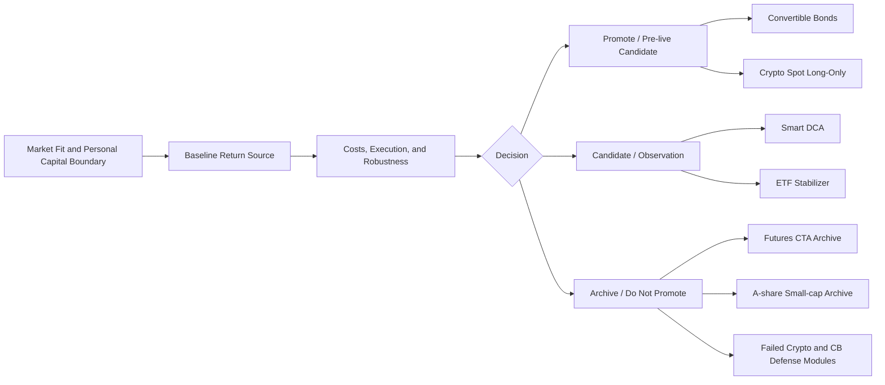

# Portfolio Map

This page describes the whole research portfolio. Individual strategy logic maps live inside each project page.

## Role Map

| Role | Line | Public Interpretation |
|---|---|---|
| Flagship research line | Convertible Bonds | Most mature line; evidence chain from market fit to sealed pre-live candidate |
| Flagship research line | Crypto Spot Long-Only | Public-data line showing high-volatility market selection, baseline testing, robustness, and failure rules |
| Candidate | Smart DCA | Accumulation framework under observation; documented but not treated as a finished public code appendix |
| Supporting line | ETF Stabilizer | Allocation and drawdown-control sleeve; not positioned as standalone alpha |
| Portfolio bridge | CB + ETF | Portfolio construction evidence connecting the convertible-bond core and ETF stabilizer |
| Archive / market-fit studies | Futures CTA and A-share Small-cap | Serious research lines archived because personal capital fit or core-book risk fit failed |
| Archive / failed modules | Failed Crypto, CB, and ETF variants | Evidence of triage discipline and explicit non-promotion decisions |

## Public Logic

## Reading Boundaries

- Convertible Bonds and Crypto are the two flagship public research lines.
- ETF is a supporting stabilizer line and portfolio-construction evidence.
- CB + ETF Bridge is only the bridge between the convertible-bond core and ETF sleeve.
- Smart DCA is a candidate accumulation framework, not an equal-strength flagship line.
- Futures CTA is a high-quality market-fit archive: credible low-correlation structure, but personal capital granularity failed.
- A-share Small-cap is an archive of a strong gross engine that failed the current core-book risk standard.
- Archives are part of the work, because they show what was tested and deliberately not promoted.
