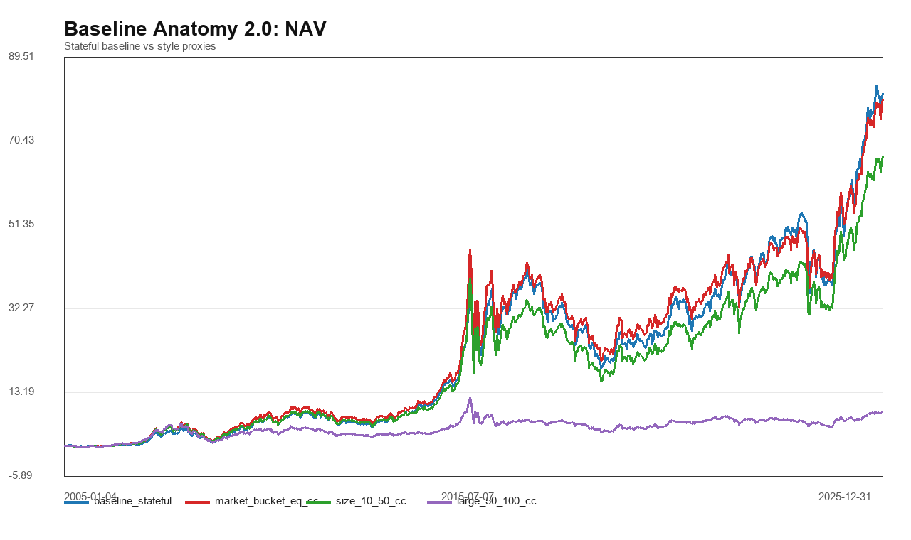
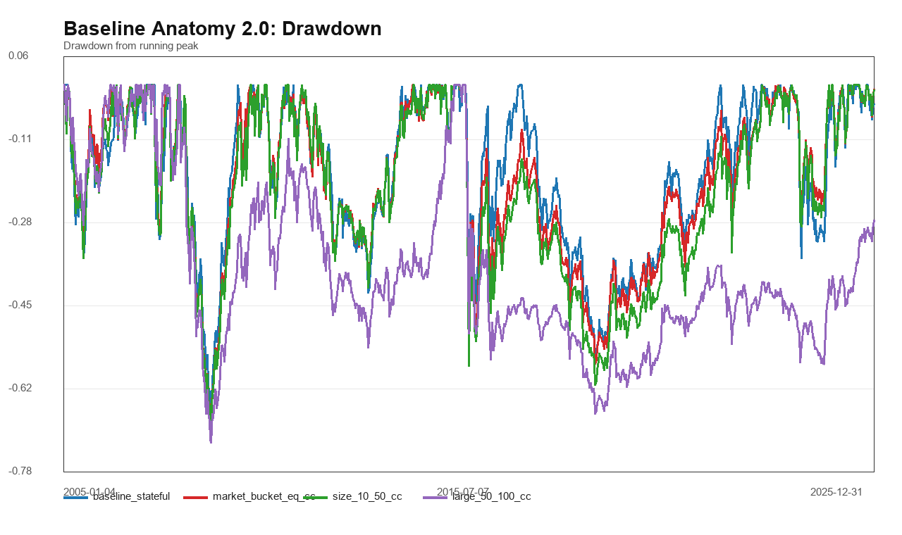
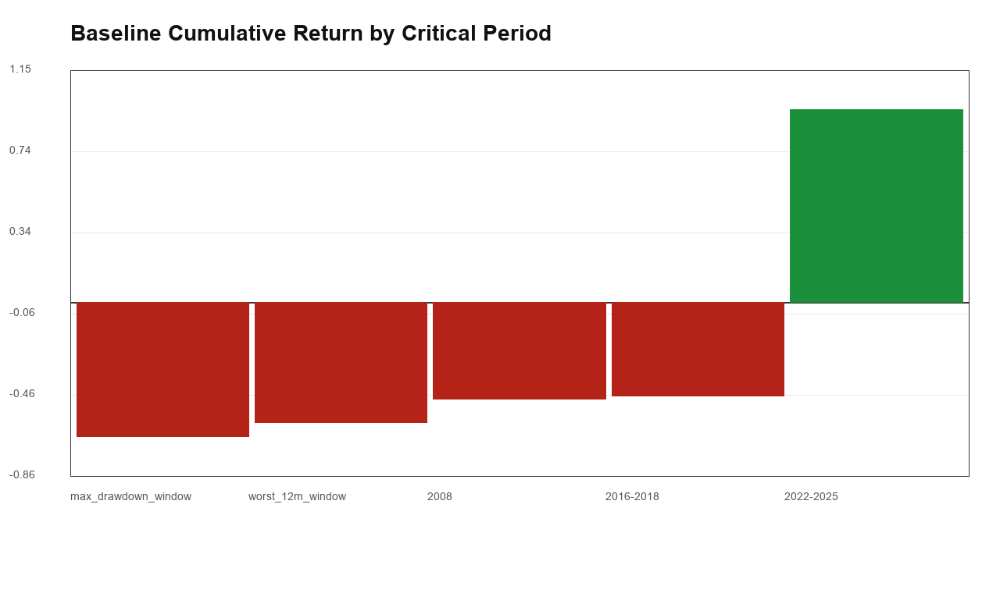
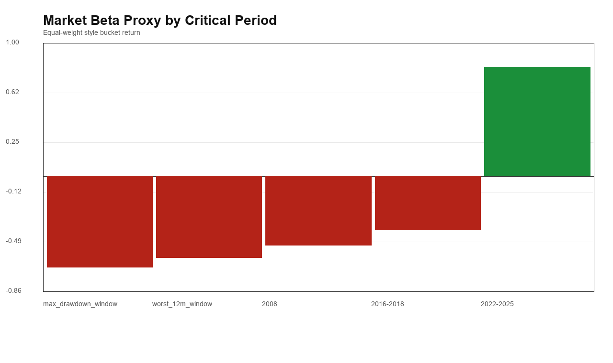
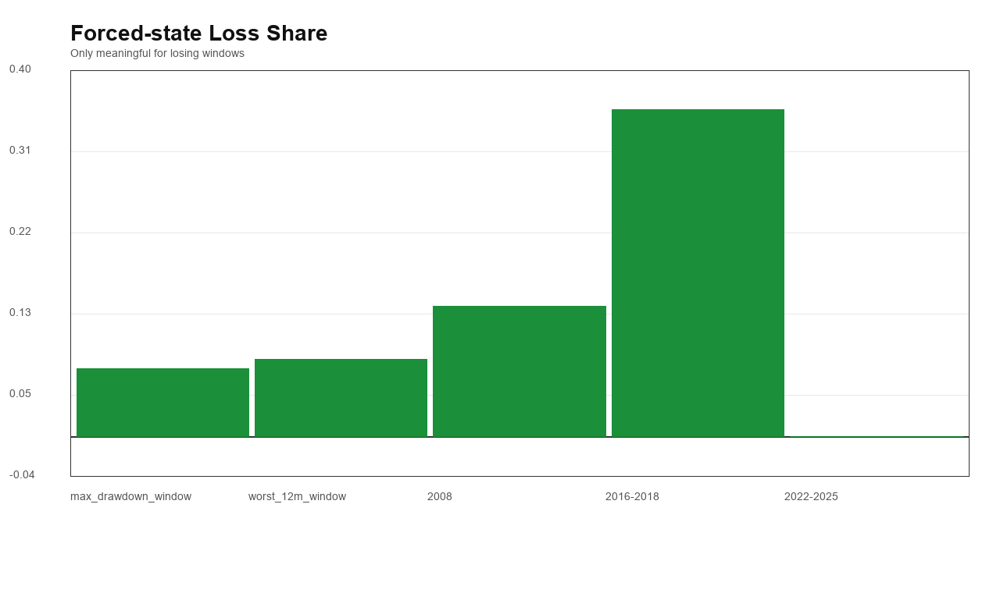
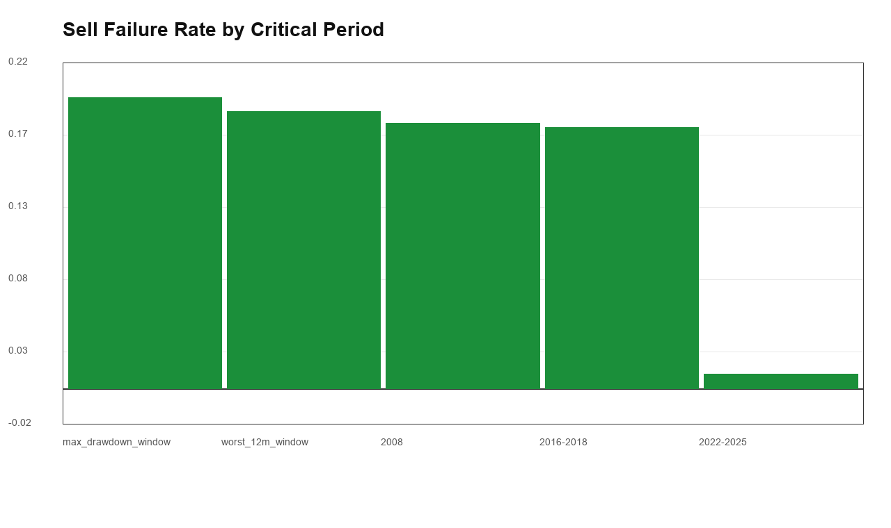
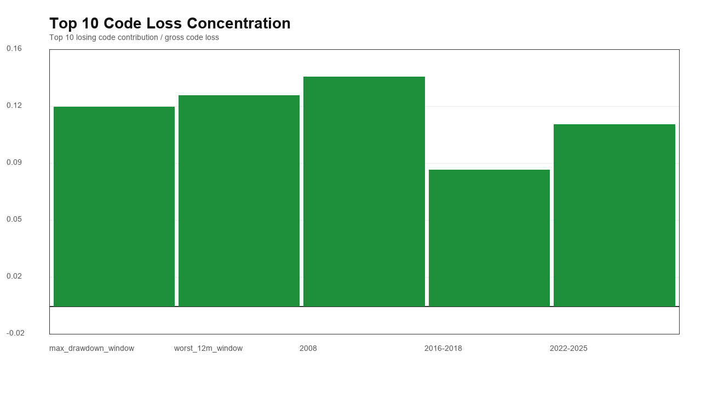
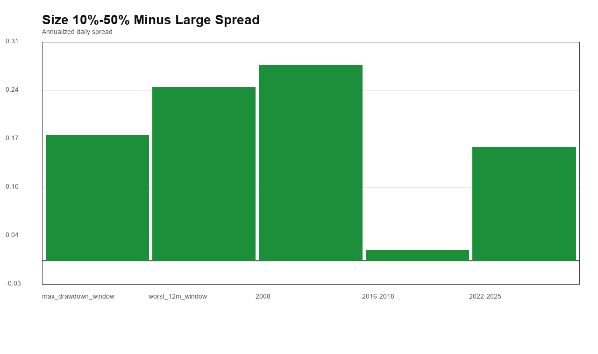

# A股小盘 baseline Drawdown Anatomy 2.0

本报告不加过滤器、不改 baseline，只把 `size 10%-50% smallest top100` 的风险来源拆清楚。

## 第一优先级任务

这一阶段只回答一个问题：

```text
baseline 的 -66.97% MDD、2016-2018 亏损、ex-2008 worst 12m，到底分别来自系统性 beta、小盘相对风险、execution、liquidity crash，还是个股 blow-up？
```

## 核心事件

- 最大回撤窗口：`2008-01-15` 到 `2008-11-04`，回撤 `-66.97%`。
- 最差 12 个月窗口：`2007-10-17` 到 `2008-10-27`，收益 `-59.36%`。

## 风险来源分类

| period | losing_or_deep_drawdown | market_beta_drawdown | small_cap_relative_drawdown | execution_drawdown | liquidity_crash | idiosyncratic_concentration | primary_read |
| --- | --- | --- | --- | --- | --- | --- | --- |
| full_sample | Yes | No | No | Yes | Yes | No | execution_liquidity |
| max_drawdown_window | Yes | Yes | No | Yes | Yes | No | systemic_beta_first |
| worst_12m_window | Yes | Yes | No | Yes | Yes | No | market_beta_dominant |
| ex_2008 | Yes | No | No | Yes | Yes | No | execution_liquidity |
| 2008 | Yes | Yes | No | Yes | Yes | No | systemic_beta_first |
| 2016-2018 | Yes | Yes | No | Yes | Yes | No | weak_market_plus_execution |
| 2022-2025 | Yes | No | No | No | No | No | mixed_or_not_loss |
| 2005-2013 | Yes | No | No | Yes | Yes | No | execution_liquidity |
| 2014-2015 | Yes | No | No | Yes | Yes | Yes | execution_liquidity |
| 2019-2021 | Yes | No | No | No | No | No | mixed_or_not_loss |

## 关键窗口分解

| period | start | end | baseline_ret | baseline_mdd | market_ret | large_ret | size-large_ann | forced_pnl | forced_loss_share | sell_fail_rate | sell_fail_no_bar | avg_suspended | top10_loss_share | worst_code | worst_code_pnl |
| --- | --- | --- | --- | --- | --- | --- | --- | --- | --- | --- | --- | --- | --- | --- | --- |
| full_sample | 2005-01-01 | 2025-12-31 | 8019.42% | -66.97% | 7883.01% | 780.08% | 11.80% | -0.1271 | n/a | 11.83% | 75.52% | 4.0700 | 5.49% | 002070 | -0.0174 |
| max_drawdown_window | 2008-01-15 | 2008-11-04 | -66.52% | -66.97% | -68.44% | -72.12% | 17.71% | -0.0725 | 7.46% | 20.06% | 63.24% | 5.3214 | 12.30% | 000923 | -0.0151 |
| worst_12m_window | 2007-10-17 | 2008-10-27 | -59.36% | -65.88% | -61.32% | -68.53% | 24.48% | -0.0647 | 8.46% | 19.12% | 70.51% | 5.4405 | 13.03% | 000791 | -0.0136 |
| ex_2008 | 2005-01-01 | 2025-12-31 | 15489.10% | -56.75% | 16541.45% | 2252.41% | 11.06% | -0.0553 | n/a | 11.57% | 76.24% | 4.0389 | 5.33% | 300028 | -0.0154 |
| 2016-2018 | 2016-01-01 | 2018-12-31 | -46.30% | -56.75% | -40.32% | -43.31% | 1.46% | -0.1788 | 35.90% | 18.01% | 79.37% | 6.3379 | 8.41% | 300028 | -0.0148 |
| 2022-2025 | 2022-01-01 | 2025-12-31 | 95.16% | -43.94% | 81.61% | 12.56% | 16.06% | -0.0034 | n/a | 1.03% | 30.43% | 0.1424 | 11.24% | 301046 | -0.0092 |

## 个股损伤集中度

| period | loss_code_count | top1_loss | top5_loss | top10_loss | top1_loss_share | top5_loss_share | top10_loss_share | worst_code | worst_code_contribution |
| --- | --- | --- | --- | --- | --- | --- | --- | --- | --- |
| max_drawdown_window | 213 | -0.0151 | -0.0695 | -0.1294 | 1.44% | 6.61% | 12.30% | 000923 | -0.0151 |
| worst_12m_window | 198 | -0.0136 | -0.0633 | -0.1187 | 1.49% | 6.94% | 13.03% | 000791 | -0.0136 |
| ex_2008 | 932 | -0.0154 | -0.0565 | -0.1009 | 0.81% | 2.99% | 5.33% | 300028 | -0.0154 |
| 2016-2018 | 460 | -0.0148 | -0.0499 | -0.0859 | 1.45% | 4.88% | 8.41% | 300028 | -0.0148 |
| 2022-2025 | 364 | -0.0092 | -0.0376 | -0.0669 | 1.55% | 6.32% | 11.24% | 301046 | -0.0092 |

## 关键窗口最大亏损代码

| period | rank | code | contribution |
| --- | --- | --- | --- |
| max_drawdown_window | 1 | 000923 | -0.0151 |
| max_drawdown_window | 2 | 000791 | -0.0139 |
| max_drawdown_window | 3 | 600781 | -0.0137 |
| max_drawdown_window | 4 | 000721 | -0.0135 |
| max_drawdown_window | 5 | 002132 | -0.0134 |
| max_drawdown_window | 6 | 000567 | -0.0128 |
| max_drawdown_window | 7 | 000760 | -0.0119 |
| max_drawdown_window | 8 | 002156 | -0.0119 |
| max_drawdown_window | 9 | 002027 | -0.0119 |
| max_drawdown_window | 10 | 002162 | -0.0114 |
| 2016-2018 | 1 | 300028 | -0.0148 |
| 2016-2018 | 2 | 300062 | -0.0096 |
| 2016-2018 | 3 | 002786 | -0.0089 |
| 2016-2018 | 4 | 002785 | -0.0083 |
| 2016-2018 | 5 | 600981 | -0.0083 |
| 2016-2018 | 6 | 300494 | -0.0079 |
| 2016-2018 | 7 | 603798 | -0.0073 |
| 2016-2018 | 8 | 002771 | -0.0071 |
| 2016-2018 | 9 | 002708 | -0.0069 |
| 2016-2018 | 10 | 603081 | -0.0068 |

## PNG 图

















## 初步解读

- 2008 / 最大回撤窗口优先看作 `systemic_beta_first`，不应指望 hard stock filter 单独解决。
- 2016-2018 是 `weak_market_plus_execution`，这里才是 liquidity / execution guard 和 hard negative screen 的主要战场。
- 如果 ex-2008 的 worst 12m 仍显示较高 sell-fail、forced-state 或个股集中损伤，下一阶段优先测试 execution / liquidity guard。
- 这一版没有引入任何新 alpha 因子；后续每个 risk guard 都必须与本报告的风险来源一一对应。
