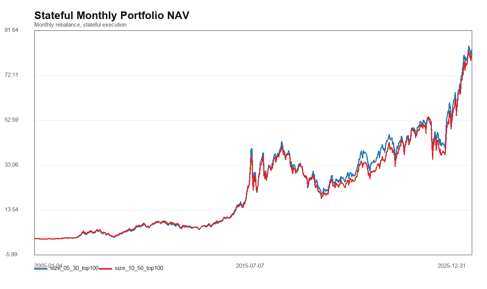
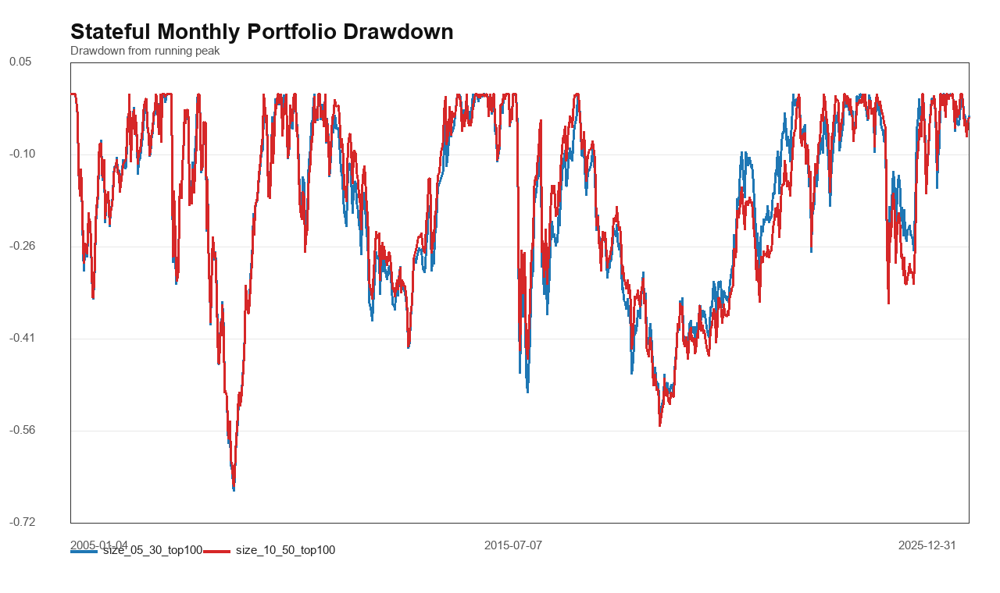
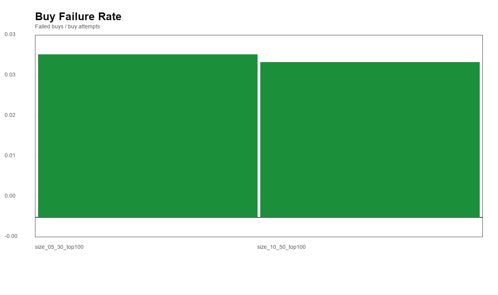
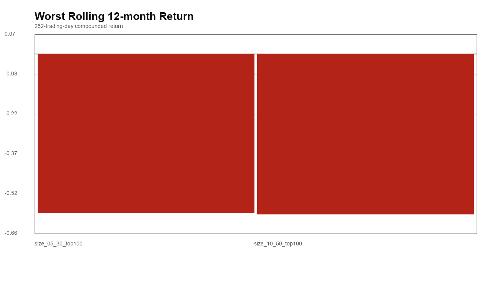
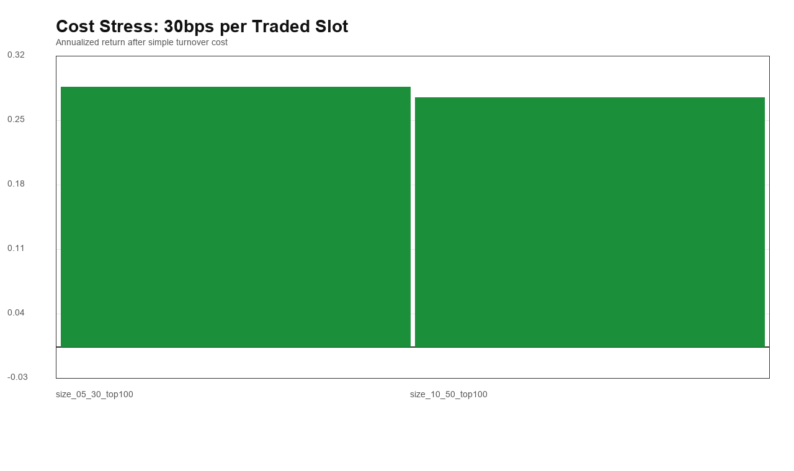
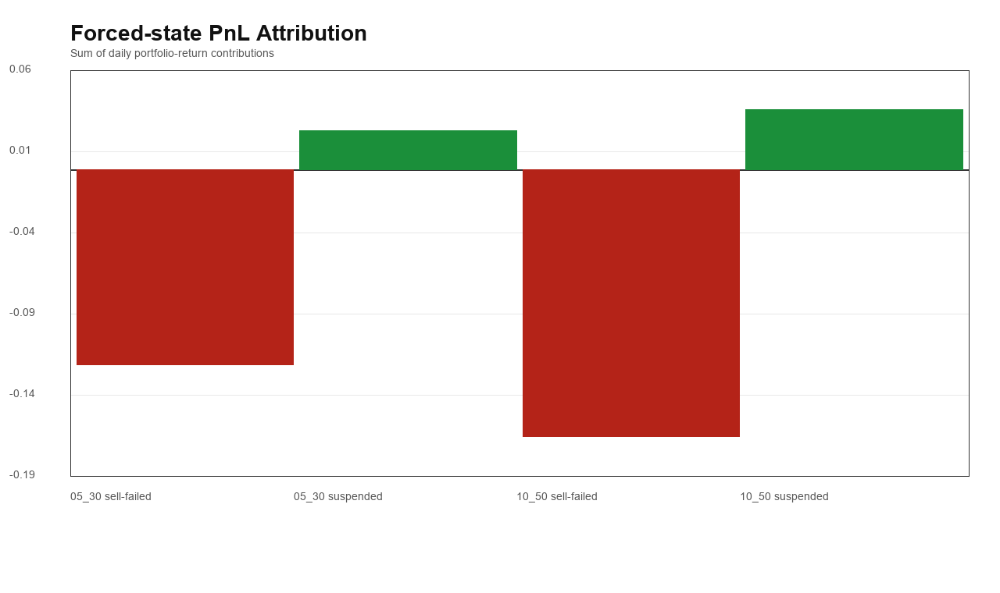
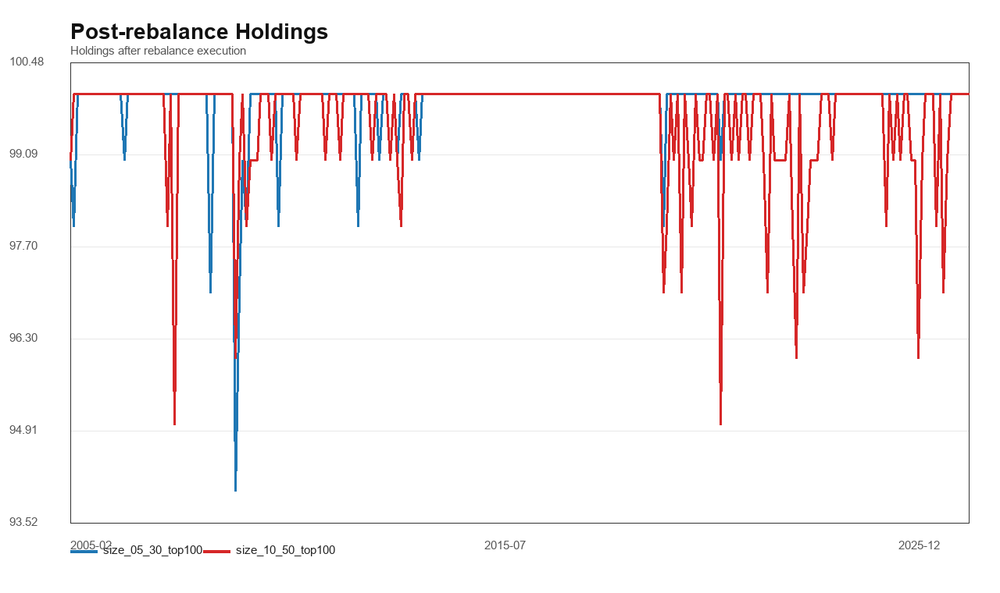

# A股小盘 Pre Research v2：真实持仓状态机

这份报告只做 execution realism 诊断，不做 RPE、多因子或参数优化。

## 本次修正

- v2 状态机的循环日期已经是实际执行日 D，因此新买入收益改为 D 日 `adj_close / adj_open - 1`。
- `exec_oc_ret_1d` 仍适合 v1 fresh-entry 诊断：在 T 日特征行上看 T+1 open-to-close。
- 新增 Risk Realism Gate：最大回撤、最差 12 个月、分阶段回撤、卖不出/停牌持仓归因、基础成本压力。

## 组合设定

- 样本：`2005-01-01` 到 `2025-12-31`。
- 月度调仓：T 日收盘生成目标名单，T+1 执行。
- 目标池只看两组：`size 5%-30% top100` 和 `size 10%-50% top100`。
- T+1 买得到才进入，买不到留现金；调仓卖出遇到跌停或无 bar，卖不出则继续持有。
- 停牌无 bar 日收益记 0，复牌日把停牌前最后一个复权 close 到复牌 close 的跳空收益/损失归到复牌日。
- 单日组合收益按 100 个目标槽位计算，空仓槽位收益为 0。

## Gate 摘要

- **Stateful Execution Gate**：`Green` - Monthly portfolio with failed buys as cash, failed sells held, and suspension days frozen.
- **Stateful Regime Gate**：`Green` - Positive regime-strategy cells: 8/10.
- **Risk Realism Gate**：`Yellow` - Checks max drawdown, worst 12-month return, forced-state PnL attribution, and simple 10/30bps turnover cost stress.

## 关键结果

| 组合 | 年化收益 | 累计收益 | 最大回撤 | 最差12个月 | 30bps成本压力后年化 | 买入失败率 | 卖出失败率 | 停牌持仓日 |
| --- | --- | --- | --- | --- | --- | --- | --- | --- |
| size_05_30_top100 | 31.09% | 8229.23% | -67.73% | -58.91% | 28.40% | 3.06% | 18.49% | 29960 |
| size_10_50_top100 | 30.72% | 8019.42% | -66.97% | -59.36% | 27.27% | 2.91% | 11.83% | 20761 |

## 强制状态收益归因

| 组合 | 正常持仓贡献 | 买入日贡献 | 卖出开盘贡献 | 卖不出持仓贡献 | 停牌复牌贡献 | 强制状态贡献占比 |
| --- | --- | --- | --- | --- | --- | --- |
| size_05_30_top100 | 5.1585 | 0.3086 | 0.1115 | -0.1200 | 0.0242 | -1.75% |
| size_10_50_top100 | 5.0661 | 0.3903 | 0.0965 | -0.1641 | 0.0370 | -2.34% |

## 成本压力

| 组合 | 裸年化 | 10bps成本压力后年化 | 30bps成本压力后年化 |
| --- | --- | --- | --- |
| size_05_30_top100 | 31.09% | 30.19% | 28.40% |
| size_10_50_top100 | 30.72% | 29.56% | 27.27% |

## 分阶段结果

| strategy | regime | ann_return | max_drawdown | observations |
| --- | --- | --- | --- | --- |
| size_05_30_top100 | 2005-2013 | 36.51% | -67.73% | 2182 |
| size_05_30_top100 | 2014-2015 | 130.68% | -49.99% | 489 |
| size_05_30_top100 | 2016-2018 | -14.06% | -54.88% | 731 |
| size_05_30_top100 | 2019-2021 | 32.60% | -25.59% | 730 |
| size_05_30_top100 | 2022-2025 | 22.57% | -40.51% | 969 |
| size_10_50_top100 | 2005-2013 | 36.74% | -66.97% | 2182 |
| size_10_50_top100 | 2014-2015 | 121.01% | -44.79% | 489 |
| size_10_50_top100 | 2016-2018 | -15.78% | -56.75% | 731 |
| size_10_50_top100 | 2019-2021 | 32.86% | -25.23% | 730 |
| size_10_50_top100 | 2022-2025 | 24.66% | -43.94% | 969 |

## PNG 图

## 解读边界

- 这仍然不是最终可部署策略，因为还没有纳入真实撮合、滑点、冲击成本和更细的复牌交易限制。
- 这一版用于判断：小盘 gross edge 在最小真实状态机下是否还活着，以及风险是不是主要来自无法处理状态。
- 如果 Risk Realism Gate 变红，就不应继续堆 RPE/quality；如果是黄灯，可以继续研究，但必须把 execution realism 和风险控制并行推进。
