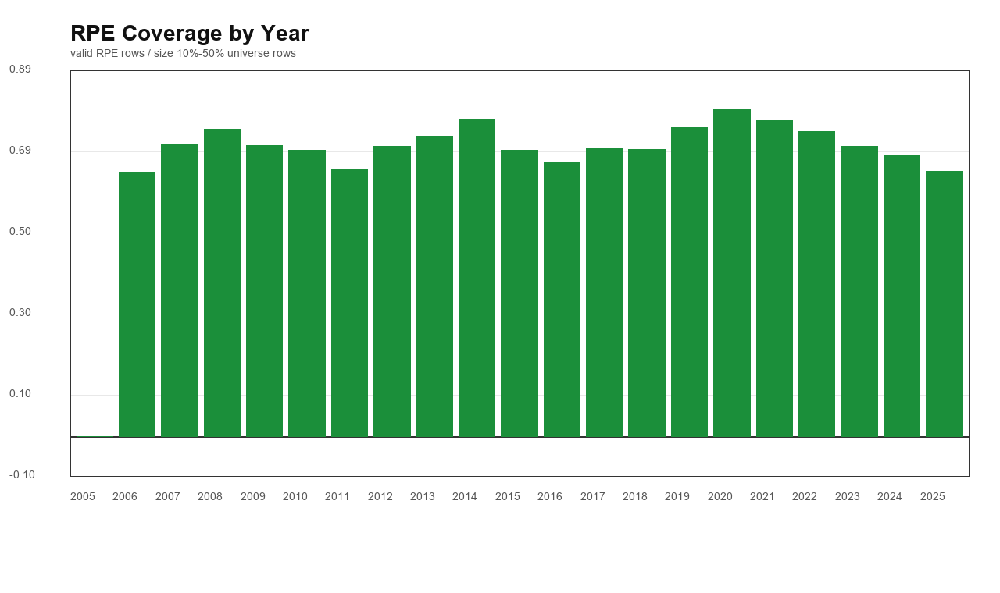
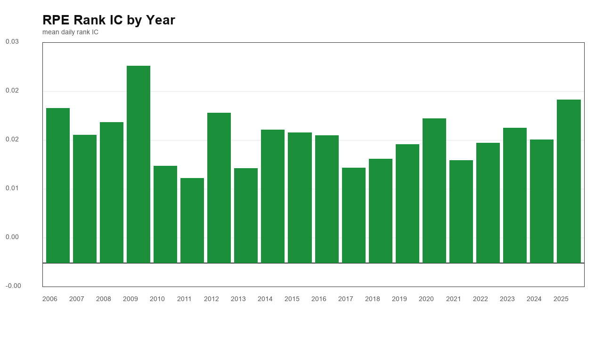
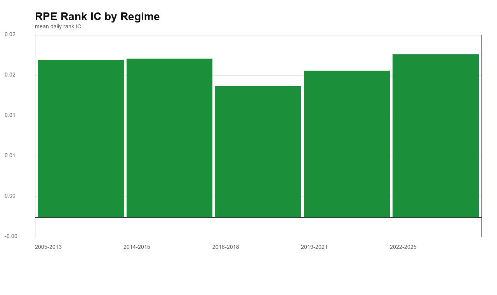
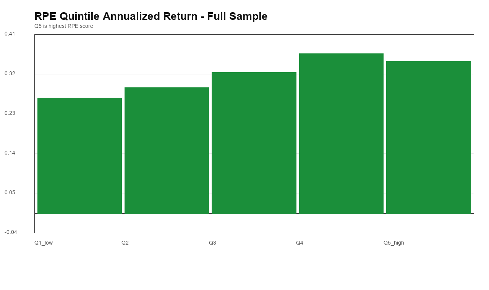
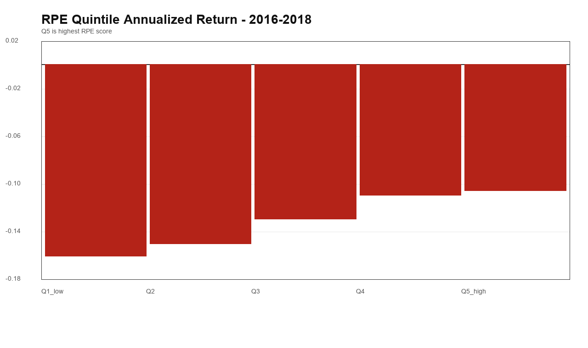
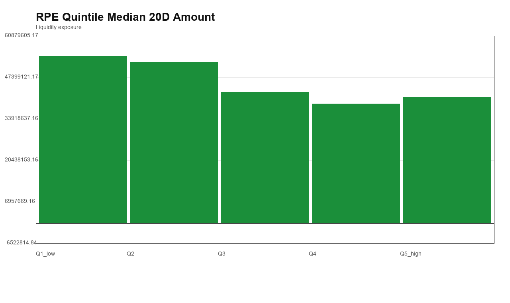
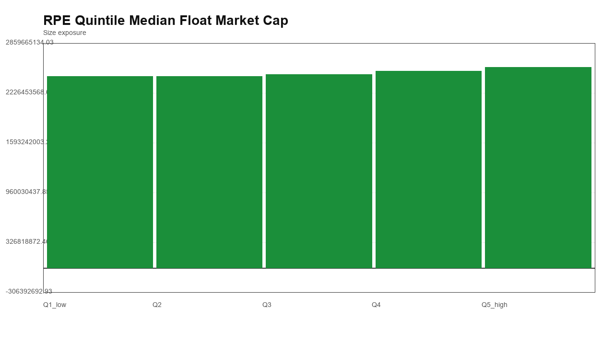
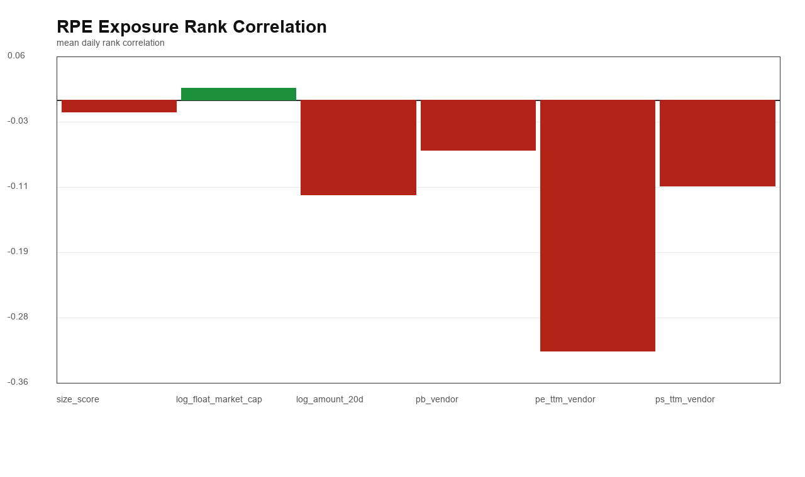

# A股小盘 RPE factor v1 诊断报告

本报告只做 RPE 因子端口、覆盖率、暴露、IC 和理论分组收益诊断，不跑状态机组合，不做参数优化。

## 因子定义

- 主 universe：`size 10%-50%`。
- 当前 PE：`market_cap / latest_visible_annual_net_profit_parent_or_net_profit`。
- 参考 PE：个股过去 `756` 个交易观察的 PE 滚动中位数，最少 `252` 个有效观察。
- RPE：`rpe_score = -log(current_pe / reference_pe)`，score 越高越好。
- PE 有效范围：`0 < PE <= 300`；负盈利、零盈利、极端 PE 只标记，不填补。
- 财务字段来自 `annual_finance_pit`，按 `effective_trade_date <= feature_date` 做 PIT as-of。

## 端口输出

- 输出目录：`processed/rpe_factor_pit`。
- 行数：`15,032,838`；有效 RPE 行数：`10,187,274`。

## 初步结论

- size 10%-50% 主池 RPE 覆盖率：`69.79%`。
- full sample 日度 rank IC 均值：`0.0168`。
- full sample Q5-Q1 年化 spread：`6.71%`。
- 2016-2018 Q5-Q1 年化 spread：`6.47%`。
- 这一轮判断重点是：RPE 是否有方向性、是否偷了更小市值/更低流动性暴露、是否在 2016-2018 有帮助。

## 覆盖率

| scope | universe_count | rpe_valid_count | coverage_rate |
| --- | --- | --- | --- |
| full_sample | 5008443 | 3495512 | 69.79% |

### 按年度

| year | universe_count | rpe_valid_count | coverage_rate |
| --- | --- | --- | --- |
| 2005 | 106060 | 0 | 0.00% |
| 2006 | 96047 | 61604 | 64.14% |
| 2007 | 105847 | 75043 | 70.90% |
| 2008 | 120199 | 89877 | 74.77% |
| 2009 | 127912 | 90539 | 70.78% |
| 2010 | 135742 | 94423 | 69.56% |
| 2011 | 166328 | 108179 | 65.04% |
| 2012 | 192800 | 136122 | 70.60% |
| 2013 | 204328 | 149181 | 73.01% |
| 2014 | 204929 | 158110 | 77.15% |
| 2015 | 198989 | 138369 | 69.54% |
| 2016 | 227836 | 151952 | 66.69% |
| 2017 | 253494 | 177582 | 70.05% |
| 2018 | 292776 | 204642 | 69.90% |
| 2019 | 315080 | 236576 | 75.08% |
| 2020 | 320620 | 254931 | 79.51% |
| 2021 | 342995 | 263307 | 76.77% |
| 2022 | 372401 | 276311 | 74.20% |
| 2023 | 394672 | 278622 | 70.60% |
| 2024 | 409879 | 279609 | 68.22% |
| 2025 | 419509 | 270533 | 64.49% |

### 按 regime

| regime | universe_count | rpe_valid_count | coverage_rate |
| --- | --- | --- | --- |
| 2005-2013 | 1255263 | 804968 | 64.13% |
| 2014-2015 | 403918 | 296479 | 73.40% |
| 2016-2018 | 774106 | 534176 | 69.01% |
| 2019-2021 | 978695 | 754814 | 77.12% |
| 2022-2025 | 1596461 | 1105075 | 69.22% |

## 暴露相关性

| exposure | daily_rank_corr_mean | daily_rank_corr_median | observations |
| --- | --- | --- | --- |
| size_score | -0.015099 | -0.016832 | 4849 |
| log_float_market_cap | 0.015099 | 0.016832 | 4849 |
| log_amount_20d | -0.120736 | -0.123617 | 4849 |
| pb_vendor | -0.0639772 | -0.0592315 | 4849 |
| pe_ttm_vendor | -0.31981 | -0.315791 | 4849 |
| ps_ttm_vendor | -0.109647 | -0.104125 | 4849 |

## Rank IC

| scope | rank_ic_mean | rank_ic_median | positive_rate | observations |
| --- | --- | --- | --- | --- |
| full_sample | 0.0168 | 0.0156 | 58.18% | 4849 |

### 按年度

| year | rank_ic_mean | rank_ic_median | positive_rate | observations |
| --- | --- | --- | --- | --- |
| 2006 | 0.0205 | 0.0213 | 60.17% | 231 |
| 2007 | 0.0169 | 0.0205 | 59.50% | 242 |
| 2008 | 0.0186 | 0.0217 | 61.38% | 246 |
| 2009 | 0.0261 | 0.0320 | 65.98% | 244 |
| 2010 | 0.0128 | 0.0108 | 57.02% | 242 |
| 2011 | 0.0112 | 0.0110 | 53.28% | 244 |
| 2012 | 0.0199 | 0.0193 | 58.44% | 243 |
| 2013 | 0.0125 | 0.0088 | 56.30% | 238 |
| 2014 | 0.0176 | 0.0149 | 55.10% | 245 |
| 2015 | 0.0173 | 0.0193 | 57.79% | 244 |
| 2016 | 0.0169 | 0.0138 | 59.02% | 244 |
| 2017 | 0.0126 | 0.0119 | 57.38% | 244 |
| 2018 | 0.0138 | 0.0111 | 55.97% | 243 |
| 2019 | 0.0157 | 0.0101 | 58.20% | 244 |
| 2020 | 0.0191 | 0.0134 | 59.26% | 243 |
| 2021 | 0.0136 | 0.0123 | 55.56% | 243 |
| 2022 | 0.0159 | 0.0121 | 57.85% | 242 |
| 2023 | 0.0179 | 0.0148 | 61.98% | 242 |
| 2024 | 0.0163 | 0.0154 | 56.20% | 242 |
| 2025 | 0.0216 | 0.0237 | 57.20% | 243 |

### 按 regime

| regime | rank_ic_mean | rank_ic_median | positive_rate | observations |
| --- | --- | --- | --- | --- |
| 2005-2013 | 0.0173 | 0.0189 | 59.02% | 1930 |
| 2014-2015 | 0.0175 | 0.0171 | 56.44% | 489 |
| 2016-2018 | 0.0144 | 0.0132 | 57.46% | 731 |
| 2019-2021 | 0.0161 | 0.0115 | 57.67% | 730 |
| 2022-2025 | 0.0179 | 0.0146 | 58.31% | 969 |

## RPE Q1-Q5 理论分组收益

| period | Q1_low | Q2 | Q3 | Q4 | Q5_high | Q5_minus_Q1_ann_spread | observations |
| --- | --- | --- | --- | --- | --- | --- | --- |
| full_sample | 26.71% | 29.05% | 32.62% | 36.95% | 35.20% | 6.71% | 4849 |
| 2005-2013 | 38.29% | 41.57% | 42.47% | 50.34% | 47.85% | 6.93% | 1930 |
| 2014-2015 | 103.78% | 98.13% | 109.62% | 107.43% | 115.18% | 5.61% | 489 |
| 2016-2018 | -15.97% | -14.95% | -12.90% | -10.91% | -10.53% | 6.47% | 731 |
| 2019-2021 | 27.94% | 33.55% | 33.17% | 39.33% | 34.00% | 4.74% | 730 |
| 2022-2025 | 13.28% | 15.33% | 24.89% | 25.86% | 22.93% | 8.53% | 969 |

## RPE Q1-Q5 暴露与交易状态

| rpe_quintile | avg_names | median_rpe_score | median_current_pe | median_float_market_cap | median_amount_20d | next_buy_fail_rate | next_sell_blocked_rate | next_no_bar_rate |
| --- | --- | --- | --- | --- | --- | --- | --- | --- |
| Q1_low | 144.5768 | -0.7609 | 95.0357 | 2,437,171,254 | 54,356,790 | 2.73% | 1.87% | 0.63% |
| Q2 | 143.9734 | -0.2241 | 51.0944 | 2,434,677,300 | 52,216,282 | 2.32% | 1.62% | 0.57% |
| Q3 | 143.9744 | -0.0115 | 37.8523 | 2,458,455,599 | 42,502,408 | 1.92% | 1.39% | 0.53% |
| Q4 | 143.9734 | 0.1650 | 30.7508 | 2,502,363,139 | 38,830,224 | 1.76% | 1.30% | 0.48% |
| Q5_high | 144.3747 | 0.5425 | 25.8471 | 2,553,272,441 | 41,001,411 | 1.85% | 1.34% | 0.52% |

## PNG 图

## 解读边界

- 这里的分组收益是理论 close-to-close 诊断，不是可部署回测。
- `next_sell_blocked_rate` 和 `next_no_bar_rate` 是下一执行日状态暴露，不等于真实组合卖出失败率；真实卖出失败要等 v2 状态机组合。
- 如果 RPE 高分组流动性明显更差，下一步 stateful portfolio 即使收益高也要谨慎。
