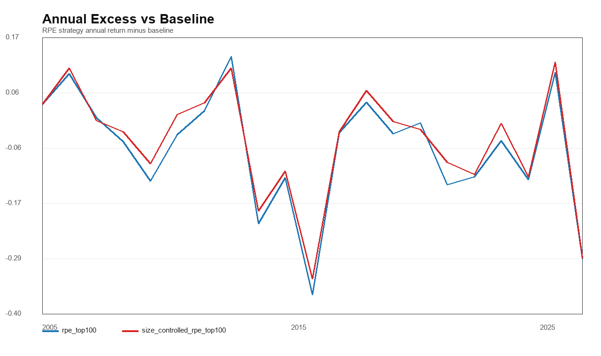
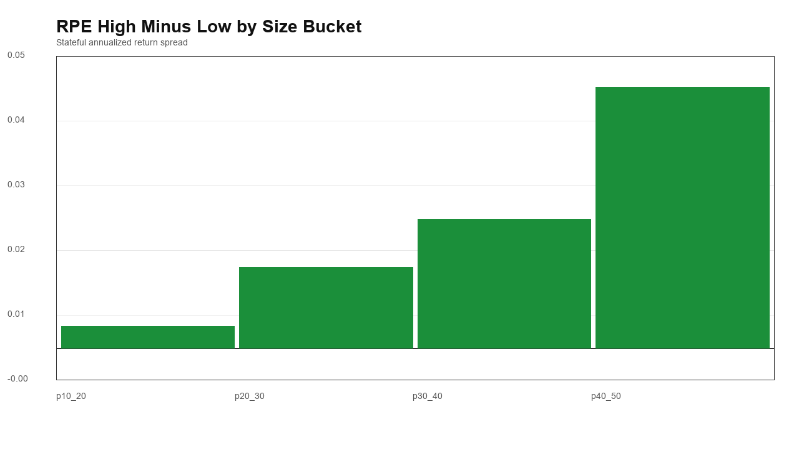
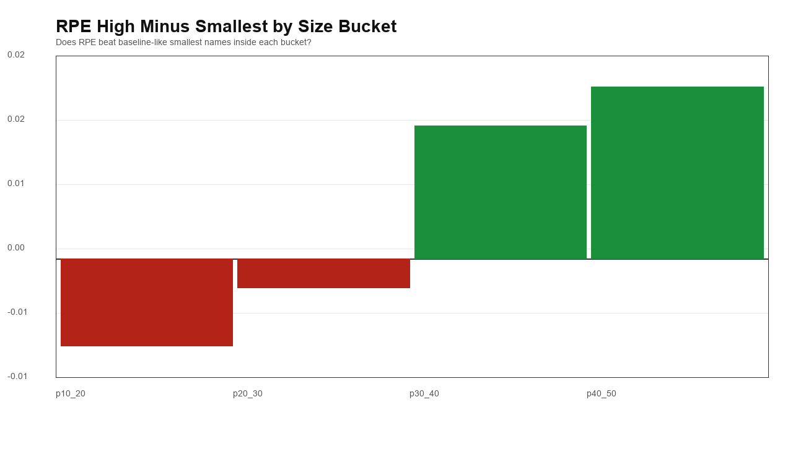
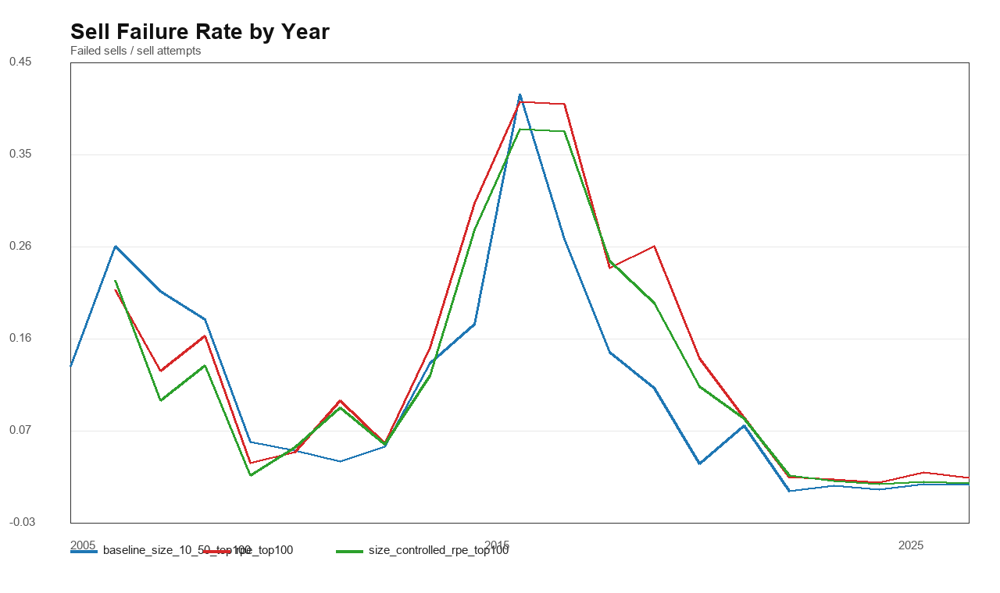
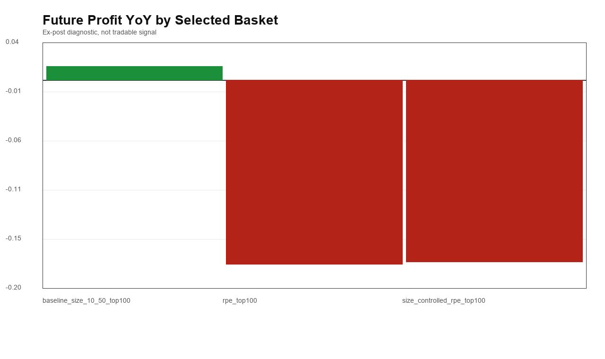
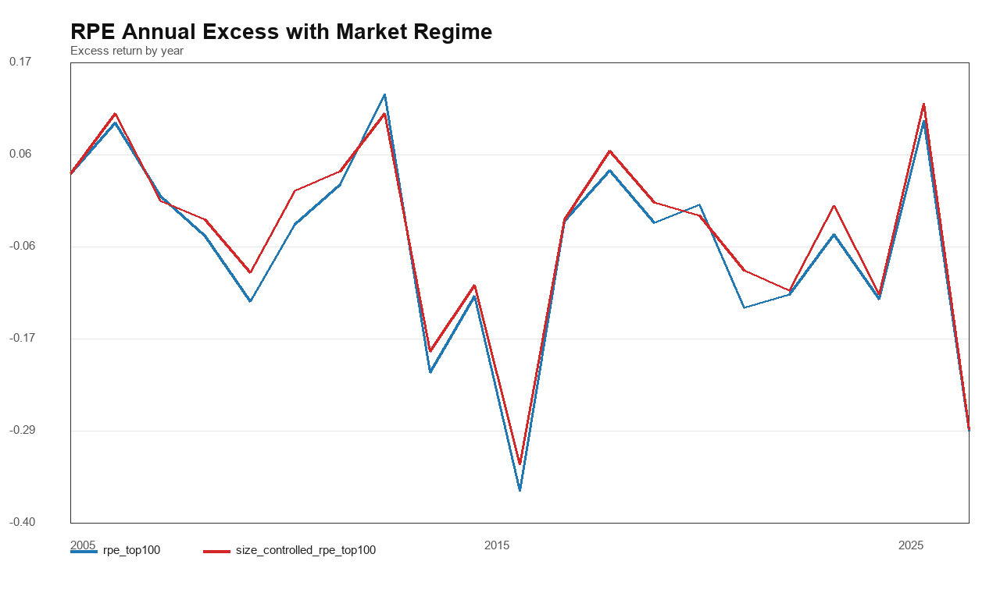

# A股小盘 RPE Failure Anatomy v1

本报告只做失败归因，不改 RPE 公式，不改窗口，不把 top100 改成 top50/top150，也不引入 composite。

## A. 年度归因

RPE 相对 baseline 最差的年份：

| strategy | year | ann_return | cumulative_return | max_drawdown | worst_12m | observations | baseline_ann_return | excess_vs_baseline |
| --- | --- | --- | --- | --- | --- | --- | --- | --- |
| rpe_top100 | 2015 | 155.64% | 1.19506 | -0.495936 |  | 244 | 192.08% | -36.44% |
| rpe_top100 | 2025 | 36.14% | 0.316837 | -0.144821 |  | 243 | 65.04% | -28.90% |
| rpe_top100 | 2013 | 35.21% | 0.297509 | -0.177029 |  | 238 | 56.86% | -21.64% |
| rpe_top100 | 2020 | 15.60% | 0.117368 | -0.171391 |  | 243 | 29.17% | -13.57% |
| rpe_top100 | 2009 | 196.38% | 1.67481 | -0.214723 |  | 244 | 209.09% | -12.71% |
| size_controlled_rpe_top100 | 2015 | 158.93% | 1.21861 | -0.495425 |  | 244 | 192.08% | -33.14% |
| size_controlled_rpe_top100 | 2025 | 36.27% | 0.317898 | -0.147746 |  | 243 | 65.04% | -28.77% |
| size_controlled_rpe_top100 | 2013 | 37.87% | 0.321262 | -0.17555 |  | 238 | 56.86% | -18.99% |
| size_controlled_rpe_top100 | 2023 | 20.23% | 0.178866 | -0.107894 |  | 242 | 32.09% | -11.86% |
| size_controlled_rpe_top100 | 2021 | 25.09% | 0.22202 | -0.151158 |  | 243 | 36.45% | -11.36% |

RPE 相对 baseline 最好的年份：

| strategy | year | ann_return | cumulative_return | max_drawdown | worst_12m | observations | baseline_ann_return | excess_vs_baseline |
| --- | --- | --- | --- | --- | --- | --- | --- | --- |
| rpe_top100 | 2012 | 15.14% | 0.105018 | -0.281293 |  | 243 | 1.96% | 13.18% |
| rpe_top100 | 2024 | 15.96% | 0.0727375 | -0.330734 |  | 242 | 6.09% | 9.87% |
| rpe_top100 | 2006 | 68.64% | 0.595835 | -0.140199 |  | 241 | 59.08% | 9.56% |
| rpe_top100 | 2017 | -20.63% | -0.214222 | -0.248426 |  | 244 | -24.25% | 3.62% |
| rpe_top100 | 2005 | 0.00% | 0 | 0 |  | 242 | -3.24% | 3.24% |
| size_controlled_rpe_top100 | 2024 | 18.10% | 0.0890077 | -0.340639 |  | 242 | 6.09% | 12.02% |
| size_controlled_rpe_top100 | 2006 | 69.84% | 0.606971 | -0.134005 |  | 241 | 59.08% | 10.76% |
| size_controlled_rpe_top100 | 2012 | 12.71% | 0.0824869 | -0.285902 |  | 243 | 1.96% | 10.75% |
| size_controlled_rpe_top100 | 2017 | -18.15% | -0.190436 | -0.229417 |  | 244 | -24.25% | 6.10% |
| size_controlled_rpe_top100 | 2011 | -19.66% | -0.214504 | -0.328175 |  | 244 | -23.24% | 3.58% |

## B. Size 桶内归因

| size_bucket | selector | ann_return | max_drawdown | sell_fail_rate | median_amount_20d | rpe_high_minus_low | rpe_high_minus_smallest |
| --- | --- | --- | --- | --- | --- | --- | --- |
| p10_20 | smallest | 30.68% | -66.97% | 11.80% | 3.45496e+07 | 0.35% | -1.01% |
| p10_20 | rpe_high | 29.67% | -60.25% | 13.41% | 3.05742e+07 | 0.35% | -1.01% |
| p10_20 | rpe_low | 29.32% | -60.25% | 13.47% | 3.64838e+07 | 0.35% | -1.01% |
| p20_30 | smallest | 27.57% | -69.94% | 11.06% | 3.82942e+07 | 1.29% | -0.34% |
| p20_30 | rpe_high | 27.23% | -65.55% | 12.25% | 3.61353e+07 | 1.29% | -0.34% |
| p20_30 | rpe_low | 25.94% | -65.60% | 12.34% | 4.32738e+07 | 1.29% | -0.34% |
| p30_40 | smallest | 22.80% | -69.38% | 9.55% | 4.70638e+07 | 2.06% | 1.54% |
| p30_40 | rpe_high | 24.34% | -66.33% | 10.82% | 4.33271e+07 | 2.06% | 1.54% |
| p30_40 | rpe_low | 22.29% | -66.58% | 11.50% | 5.41018e+07 | 2.06% | 1.54% |
| p40_50 | smallest | 18.37% | -70.43% | 12.09% | 5.4915e+07 | 4.15% | 1.99% |
| p40_50 | rpe_high | 20.36% | -66.23% | 13.78% | 5.24459e+07 | 4.15% | 1.99% |
| p40_50 | rpe_low | 16.20% | -66.39% | 13.37% | 6.72413e+07 | 4.15% | 1.99% |

## C. 卖出失败归因

| strategy | sell_fail_events | unique_codes | no_bar_rate | median_amount_20d | median_amount_20d_vs_60d | median_return_10d | median_return_25d | mean_limit_down_20d | mean_one_price_limit_20d | median_days_since_last_bar | sell_attempts | sell_fail_rate |
| --- | --- | --- | --- | --- | --- | --- | --- | --- | --- | --- | --- | --- |
| baseline_size_10_50_top100 | 1205 | 498 | 75.52% | 6.2255e+07 | 12.15% | 2.59% | 6.07% | 1 | 0.249793 | 19 | 10186 | 11.83% |
| rpe_top100 | 859 | 349 | 82.31% | 6.73091e+07 | 2.62% | 1.68% | 2.21% | 1.12107 | 0.526193 | 25 | 5444 | 15.78% |
| size_controlled_rpe_top100 | 866 | 357 | 82.22% | 6.67843e+07 | 0.83% | 1.71% | 1.71% | 1.08776 | 0.494226 | 24 | 6080 | 14.24% |

## D. 价值陷阱事后归因

下面是未来一年财务表现的事后诊断，不是可交易信号。

| strategy | rows | future_coverage | median_future_profit_yoy | median_future_revenue_yoy | median_future_roe_parent | median_future_cfo_to_profit | median_future_debt_ratio | median_future_goodwill_to_equity | share_profit_down_30 | share_future_profit_negative | share_revenue_negative |
| --- | --- | --- | --- | --- | --- | --- | --- | --- | --- | --- | --- |
| baseline_size_10_50_top100 | 25100 | 93.29% | 1.30% | 10.05% | 5.50% | 91.14% | 38.83% | 0.05% | 25.49% | 13.86% | 29.02% |
| rpe_top100 | 23900 | 96.59% | -17.61% | 5.74% | 7.12% | 109.36% | 45.01% | 0.13% | 40.58% | 9.70% | 37.05% |
| size_controlled_rpe_top100 | 23900 | 96.59% | -17.39% | 5.76% | 7.12% | 107.26% | 44.70% | 0.13% | 40.29% | 9.78% | 37.03% |

## E. Regime 归因

| strategy | small_trend | risk_appetite | market_strength | mean_excess_vs_baseline | years |
| --- | --- | --- | --- | --- | --- |
| rpe_top100 | small_down | small_beats_large | market_weak | -0.56% | 4 |
| rpe_top100 | small_down | small_lags_large | market_weak | 3.62% | 1 |
| rpe_top100 | small_up | small_beats_large | market_strong | -12.98% | 12 |
| rpe_top100 | small_up | small_beats_large | market_weak | 6.22% | 3 |
| rpe_top100 | small_up | small_lags_large | market_strong | 9.56% | 1 |
| size_controlled_rpe_top100 | small_down | small_beats_large | market_weak | 1.00% | 4 |
| size_controlled_rpe_top100 | small_down | small_lags_large | market_weak | 6.10% | 1 |
| size_controlled_rpe_top100 | small_up | small_beats_large | market_strong | -11.36% | 12 |
| size_controlled_rpe_top100 | small_up | small_beats_large | market_weak | 7.35% | 3 |
| size_controlled_rpe_top100 | small_up | small_lags_large | market_strong | 10.76% | 1 |

## PNG 图

## 解读边界

- 本报告只决定 RPE 失败机制，不决定新策略。
- D 部分使用未来财务，只能解释价值陷阱，不能作为当时可见信号。
- 如果 RPE 只在部分 size bucket 或部分 regime 有用，下一步应降级为 overlay / filter / observation，而不是晋升为 core alpha。
