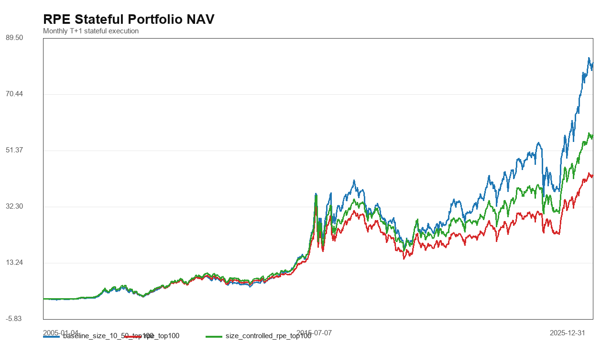
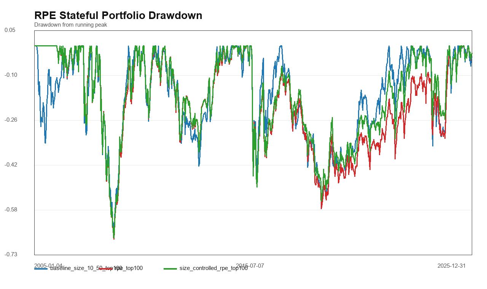
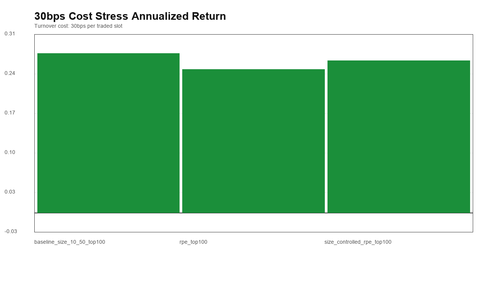
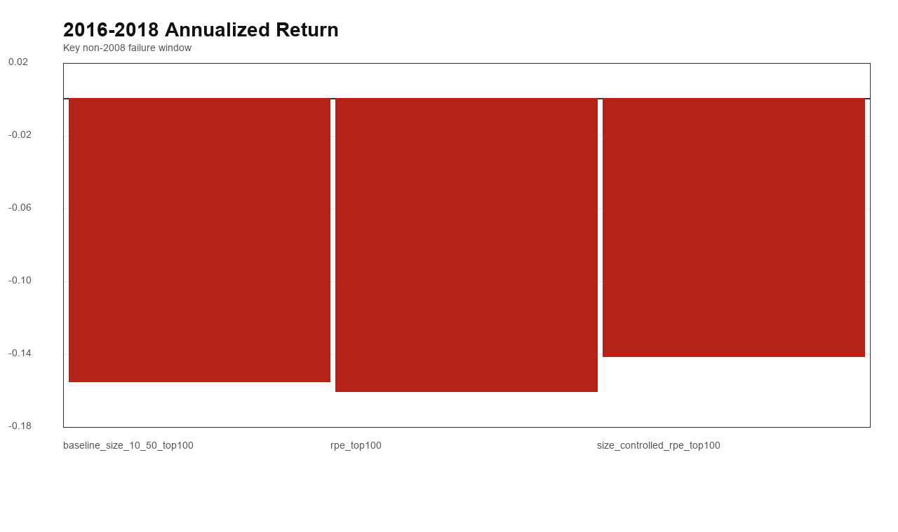
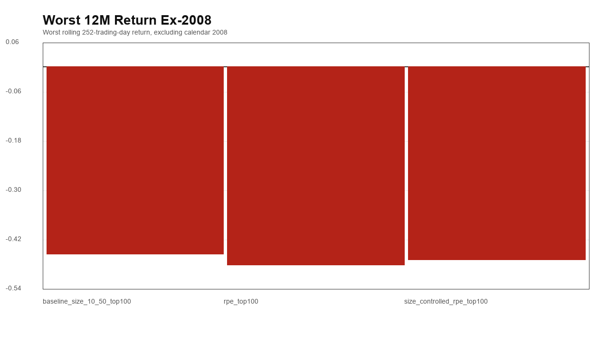
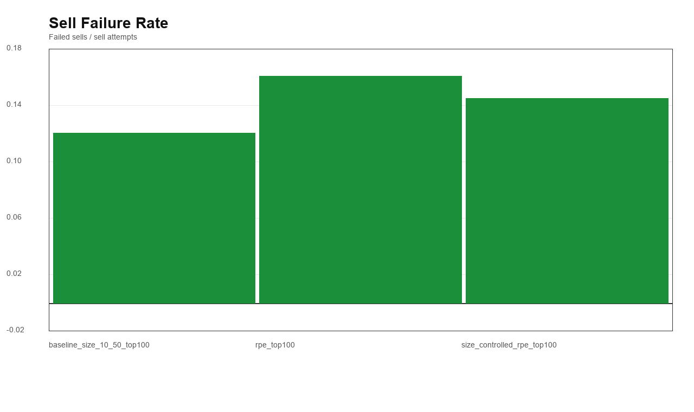
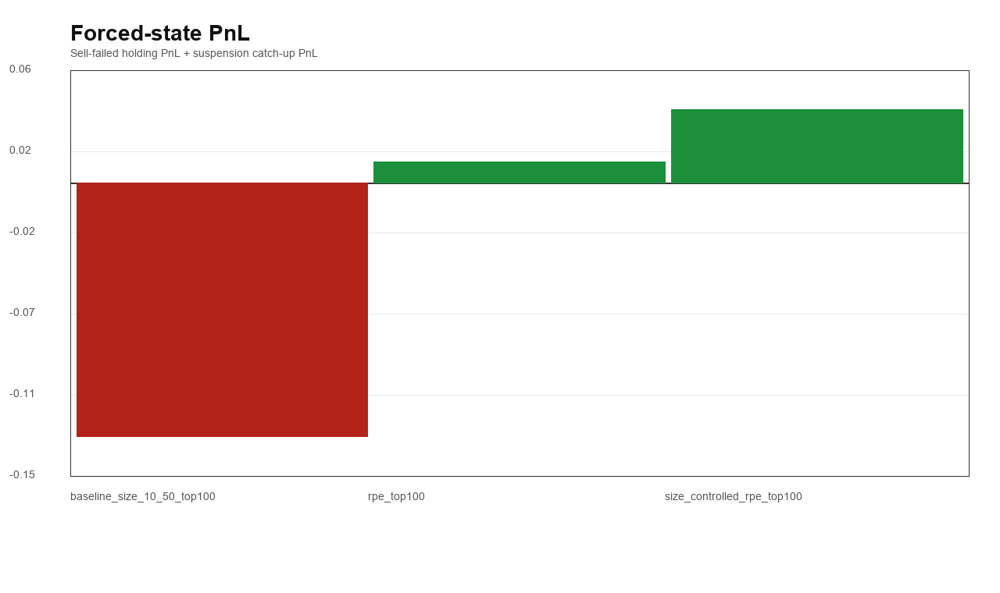
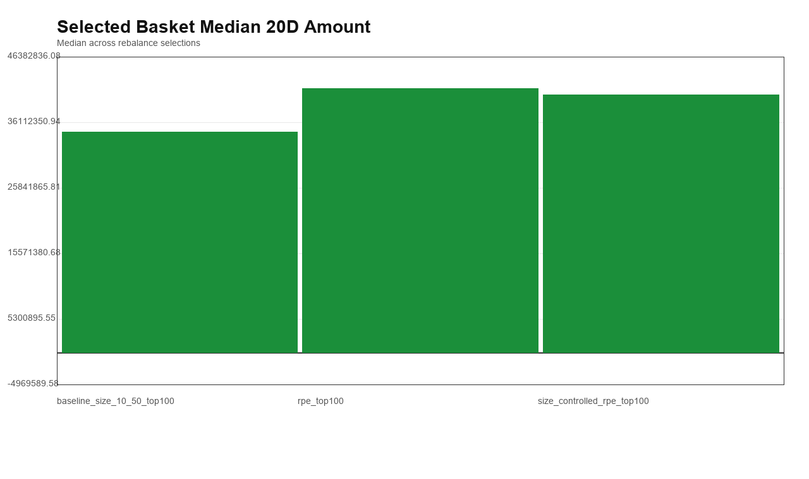
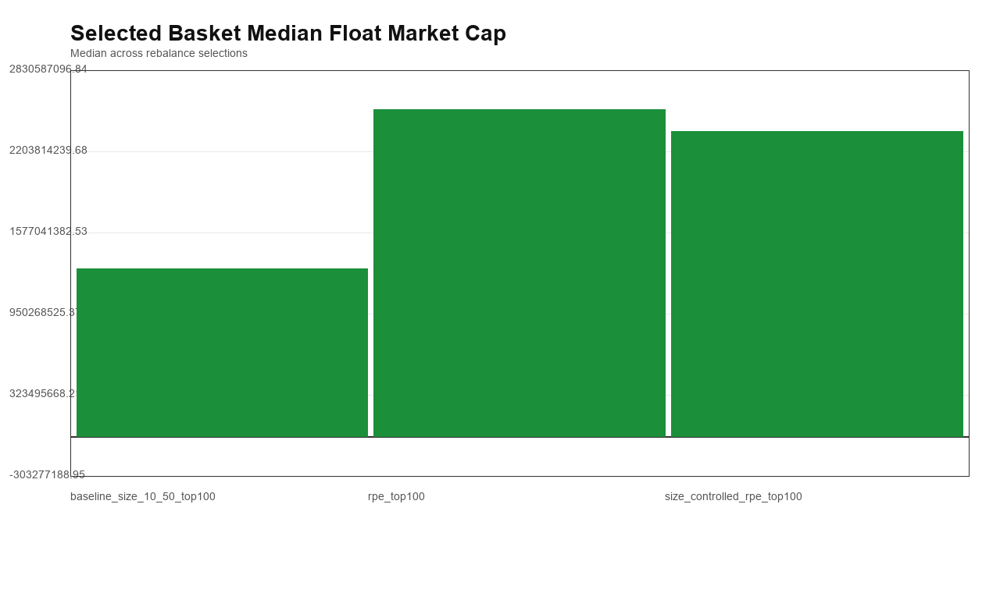
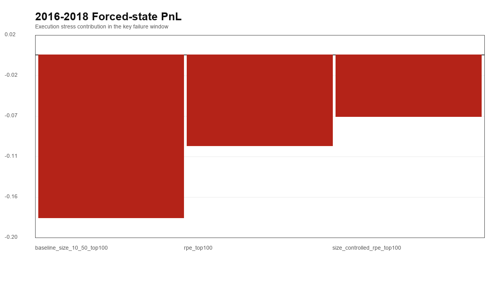

# A股小盘 RPE Stateful Portfolio v1

本报告只测试冻结的 RPE v1 端口在真实持仓状态机下是否仍有增量，不做参数优化，不改 RPE 公式。

## 组合设定

- 样本：`2005-01-01` 到 `2025-12-31`；2026 不进入正式结论。
- 主 universe：`size 10%-50%`。
- baseline：主 universe 内最小流通市值 `top100`。
- RPE top100：主 universe 内 `valid_rpe_flag=True` 且 `rpe_score` 最高的 100 只。
- size-controlled RPE：把 `size 10%-50%` 固定切为 `10-20 / 20-30 / 30-40 / 40-50` 四桶，每桶优先选 25 只高 RPE。
- 状态机：月度调仓，T 日收盘算目标，T+1 执行；买不到留现金，卖不出继续持有，停牌冻结，复牌归因。
- 成本压力：沿用 10bps / 30bps per traded slot。

## 第一轮判定

| strategy | verdict | 通过项 |
| --- | --- | --- |
| rpe_top100 | Fail | 7/10 |
| size_controlled_rpe_top100 | Borderline | 9/10 |

## 组合对比

| 组合 | 年化 | 30bps后年化 | 累计收益 | 最大回撤 | 最差12个月 | ex-2008最差12个月 | ex-2008最大回撤 | 2016-2018年化 | 2016-2018最大回撤 | 2022-2025年化 | 卖出失败率 | 停牌持仓日 | forced-state PnL | 年化换手 |
| --- | --- | --- | --- | --- | --- | --- | --- | --- | --- | --- | --- | --- | --- | --- |
| baseline_size_10_50_top100 | 30.72% | 27.27% | 8019.42% | -66.97% | -59.36% | -45.32% | -56.75% | -15.78% | -56.75% | 24.66% | 11.83% | 20761 | -0.1271 | 8.9230 |
| rpe_top100 | 26.23% | 24.51% | 4208.43% | -69.05% | -61.61% | -48.03% | -58.37% | -16.32% | -54.70% | 17.22% | 15.78% | 16523 | 0.0103 | 4.5791 |
| size_controlled_rpe_top100 | 27.98% | 26.00% | 5556.29% | -68.65% | -60.60% | -46.69% | -55.75% | -14.38% | -52.40% | 19.00% | 14.24% | 16474 | 0.0367 | 5.2011 |

## 执行与暴露

| 组合 | 买入失败率 | 卖出失败率 | 停牌持仓日 | forced-state PnL | forced-state占比 | 入选20日成交额中位数 | 入选流通市值中位数 | 中位目标数 | 中位持仓数 | 中位现金槽位 |
| --- | --- | --- | --- | --- | --- | --- | --- | --- | --- | --- |
| baseline_size_10_50_top100 | 2.91% | 11.83% | 20761 | -0.1271 | -2.34% | 34,549,558 | 1,298,140,871 | 100.0000 | 100.0000 | 0.0000 |
| rpe_top100 | 1.95% | 15.78% | 16523 | 0.0103 | 0.22% | 41,413,246 | 2,527,309,908 | 100.0000 | 100.0000 | 0.0000 |
| size_controlled_rpe_top100 | 1.94% | 14.24% | 16474 | 0.0367 | 0.73% | 40,449,772 | 2,358,421,225 | 100.0000 | 100.0000 | 0.0000 |

## Size 桶入选结构

| strategy | selected_p10_20 | selected_p20_30 | selected_p30_40 | selected_p40_50 |
| --- | --- | --- | --- | --- |
| baseline_size_10_50_top100 | 100 | 0 | 0 | 0 |
| rpe_top100 | 19 | 25 | 27 | 28 |
| size_controlled_rpe_top100 | 25 | 25 | 25 | 25 |

## 审计窗口

| strategy | window | ann_return | cumulative_return | max_drawdown | worst_12m | forced_state_pnl | forced_state_pnl_share | suspended_position_days | observations |
| --- | --- | --- | --- | --- | --- | --- | --- | --- | --- |
| baseline_size_10_50_top100 | full_sample | 30.72% | 8019.42% | -66.97% | -59.36% | -0.1271 | -2.34% | 20761 | 5101 |
| baseline_size_10_50_top100 | max_drawdown_window | -71.43% | -66.52% | -66.97% | n/a | -0.0725 | 7.46% | 1043 | 196 |
| baseline_size_10_50_top100 | worst_12m_window | -53.53% | -59.36% | -65.88% | -59.36% | -0.0647 | 8.46% | 1371 | 252 |
| baseline_size_10_50_top100 | ex_2008 | 36.01% | 15489.10% | -56.75% | -45.32% | -0.0553 | -0.93% | 19609 | 4855 |
| baseline_size_10_50_top100 | 2016-2018 | -15.78% | -46.30% | -56.75% | -45.32% | -0.1788 | 35.90% | 4633 | 731 |
| baseline_size_10_50_top100 | 2022-2025 | 24.66% | 95.16% | -43.94% | -33.98% | -0.0034 | -0.41% | 138 | 969 |
| rpe_top100 | full_sample | 26.23% | 4208.43% | -69.05% | -61.61% | 0.0103 | 0.22% | 16523 | 5101 |
| rpe_top100 | max_drawdown_window | -72.79% | -68.11% | -69.05% | n/a | -0.0604 | 5.98% | 516 | 196 |
| rpe_top100 | worst_12m_window | -55.60% | -61.61% | -67.67% | -61.61% | -0.0520 | 6.41% | 752 | 252 |
| rpe_top100 | ex_2008 | 31.62% | 8942.74% | -58.37% | -48.03% | 0.0539 | 1.02% | 15858 | 4855 |
| rpe_top100 | 2016-2018 | -16.32% | -46.25% | -54.70% | -48.03% | -0.1000 | 19.36% | 5189 | 731 |
| rpe_top100 | 2022-2025 | 17.22% | 60.11% | -33.86% | -28.68% | -0.0163 | -2.67% | 76 | 969 |
| size_controlled_rpe_top100 | full_sample | 27.98% | 5556.29% | -68.65% | -60.60% | 0.0367 | 0.73% | 16474 | 5101 |
| size_controlled_rpe_top100 | max_drawdown_window | -72.31% | -67.64% | -68.65% | n/a | -0.0536 | 5.38% | 405 | 196 |
| size_controlled_rpe_top100 | worst_12m_window | -54.44% | -60.60% | -67.24% | -60.60% | -0.0445 | 5.67% | 587 | 252 |
| size_controlled_rpe_top100 | ex_2008 | 33.30% | 11356.83% | -55.75% | -46.69% | 0.0749 | 1.35% | 15927 | 4855 |
| size_controlled_rpe_top100 | 2016-2018 | -14.38% | -42.54% | -52.40% | -46.69% | -0.0681 | 15.12% | 5418 | 731 |
| size_controlled_rpe_top100 | 2022-2025 | 19.00% | 69.12% | -35.17% | -29.33% | -0.0033 | -0.49% | 82 | 969 |

## PNG 图

## 研究解读

- `rpe_top100` 第一轮判定：`Fail`；`size_controlled_rpe_top100` 第一轮判定：`Borderline`。
- baseline 年化为 `30.72%`，30bps 后为 `27.27%`；RPE top100 年化为 `26.23%`，30bps 后为 `24.51%`；size-controlled RPE 年化为 `27.98%`，30bps 后为 `26.00%`。
- 关键窗口 2016-2018：baseline `-15.78%`，RPE top100 `-16.32%`，size-controlled RPE `-14.38%`。
- 执行风险：baseline 卖出失败率 `11.83%`、停牌持仓日 `20,761`；RPE top100 为 `15.78%` / `16,523`；size-controlled RPE 为 `14.24%` / `16,474`。
- 流动性暴露：baseline 入选 20 日成交额中位数 `34,549,558`，RPE top100 `41,413,246`，size-controlled RPE `40,449,772`。

- 结论：RPE 有增量迹象，但还没有干净到可以晋升。下一步应优先查失败项，而不是调参救曲线。

## 解读边界

- 这仍是 pre-research，不是可部署策略结论。
- 2008 主要是系统性 beta risk，本轮重点是 2016-2018、ex-2008 风险、执行失败和流动性暴露。
- 如果结果只是年化更高，但执行风险或 2016-2018 恶化，应判为不合格。
