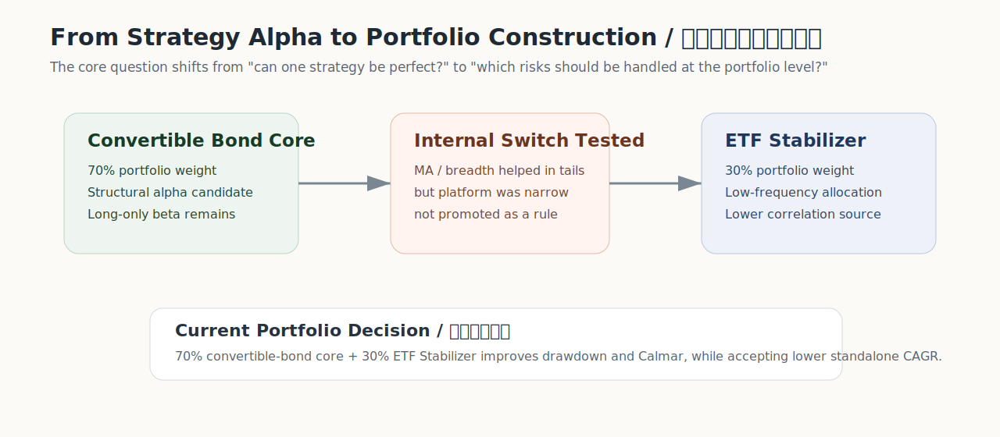

# Convertible Bond Core + ETF Stabilizer Bridge

## One-line Thesis

Convertible bonds carry the return engine. ETF makes the curve easier to hold.

可转债承担收益引擎，ETF 让资金曲线更可持有。

## Scope

This is not the bridge for the whole portfolio. It is specifically the bridge between:

- the convertible-bond `top12_keep37` core;
- the ETF Stabilizer V1.1 sleeve.

Crypto remains a separate flagship research line and is not part of this combined-portfolio test.

## Combined Portfolio

| Module | Role | CAGR | MDD | Calmar |
|---|---|---:|---:|---:|
| Convertible bond `top12_keep37` | Main return engine | 18.60% | -18.76% | 0.99 |
| ETF Stabilizer | Allocation and drawdown-control sleeve | 6.91% | -10.59% | 0.65 |
| 70% CB + 30% ETF Stabilizer | Combined portfolio | 15.49% | -10.77% | 1.44 |

The bridge is not a performance trick. It makes the trade-off visible: some CAGR is exchanged for a much lower drawdown and a higher Calmar ratio.

## Evidence Chain

| Stage | Public Evidence |
|---|---|
| Integration logic | [CB integration note](reports/可转债整合说明.md) |
| Combined portfolio validation | [combo validation report](reports/01_final_combo_validation_zh.md) |
| Result tables | [combo practical table](results/etf_final_cb_combo_practical.csv), [common-window summary](results/etf_final_cb_common_window_summary.csv), [decision table](results/etf_final_cb_decision.csv) |
| Code anchors | [Convertible Bonds Code](../../code/convertible-bonds/README.md), [ETF Stabilizer Code](../../code/etf-stabilizer/README.md) |

## Monitoring Focus

| Layer | Monitor |
|---|---|
| Convertible bonds | Credit events, strong-call data, liquidity, rank drift |
| ETF sleeve | Monthly signal state, cross-border premium, Treasury/Gold exposure |
| Combined portfolio | Drawdown overlap, correlation, recovery speed, execution cost |

## Public Evidence Anchors

- [Evidence Index](../../docs/evidence-index.md)
- [Convertible Bonds](../convertible-bonds/README.md)
- [ETF Stabilizer](../etf-stabilizer/README.md)
