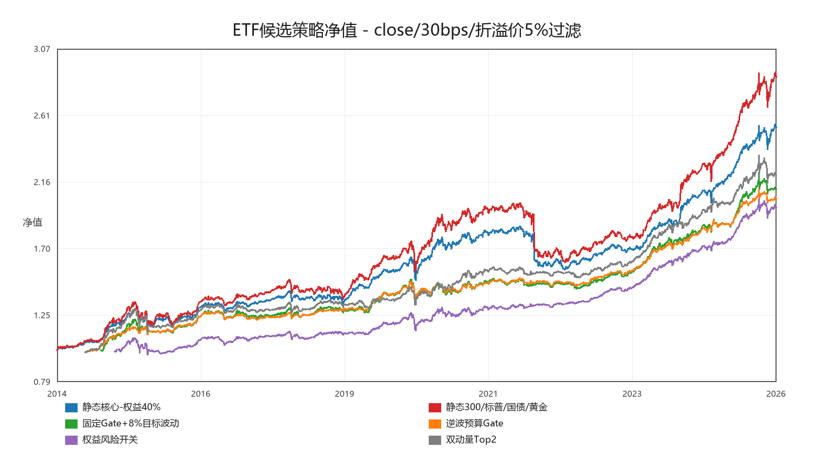
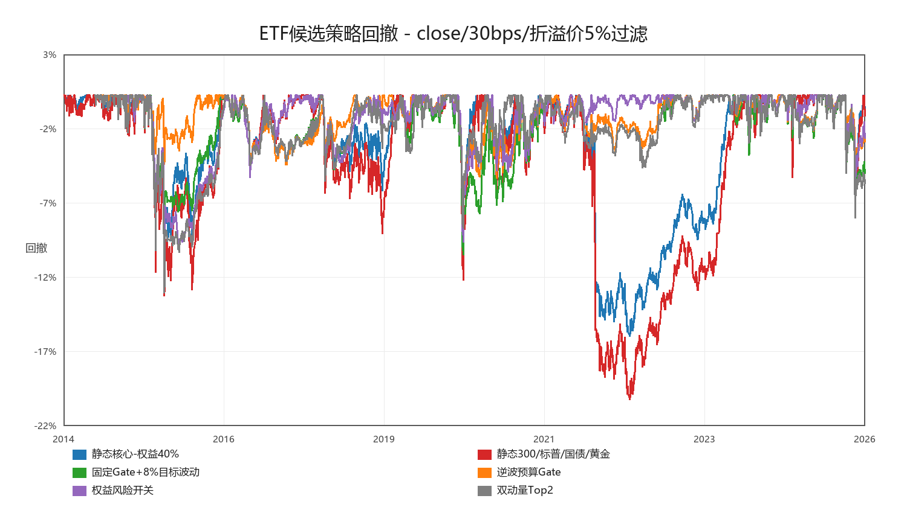
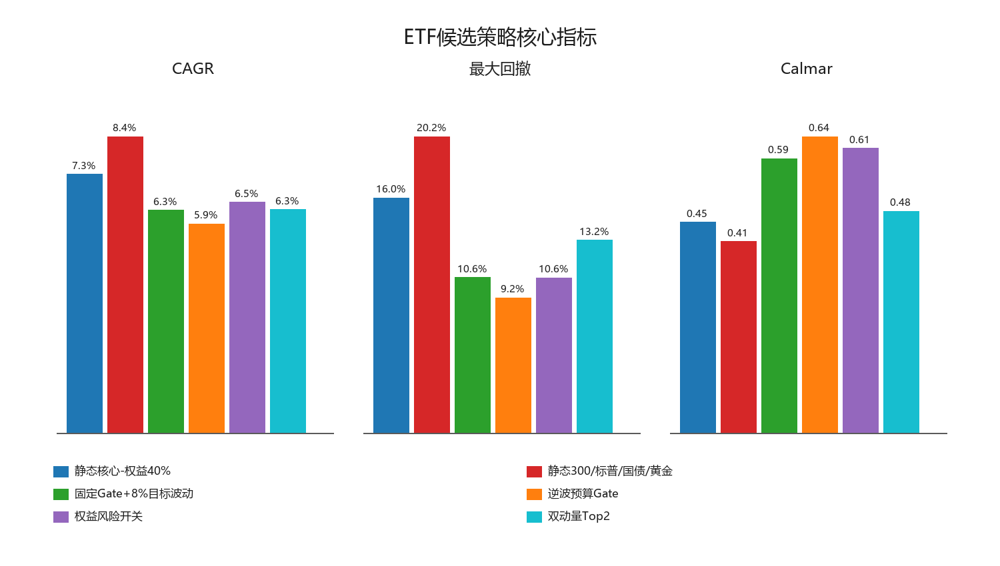
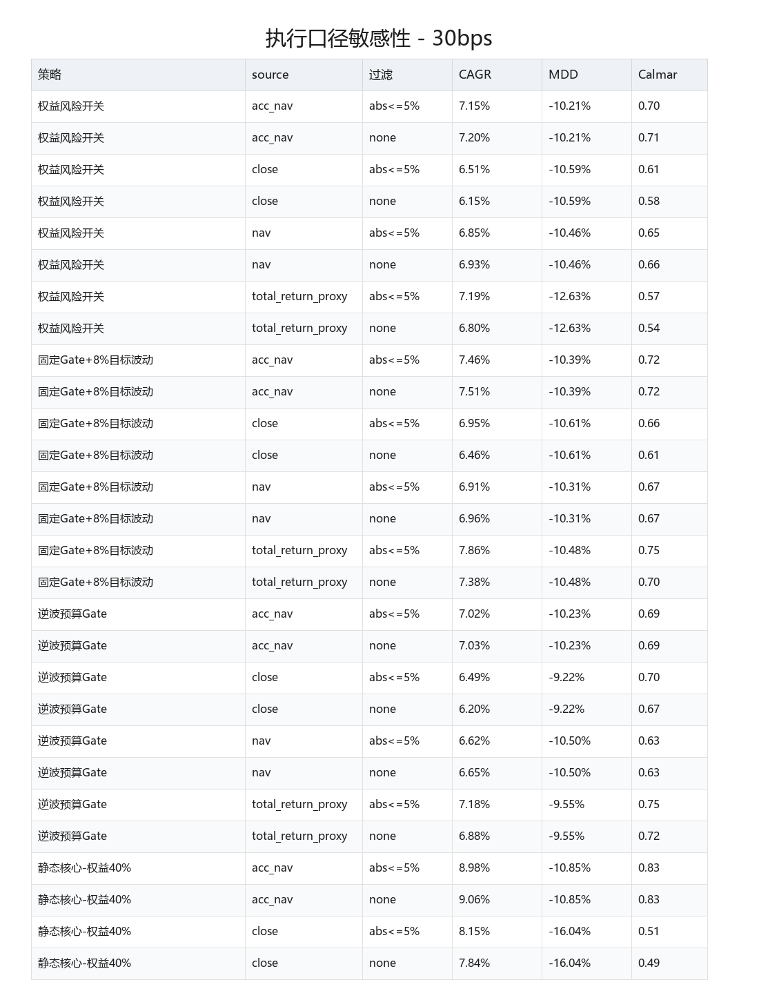
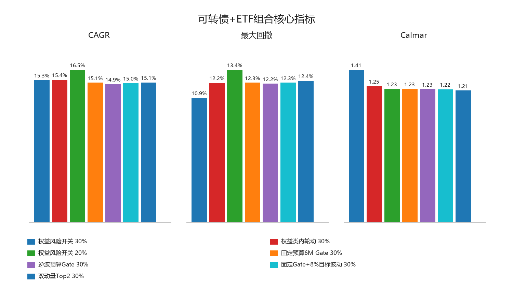
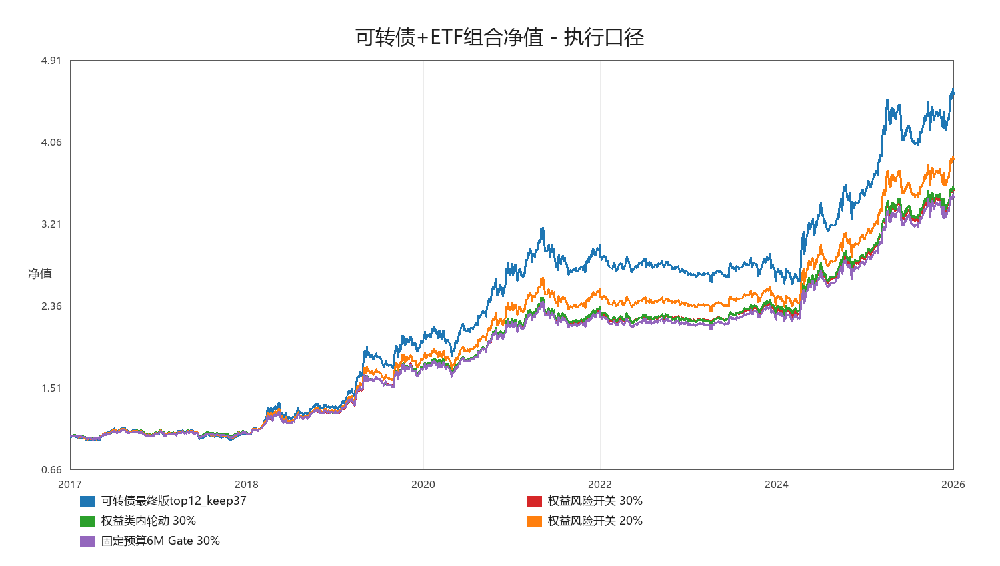
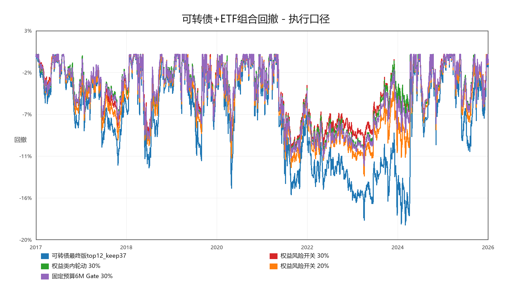

# ETF 稳定器最终可转债组合验证

生成时间：2026-05-22 17:44:41

## 这轮验证什么

- 可转债参考版本：`../../convertible-bonds/results/final/final_daily_returns.csv`，使用 `net` 日收益。
- ETF 不再只看 total-return proxy，而是同时检查 close、NAV、acc_nav、10bps/30bps、跨境 ETF 折溢价过滤。
- 主表改为同窗口比较；组合层也用可转债和所有 ETF 候选的共同窗口计算，避免样本起点差异影响“谁赢谁输”。

## 关键结论

- 执行口径下，满足晋级线的候选：权益风险开关。
- ETF 单体执行口径最优 Calmar：逆波预算Gate，CAGR 5.90%，MDD -9.22%，Calmar 0.64。
- 强基准 `静态核心-权益40%`：CAGR 7.29%，MDD -16.04%，Calmar 0.45。
- 可转债最终版单独：CAGR 18.60%，MDD -18.76%，Calmar 0.99。
- 组合层执行口径最优：可转债 + 权益风险开关 30.00%，CAGR 15.35%，MDD -10.92%，Calmar 1.41，对可转债 MDD 改善 7.83%。

## 执行口径 ETF 单体：同窗口

口径：`close`，成本 `30bps`，跨境 ETF 绝对折溢价 `5%` 过滤。此表所有 ETF 策略在同一时间窗口比较。

| 策略 | 类型 | CAGR | MDD | Calmar | Sharpe | worst12m | 最差3年CAGR | 最差3年MDD | 年换手 |
|---|---|---:|---:|---:|---:|---:|---:|---:|---:|
| 逆波预算Gate | 风险预算 | 5.90% | -9.22% | 0.64 | 1.22 | -3.02% | 0.41% | -9.22% | 2.50 |
| 权益风险开关 | 轮动/风控 | 6.51% | -10.59% | 0.61 | 1.11 | -5.11% | 0.33% | -10.59% | 1.60 |
| 固定Gate+8%目标波动 | 半静态风控 | 6.28% | -10.61% | 0.59 | 1.00 | -4.07% | -0.39% | -10.61% | 3.35 |
| 双动量Top2 | 轮动/风控 | 6.30% | -13.16% | 0.48 | 0.95 | -5.18% | 0.47% | -13.16% | 2.67 |
| 固定预算6M Gate | 半静态风控 | 6.22% | -13.25% | 0.47 | 0.88 | -5.72% | -0.19% | -13.25% | 3.04 |
| 静态核心-权益40% | 静态基准 | 7.29% | -16.04% | 0.45 | 0.96 | -14.56% | -0.86% | -16.04% | 0.44 |
| 静态300/标普/国债/黄金 | 静态基准 | 8.36% | -20.24% | 0.41 | 0.88 | -18.69% | -1.89% | -20.24% | 0.55 |
| 权益类内轮动 | 轮动/风控 | 7.21% | -19.21% | 0.38 | 0.85 | -11.16% | 0.55% | -19.21% | 2.80 |
| 静态300/纳指/国债/黄金 | 静态基准 | 9.21% | -29.41% | 0.31 | 0.83 | -27.42% | -5.13% | -29.41% | 0.37 |

## 晋级判断

| 策略 | 类型 | CAGR差 | MDD改善 | 最差3年CAGR差 | 最差3年MDD改善 | 判断 |
|---|---|---:|---:|---:|---:|---|
| 静态300/标普/国债/黄金 | 静态基准 | 1.07% | -4.20% | -1.03% | -4.20% | 基准 |
| 静态300/纳指/国债/黄金 | 静态基准 | 1.91% | -13.36% | -4.27% | -13.36% | 基准 |
| 权益风险开关 | 轮动/风控 | -0.79% | 5.45% | 1.19% | 5.45% | 晋级 |
| 逆波预算Gate | 风险预算 | -1.40% | 6.83% | 1.27% | 6.83% | 观察 |
| 固定Gate+8%目标波动 | 半静态风控 | -1.01% | 5.44% | 0.47% | 5.44% | 观察 |
| 双动量Top2 | 轮动/风控 | -1.00% | 2.89% | 1.33% | 2.89% | 观察 |
| 固定预算6M Gate | 半静态风控 | -1.07% | 2.80% | 0.67% | 2.80% | 观察 |
| 权益类内轮动 | 轮动/风控 | -0.08% | -3.17% | 1.42% | -3.17% | 观察 |

## 可转债 + ETF 组合层

下表为执行口径组合：ETF 使用 close、30bps、折溢价 5% 过滤。

| ETF策略 | ETF权重 | CAGR | MDD | Calmar | Sharpe | 与可转债相关 | CAGR差 | MDD改善 | 波动差 |
|---|---:|---:|---:|---:|---:|---:|---:|---:|---:|
| 权益风险开关 | 30.00% | 15.35% | -10.92% | 1.41 | 1.27 | 0.26 | -3.25% | 7.83% | -4.43% |
| 权益类内轮动 | 30.00% | 15.37% | -12.25% | 1.25 | 1.24 | 0.30 | -3.23% | 6.51% | -4.12% |
| 权益风险开关 | 20.00% | 16.45% | -13.39% | 1.23 | 1.21 | 0.26 | -2.15% | 5.36% | -2.98% |
| 固定预算6M Gate | 30.00% | 15.05% | -12.26% | 1.23 | 1.23 | 0.29 | -3.54% | 6.49% | -4.24% |
| 逆波预算Gate | 30.00% | 14.91% | -12.16% | 1.23 | 1.25 | 0.23 | -3.69% | 6.59% | -4.55% |
| 固定Gate+8%目标波动 | 30.00% | 15.02% | -12.26% | 1.22 | 1.23 | 0.28 | -3.58% | 6.49% | -4.31% |
| 双动量Top2 | 30.00% | 15.07% | -12.42% | 1.21 | 1.24 | 0.27 | -3.53% | 6.34% | -4.34% |
| 权益类内轮动 | 20.00% | 16.46% | -14.26% | 1.15 | 1.20 | 0.30 | -2.14% | 4.49% | -2.79% |
| 固定预算6M Gate | 20.00% | 16.25% | -14.27% | 1.14 | 1.19 | 0.29 | -2.35% | 4.48% | -2.87% |
| 逆波预算Gate | 20.00% | 16.16% | -14.21% | 1.14 | 1.20 | 0.23 | -2.44% | 4.55% | -3.06% |
| 固定Gate+8%目标波动 | 20.00% | 16.23% | -14.27% | 1.14 | 1.19 | 0.28 | -2.37% | 4.48% | -2.91% |
| 双动量Top2 | 20.00% | 16.26% | -14.38% | 1.13 | 1.20 | 0.27 | -2.33% | 4.38% | -2.93% |
| 静态核心-权益40% | 30.00% | 15.51% | -15.07% | 1.03 | 1.24 | 0.34 | -3.09% | 3.69% | -4.03% |
| 静态核心-权益40% | 20.00% | 16.56% | -16.10% | 1.03 | 1.20 | 0.34 | -2.04% | 2.65% | -2.74% |
| 静态300/标普/国债/黄金 | 20.00% | 16.81% | -16.61% | 1.01 | 1.20 | 0.34 | -1.79% | 2.15% | -2.56% |
| 静态300/标普/国债/黄金 | 30.00% | 15.89% | -15.84% | 1.00 | 1.24 | 0.34 | -2.71% | 2.92% | -3.74% |
| 可转债最终版top12_keep37 | 0.00% | 18.60% | -18.76% | 0.99 | 1.13 | 1.00 | 0.00% | 0.00% | 0.00% |
| 静态300/纳指/国债/黄金 | 20.00% | 16.97% | -17.58% | 0.97 | 1.20 | 0.32 | -1.63% | 1.18% | -2.44% |
| 静态300/纳指/国债/黄金 | 30.00% | 16.11% | -17.89% | 0.90 | 1.24 | 0.32 | -2.49% | 0.86% | -3.52% |

## 口径敏感性

| 策略 | source | 成本 | 折溢价过滤 | CAGR | MDD | Calmar |
|---|---|---:|---|---:|---:|---:|
| 双动量Top2 | acc_nav | 10bps | abs<=5% | 7.93% | -12.75% | 0.62 |
| 双动量Top2 | acc_nav | 10bps | none | 7.72% | -12.75% | 0.61 |
| 双动量Top2 | acc_nav | 30bps | abs<=5% | 7.38% | -12.75% | 0.58 |
| 双动量Top2 | acc_nav | 30bps | none | 7.19% | -12.75% | 0.56 |
| 双动量Top2 | close | 10bps | abs<=5% | 7.77% | -13.16% | 0.59 |
| 双动量Top2 | close | 10bps | none | 7.19% | -13.16% | 0.55 |
| 双动量Top2 | close | 30bps | abs<=5% | 7.21% | -13.16% | 0.55 |
| 双动量Top2 | close | 30bps | none | 6.67% | -13.16% | 0.51 |
| 双动量Top2 | nav | 10bps | abs<=5% | 7.69% | -13.07% | 0.59 |
| 双动量Top2 | nav | 10bps | none | 7.45% | -13.07% | 0.57 |
| 双动量Top2 | nav | 30bps | abs<=5% | 7.16% | -13.07% | 0.55 |
| 双动量Top2 | nav | 30bps | none | 6.93% | -13.07% | 0.53 |
| 双动量Top2 | total_return_proxy | 10bps | abs<=5% | 8.56% | -15.66% | 0.55 |
| 双动量Top2 | total_return_proxy | 10bps | none | 8.18% | -15.66% | 0.52 |
| 双动量Top2 | total_return_proxy | 30bps | abs<=5% | 7.95% | -15.66% | 0.51 |
| 双动量Top2 | total_return_proxy | 30bps | none | 7.62% | -15.66% | 0.49 |
| 权益风险开关 | acc_nav | 10bps | abs<=5% | 7.47% | -10.21% | 0.73 |
| 权益风险开关 | acc_nav | 10bps | none | 7.45% | -10.21% | 0.73 |
| 权益风险开关 | acc_nav | 30bps | abs<=5% | 7.15% | -10.21% | 0.70 |
| 权益风险开关 | acc_nav | 30bps | none | 7.20% | -10.21% | 0.71 |
| 权益风险开关 | close | 10bps | abs<=5% | 6.85% | -10.59% | 0.65 |
| 权益风险开关 | close | 10bps | none | 6.41% | -10.59% | 0.61 |
| 权益风险开关 | close | 30bps | abs<=5% | 6.51% | -10.59% | 0.61 |
| 权益风险开关 | close | 30bps | none | 6.15% | -10.59% | 0.58 |
| 权益风险开关 | nav | 10bps | abs<=5% | 7.14% | -10.46% | 0.68 |
| 权益风险开关 | nav | 10bps | none | 7.15% | -10.46% | 0.68 |
| 权益风险开关 | nav | 30bps | abs<=5% | 6.85% | -10.46% | 0.65 |
| 权益风险开关 | nav | 30bps | none | 6.93% | -10.46% | 0.66 |
| 权益风险开关 | total_return_proxy | 10bps | abs<=5% | 7.55% | -12.63% | 0.60 |
| 权益风险开关 | total_return_proxy | 10bps | none | 7.10% | -12.63% | 0.56 |
| 权益风险开关 | total_return_proxy | 30bps | abs<=5% | 7.19% | -12.63% | 0.57 |
| 权益风险开关 | total_return_proxy | 30bps | none | 6.80% | -12.63% | 0.54 |
| 固定Gate+8%目标波动 | acc_nav | 10bps | abs<=5% | 8.15% | -10.25% | 0.79 |
| 固定Gate+8%目标波动 | acc_nav | 10bps | none | 8.12% | -10.25% | 0.79 |
| 固定Gate+8%目标波动 | acc_nav | 30bps | abs<=5% | 7.46% | -10.39% | 0.72 |
| 固定Gate+8%目标波动 | acc_nav | 30bps | none | 7.51% | -10.39% | 0.72 |
| 固定Gate+8%目标波动 | close | 10bps | abs<=5% | 7.68% | -10.52% | 0.73 |
| 固定Gate+8%目标波动 | close | 10bps | none | 7.14% | -10.52% | 0.68 |
| 固定Gate+8%目标波动 | close | 30bps | abs<=5% | 6.95% | -10.61% | 0.66 |
| 固定Gate+8%目标波动 | close | 30bps | none | 6.46% | -10.61% | 0.61 |
| 固定Gate+8%目标波动 | nav | 10bps | abs<=5% | 7.61% | -10.18% | 0.75 |
| 固定Gate+8%目标波动 | nav | 10bps | none | 7.60% | -10.18% | 0.75 |
| 固定Gate+8%目标波动 | nav | 30bps | abs<=5% | 6.91% | -10.31% | 0.67 |
| 固定Gate+8%目标波动 | nav | 30bps | none | 6.96% | -10.31% | 0.67 |
| 固定Gate+8%目标波动 | total_return_proxy | 10bps | abs<=5% | 8.64% | -10.38% | 0.83 |
| 固定Gate+8%目标波动 | total_return_proxy | 10bps | none | 8.09% | -10.38% | 0.78 |
| 固定Gate+8%目标波动 | total_return_proxy | 30bps | abs<=5% | 7.86% | -10.48% | 0.75 |
| 固定Gate+8%目标波动 | total_return_proxy | 30bps | none | 7.38% | -10.48% | 0.70 |
| 逆波预算Gate | acc_nav | 10bps | abs<=5% | 7.55% | -10.22% | 0.74 |
| 逆波预算Gate | acc_nav | 10bps | none | 7.51% | -10.22% | 0.73 |
| 逆波预算Gate | acc_nav | 30bps | abs<=5% | 7.02% | -10.23% | 0.69 |
| 逆波预算Gate | acc_nav | 30bps | none | 7.03% | -10.23% | 0.69 |
| 逆波预算Gate | close | 10bps | abs<=5% | 7.03% | -9.20% | 0.76 |
| 逆波预算Gate | close | 10bps | none | 6.69% | -9.20% | 0.73 |
| 逆波预算Gate | close | 30bps | abs<=5% | 6.49% | -9.22% | 0.70 |
| 逆波预算Gate | close | 30bps | none | 6.20% | -9.22% | 0.67 |
| 逆波预算Gate | nav | 10bps | abs<=5% | 7.16% | -10.49% | 0.68 |
| 逆波预算Gate | nav | 10bps | none | 7.13% | -10.49% | 0.68 |
| 逆波预算Gate | nav | 30bps | abs<=5% | 6.62% | -10.50% | 0.63 |
| 逆波预算Gate | nav | 30bps | none | 6.65% | -10.50% | 0.63 |
| 逆波预算Gate | total_return_proxy | 10bps | abs<=5% | 7.74% | -9.54% | 0.81 |
| 逆波预算Gate | total_return_proxy | 10bps | none | 7.38% | -9.54% | 0.77 |
| 逆波预算Gate | total_return_proxy | 30bps | abs<=5% | 7.18% | -9.55% | 0.75 |
| 逆波预算Gate | total_return_proxy | 30bps | none | 6.88% | -9.55% | 0.72 |
| 静态核心-权益40% | acc_nav | 10bps | abs<=5% | 9.08% | -10.85% | 0.84 |
| 静态核心-权益40% | acc_nav | 10bps | none | 9.07% | -10.85% | 0.84 |
| 静态核心-权益40% | acc_nav | 30bps | abs<=5% | 8.98% | -10.85% | 0.83 |
| 静态核心-权益40% | acc_nav | 30bps | none | 9.06% | -10.85% | 0.83 |
| 静态核心-权益40% | close | 10bps | abs<=5% | 8.26% | -16.04% | 0.51 |
| 静态核心-权益40% | close | 10bps | none | 7.86% | -16.04% | 0.49 |
| 静态核心-权益40% | close | 30bps | abs<=5% | 8.15% | -16.04% | 0.51 |
| 静态核心-权益40% | close | 30bps | none | 7.84% | -16.04% | 0.49 |
| 静态核心-权益40% | nav | 10bps | abs<=5% | 7.82% | -15.57% | 0.50 |
| 静态核心-权益40% | nav | 10bps | none | 7.83% | -15.57% | 0.50 |
| 静态核心-权益40% | nav | 30bps | abs<=5% | 7.71% | -15.57% | 0.50 |
| 静态核心-权益40% | nav | 30bps | none | 7.81% | -15.57% | 0.50 |
| 静态核心-权益40% | total_return_proxy | 10bps | abs<=5% | 10.42% | -12.63% | 0.82 |
| 静态核心-权益40% | total_return_proxy | 10bps | none | 10.00% | -12.63% | 0.79 |
| 静态核心-权益40% | total_return_proxy | 30bps | abs<=5% | 10.31% | -12.63% | 0.82 |
| 静态核心-权益40% | total_return_proxy | 30bps | none | 9.98% | -12.63% | 0.79 |

## 折溢价诊断

这里的 `abs(premium) <= 5%` 是保守执行过滤，不是收益最大化规则。正溢价和折价含义不完全一样；QDII ETF 的 NAV 也可能有时差，因此该过滤只能作为近似风控。

| code | start | end | 期末折溢价 | 近60日绝对均值 | P95绝对值 | P99绝对值 | >5%天数占比 | >10%天数占比 |
|---|---:|---:|---:|---:|---:|---:|---:|---:|
| 513500.SH | 2014-01-16 | 2026-05-15 | 2.54% | 4.02% | 7.27% | 14.72% | 9.85% | 2.27% |
| 513100.SH | 2013-05-15 | 2026-05-15 | 4.32% | 4.52% | 7.44% | 14.69% | 9.65% | 2.85% |

## 最大回撤归因

| 策略 | 起点 | 终点 | 深度 | 主要仓位 | 权益 | 国债 | 黄金 |
|---|---:|---:|---:|---|---:|---:|---:|
| 静态300/纳指/国债/黄金 | 2021-11-19 | 2022-10-28 | -29.41% | 510300.SH:25%; 513100.SH:25%; 511010.SH:25%; 518880.SH:25% | 50.00% | 25.00% | 25.00% |
| 静态300/标普/国债/黄金 | 2021-12-28 | 2022-10-11 | -20.24% | 510300.SH:25%; 513500.SH:25%; 511010.SH:25%; 518880.SH:25% | 50.00% | 25.00% | 25.00% |
| 权益类内轮动 | 2015-06-08 | 2015-08-25 | -19.21% | 510300.SH:40%; 511010.SH:40%; 518880.SH:20% | 40.00% | 40.00% | 20.00% |
| 静态核心-权益40% | 2021-12-31 | 2022-10-11 | -16.04% | 511010.SH:40%; 510300.SH:20%; 513500.SH:20%; 518880.SH:20% | 40.00% | 40.00% | 20.00% |
| 固定预算6M Gate | 2015-06-12 | 2015-08-25 | -13.25% | 511010.SH:44%; 510300.SH:25%; 513500.SH:25%; 518880.SH:6% | 50.00% | 44.23% | 5.77% |
| 双动量Top2 | 2015-06-08 | 2015-08-25 | -13.16% | 511010.SH:50%; 510300.SH:25%; 513500.SH:25% | 50.00% | 50.00% | 0.00% |
| 固定Gate+8%目标波动 | 2020-02-21 | 2020-03-23 | -10.61% | 511010.SH:32%; 510300.SH:23%; 513500.SH:23%; 518880.SH:23% | 45.17% | 32.24% | 22.59% |
| 权益风险开关 | 2015-06-08 | 2015-08-25 | -10.59% | 511010.SH:40%; 510300.SH:20%; 513500.SH:20%; 518880.SH:20% | 40.00% | 40.00% | 20.00% |
| 逆波预算Gate | 2020-02-21 | 2020-03-23 | -9.22% | 511010.SH:45%; 513500.SH:20%; 518880.SH:19%; 510300.SH:16% | 36.38% | 45.00% | 18.62% |

## 场景组合补充

| 场景 | ETF策略 | ETF权重 | CAGR | MDD | Calmar |
|---|---|---:|---:|---:|---:|
| acc_nav_30bps_filter5 | 静态300/纳指/国债/黄金 | 30.00% | 21.20% | -12.56% | 1.69 |
| acc_nav_30bps_filter5 | 静态300/纳指/国债/黄金 | 20.00% | 20.51% | -14.02% | 1.46 |
| acc_nav_30bps_filter5 | 权益风险开关 | 30.00% | 15.57% | -11.18% | 1.39 |
| acc_nav_30bps_filter5 | 静态300/标普/国债/黄金 | 30.00% | 16.34% | -12.21% | 1.34 |
| acc_nav_30bps_filter5 | 固定预算6M Gate | 30.00% | 15.38% | -11.56% | 1.33 |
| acc_nav_30bps_filter5 | 固定Gate+8%目标波动 | 30.00% | 15.31% | -11.56% | 1.32 |
| close_30bps_filter5 | 权益风险开关 | 30.00% | 15.35% | -10.92% | 1.41 |
| close_30bps_filter5 | 权益类内轮动 | 30.00% | 15.37% | -12.25% | 1.25 |
| close_30bps_filter5 | 权益风险开关 | 20.00% | 16.45% | -13.39% | 1.23 |
| close_30bps_filter5 | 固定预算6M Gate | 30.00% | 15.05% | -12.26% | 1.23 |
| close_30bps_filter5 | 逆波预算Gate | 30.00% | 14.91% | -12.16% | 1.23 |
| close_30bps_filter5 | 固定Gate+8%目标波动 | 30.00% | 15.02% | -12.26% | 1.22 |
| research_proxy | 权益风险开关 | 30.00% | 15.43% | -11.25% | 1.37 |
| research_proxy | 静态300/纳指/国债/黄金 | 30.00% | 16.94% | -12.79% | 1.32 |
| research_proxy | 静态300/标普/国债/黄金 | 30.00% | 16.43% | -12.57% | 1.31 |
| research_proxy | 静态核心-权益40% | 30.00% | 15.96% | -12.44% | 1.28 |
| research_proxy | 逆波预算Gate | 30.00% | 15.07% | -11.96% | 1.26 |
| research_proxy | 固定预算6M Gate | 30.00% | 15.16% | -12.22% | 1.24 |

## 图表

## 研究判断

- 现在还不能说“半静态持有天然优于好轮动”，但这轮更严格地说明：简单轮动如果不能在 close、30bps、折溢价过滤下打败静态核心，就不应被升格为主线。
- ETF 单体和组合层要分开判断：单体最优不一定是组合最优，组合里更重要的是和可转债的低相关、回撤错位与波动下降。
- 短融/现金类资产仍可作为执行 fallback 测试对象，但不应再决定长期样本窗口；本轮组合验证以最终可转债版本和可交易 ETF close 口径为准。
