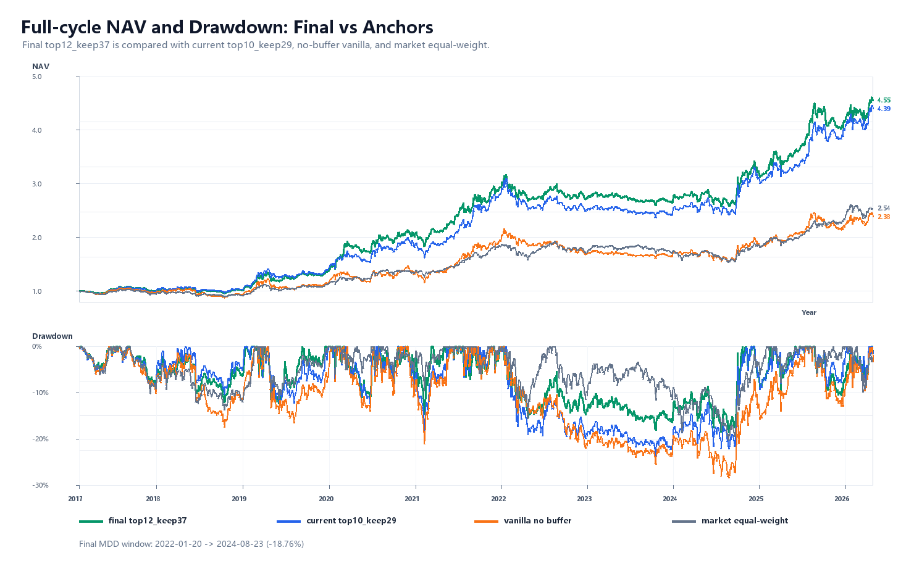
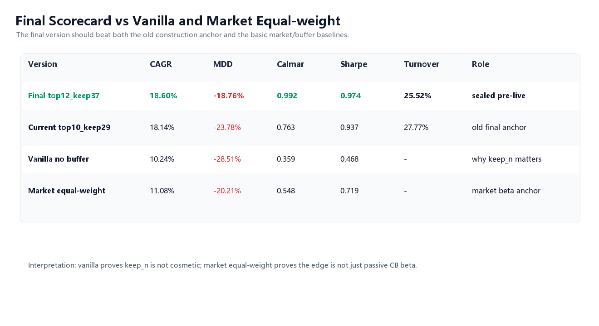
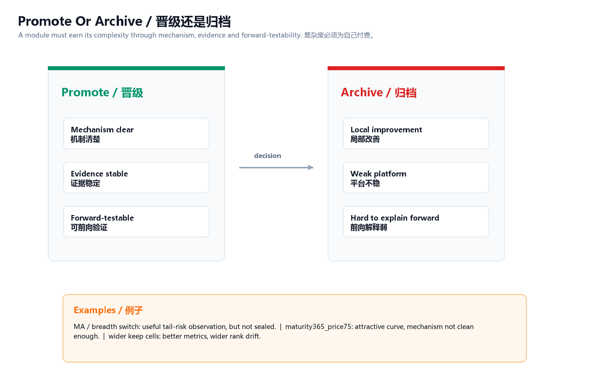

# China Convertible Bonds


## Thesis

China convertible bonds are a small-capital, low-frequency quant market where personal capital can sometimes fit better than large institutional capital.

This line studies whether a structurally constrained market can support a research-frozen, executable candidate built from credit-aware dual-low logic, underlying-stock momentum, turnover control, and realistic execution assumptions.

## Current Decision

Status: research-frozen candidate, pre-live validation required.

The current public version is:

```text
top12_keep37
weekly rebalance
T+2 execution assumption
15 bps one-way cost
C_rank_mom20 = price rank + premium rank + underlying stock 20-day momentum rank
buy top 12; retain existing holdings while still within top 37
```



## Evidence Snapshot

| Strategy | CAGR | Max Drawdown | Calmar | Sharpe | Turnover |
|---|---:|---:|---:|---:|---:|
| Original `top10_keep29` | 18.14% | -23.78% | 0.763 | 0.937 | 27.77% |
| Final `top12_keep37` | 18.60% | -18.76% | 0.992 | 0.974 | 25.52% |
| Vanilla baseline | 10.24% | -28.51% | 0.359 | n/a | n/a |
| Equal-weight benchmark | 11.08% | -20.21% | 0.548 | n/a | n/a |



## Why This Is A Flagship Line

- It starts from market fit, not from a parameter search.
- It has a clear return-source hypothesis.
- It compares baseline, filters, momentum, retention control, cost, execution lag, and robustness.
- It keeps rejected defensive filters visible instead of hiding them.
- It is strong enough to support portfolio-level construction with ETF Stabilizer.

## Boundaries

This is not a mature live product. It still needs pre-live checks around fills, strong-call data, liquidity, rank drift, data updates, and operational discipline.

The strategy remains long-only and still carries convertible-bond/equity beta. ETF is used at portfolio level because internal MA/breadth switches were not strong enough to seal.



## Code And Evidence Anchors

- [Code appendix](../../code/convertible-bonds/README.md)
- Public evidence index: [Evidence Index](../../docs/evidence-index.md)
- Notion hub: China Convertible Bond Research Hub
- Local source family before public migration: convertible-bond final archive and pre-live core
