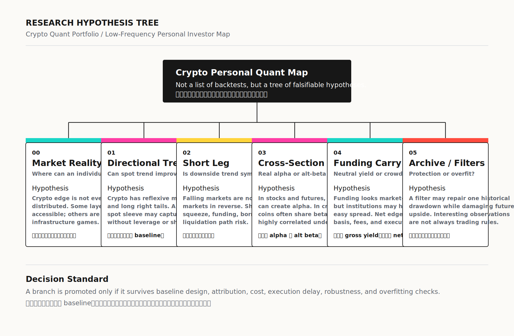
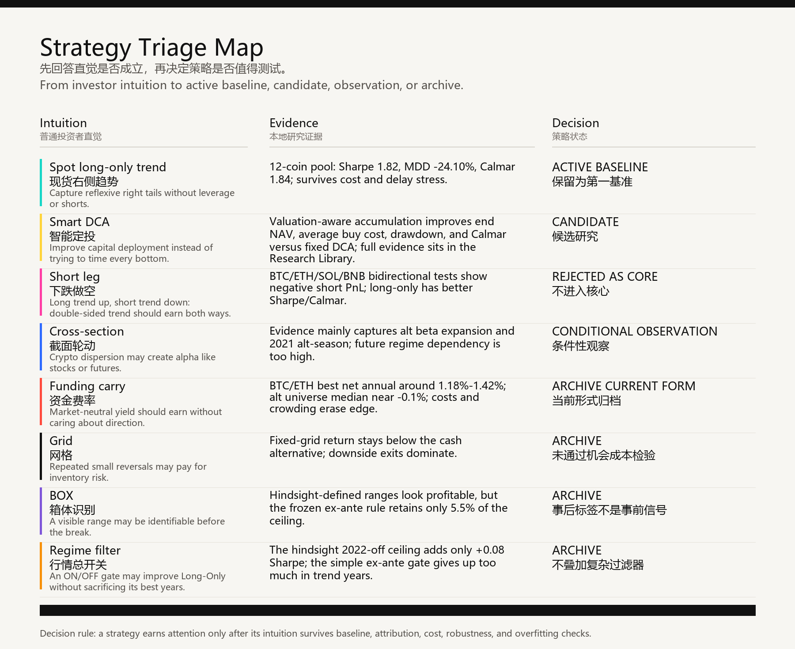
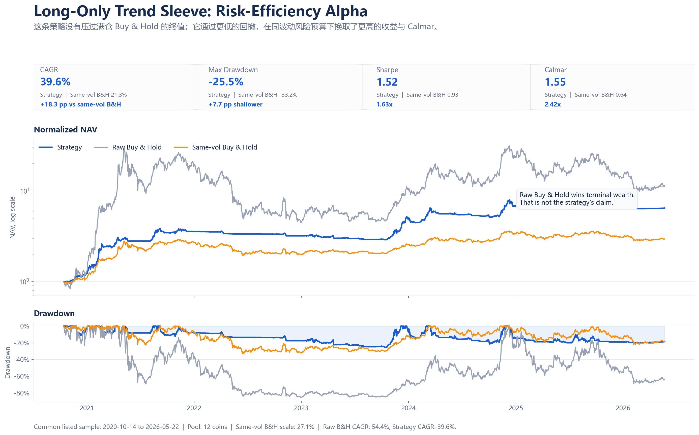
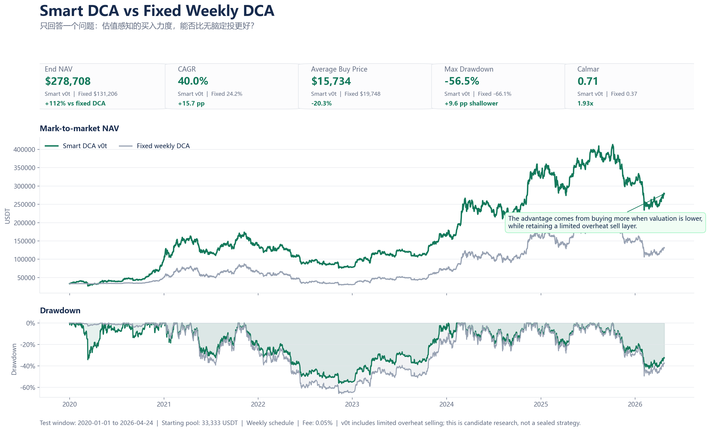

# Crypto Quant Research



## Thesis

Crypto is a high-volatility, globally traded market with visible opportunities, but the competition is uneven. The most infrastructure-heavy layers reward speed, fees, routing, exchange access, and inventory management.

This research therefore starts from slower daily/weekly signals that can be audited and realistically executed by an individual investor.

## Current Map

| Role | Research Line | Decision |
|---|---|---|
| Active baseline | Spot Long-Only Trend Sleeve | Current right-side baseline |
| Candidate | Smart DCA / Mayer Accumulation | Candidate accumulation framework |
| Observation | Cross-section | Regime-dependent observation |
| Archived | Short leg, single-venue funding carry, grid, BOX, regime filter | Not retained as core |



## Spot Long-Only Baseline

Fixed rule:

```text
Universe: liquid major Binance spot pairs
Entry: close above previous 20-day high and previous EMA200
Sizing: volatility-scaled at entry, no daily rebalance back to target
Exit: close-based 3ATR trailing exit
Shorting: prohibited
Cash: idle when sleeve has no signal
Per-symbol tuning: prohibited
```

Key predeployment evidence:

| Variant | CAGR | Sharpe | MDD | Calmar | Avg Exposure |
|---|---:|---:|---:|---:|---:|
| Same close gross | 44.32% | 1.82 | -24.10% | 1.84 | 19.83% |
| Next open gross | 44.28% | 1.82 | -24.09% | 1.84 | 19.83% |
| Next open 15bp | 43.42% | 1.79 | -24.90% | 1.74 | 19.84% |



## Smart DCA Candidate

Smart DCA asks whether capital that already plans to accumulate BTC can buy with more discipline than fixed weekly DCA.

| Metric | Smart v0 | Smart v0t | Fixed DCA |
|---|---:|---:|---:|
| End NAV | 289,281.92 | 278,707.99 | 131,205.89 |
| CAGR | 40.78% | 39.95% | 24.22% |
| Sharpe | 1.018 | 1.019 | 0.711 |
| Calmar | 0.745 | 0.707 | 0.366 |
| Max DD | -54.71% | -56.49% | -66.10% |

This remains a candidate, not a finished alpha claim.



## Why Archives Stay Visible

Archived Crypto ideas are useful because they show where common intuition breaks:

- shorting is not simply long-only in reverse;
- funding is not fixed interest;
- cross-section can be alt-beta expansion rather than stable alpha;
- grid/BOX ideas can look obvious after the path is complete but fail ex ante;
- regime filters can repair one bear market while damaging trend participation.

## Code And Evidence Anchors

- [Spot Long-Only code appendix](../../code/crypto/spot-long-only/README.md)
- Public evidence index: [Evidence Index](../../docs/evidence-index.md)
- Notion hub: Crypto Quant Research Hub
- Local source family before public migration: Crypto Spot Long-Only, Smart DCA, and archived strategy triage research
