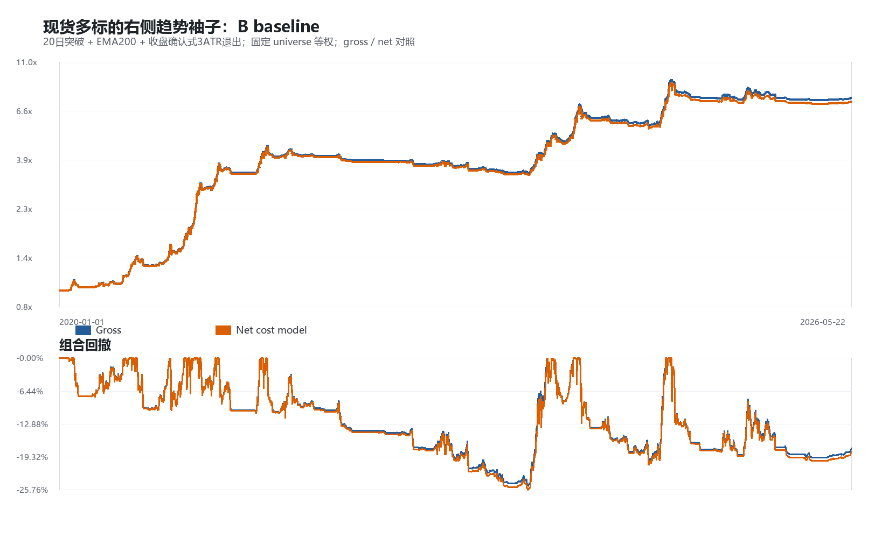
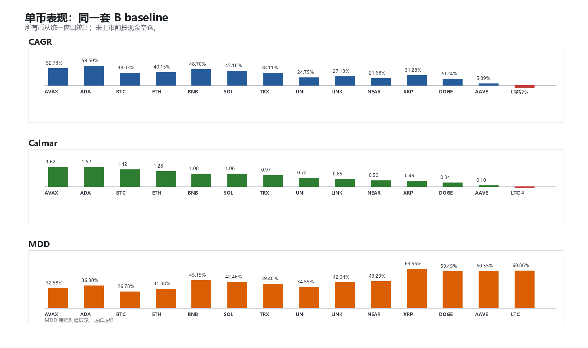
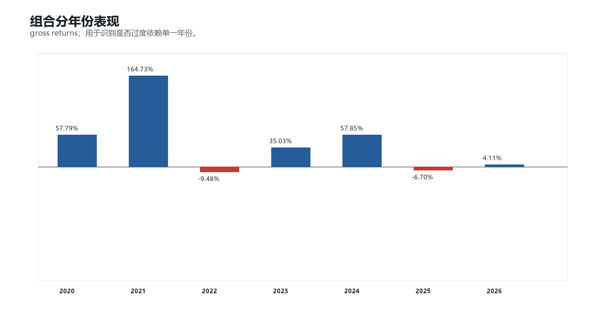

# Crypto 现货右侧 Long-Only B Baseline 扩展验证

> 生成时间：2026-05-23 18:30
> 数据：Binance spot daily klines，本地缓存 `spot_data_cache/`
> 统一窗口：2020-01-01 -> 2026-05-22

## 1. 本轮边界

本轮只验证冻结后的 B baseline，不做参数优化，不比较 A/C。Universe 先经过主流币可交易性筛选，再进入回测。

- 现货、long-only、无底仓、无做空。
- 入场后持有固定数量现货，不做每日目标权重再平衡。
- 新币上市前按现金空仓处理，收益为 0。
- Sharpe 使用 `rf=0`，现金收益不计入策略曲线。

数据起点：BTCUSDT 2020-01-01；ETHUSDT 2020-01-01；SOLUSDT 2020-08-11；XRPUSDT 2020-01-01；DOGEUSDT 2020-01-01；BNBUSDT 2020-01-01；TRXUSDT 2020-01-01；ADAUSDT 2020-01-01；LINKUSDT 2020-01-01；AVAXUSDT 2020-09-22；NEARUSDT 2020-10-14；LTCUSDT 2020-01-01；AAVEUSDT 2020-10-15；UNIUSDT 2020-09-17。

## 2. Universe 筛选

候选池：BTCUSDT, ETHUSDT, BNBUSDT, SOLUSDT, XRPUSDT, ADAUSDT, DOGEUSDT, LINKUSDT, LTCUSDT, AVAXUSDT, TRXUSDT, DOTUSDT, BCHUSDT, XLMUSDT, ETCUSDT, ATOMUSDT, FILUSDT, NEARUSDT, UNIUSDT, AAVEUSDT, APTUSDT, ARBUSDT, OPUSDT, SUIUSDT

筛选规则：

- 上市/数据历史不少于 `1825` 天。
- 数据覆盖率不低于 `95%`。
- 最近 90 日 median quote volume 不低于 `10,000,000` USDT。
- 最近 90 日 median daily trades 不低于 `20,000`。
- 排除稳定币、法币、杠杆代币。

通过筛选并进入回测：BTCUSDT, ETHUSDT, SOLUSDT, XRPUSDT, DOGEUSDT, BNBUSDT, TRXUSDT, ADAUSDT, LINKUSDT, AVAXUSDT, NEARUSDT, LTCUSDT, AAVEUSDT, UNIUSDT

| Symbol | Status | Data start | History days | Coverage | Median quote vol 90d | Median trades 90d | Failed reasons |
|---|---:|---:|---:|---:|---:|---:|---|
| BTCUSDT | PASS | 2020-01-01 | 2334 | 100.0% | 1,301,237,305 | 3,284,027 |  |
| ETHUSDT | PASS | 2020-01-01 | 2334 | 100.0% | 695,852,871 | 3,583,074 |  |
| SOLUSDT | PASS | 2020-08-11 | 2111 | 100.0% | 242,090,504 | 815,882 |  |
| XRPUSDT | PASS | 2020-01-01 | 2334 | 100.0% | 136,478,033 | 600,016 |  |
| DOGEUSDT | PASS | 2020-01-01 | 2334 | 100.0% | 79,367,735 | 606,900 |  |
| BNBUSDT | PASS | 2020-01-01 | 2334 | 100.0% | 75,664,955 | 816,762 |  |
| TRXUSDT | PASS | 2020-01-01 | 2334 | 100.0% | 34,784,979 | 78,470 |  |
| ADAUSDT | PASS | 2020-01-01 | 2334 | 100.0% | 30,231,032 | 115,310 |  |
| LINKUSDT | PASS | 2020-01-01 | 2334 | 100.0% | 26,171,977 | 64,086 |  |
| AVAXUSDT | PASS | 2020-09-22 | 2069 | 100.0% | 18,901,735 | 58,374 |  |
| NEARUSDT | PASS | 2020-10-14 | 2047 | 100.0% | 17,564,886 | 91,318 |  |
| LTCUSDT | PASS | 2020-01-01 | 2334 | 100.0% | 16,370,066 | 148,090 |  |
| AAVEUSDT | PASS | 2020-10-15 | 2046 | 100.0% | 12,796,341 | 129,858 |  |
| UNIUSDT | PASS | 2020-09-17 | 2074 | 100.0% | 10,111,166 | 56,566 |  |
| SUIUSDT | FAIL | 2023-05-03 | 1116 | 100.0% | 29,977,514 | 213,478 | history_days |
| BCHUSDT | FAIL | 2020-01-01 | 2334 | 100.0% | 8,375,601 | 55,557 | quote_volume_90d |
| DOTUSDT | FAIL | 2020-08-18 | 2104 | 100.0% | 7,864,036 | 41,940 | quote_volume_90d |
| FILUSDT | FAIL | 2020-10-15 | 2046 | 100.0% | 7,772,941 | 38,070 | quote_volume_90d |
| APTUSDT | FAIL | 2022-10-19 | 1312 | 100.0% | 7,733,942 | 33,046 | history_days;quote_volume_90d |
| XLMUSDT | FAIL | 2020-01-01 | 2334 | 100.0% | 7,454,217 | 69,112 | quote_volume_90d |
| ARBUSDT | FAIL | 2023-03-23 | 1157 | 100.0% | 6,012,346 | 27,706 | history_days;quote_volume_90d |
| OPUSDT | FAIL | 2022-06-01 | 1452 | 100.0% | 3,322,157 | 24,164 | history_days;quote_volume_90d |
| ETCUSDT | FAIL | 2020-01-01 | 2334 | 100.0% | 2,884,703 | 31,340 | quote_volume_90d |
| ATOMUSDT | FAIL | 2020-01-01 | 2334 | 100.0% | 2,326,318 | 15,316 | quote_volume_90d;trades_90d |

## 3. 固定规则

`20日突破 + EMA200 + 收盘确认式 3ATR trailing exit`

仓位：入场时按 `min(1, 40% / max(20日实现波动, 20%波动下限))` 投入；退出时全部卖出。

## 4. 组合结果

| 口径 | CAGR | Sharpe | MDD | Calmar | Vol | Avg Exposure | Final |
|---|---:|---:|---:|---:|---:|---:|---:|
| Gross | 37.38% | 1.62 | -24.96% | 1.50 | 20.91% | 19.36% | 7.61x |
| Net cost model | 36.55% | 1.59 | -25.76% | 1.42 | 20.94% | 19.36% | 7.32x |

## 5. 单币表现

| Symbol | Data start | CAGR | Sharpe | MDD | Calmar | Avg Exposure |
|---|---:|---:|---:|---:|---:|---:|
| AVAXUSDT | 2020-09-22 | 52.73% | 1.17 | -32.58% | 1.62 | 9.71% |
| ADAUSDT | 2020-01-01 | 59.50% | 1.38 | -36.80% | 1.62 | 17.67% |
| BTCUSDT | 2020-01-01 | 38.03% | 1.23 | -26.78% | 1.42 | 33.43% |
| ETHUSDT | 2020-01-01 | 40.15% | 1.13 | -31.38% | 1.28 | 25.88% |
| BNBUSDT | 2020-01-01 | 48.70% | 1.05 | -45.15% | 1.08 | 29.82% |
| SOLUSDT | 2020-08-11 | 45.16% | 1.24 | -42.46% | 1.06 | 15.62% |
| TRXUSDT | 2020-01-01 | 38.11% | 0.96 | -39.40% | 0.97 | 32.98% |
| UNIUSDT | 2020-09-17 | 24.75% | 0.75 | -34.55% | 0.72 | 12.94% |
| LINKUSDT | 2020-01-01 | 27.13% | 0.88 | -42.04% | 0.65 | 16.42% |
| NEARUSDT | 2020-10-14 | 21.68% | 0.70 | -43.29% | 0.50 | 10.33% |
| XRPUSDT | 2020-01-01 | 31.28% | 0.80 | -63.55% | 0.49 | 18.46% |
| DOGEUSDT | 2020-01-01 | 20.24% | 0.59 | -59.45% | 0.34 | 14.75% |
| AAVEUSDT | 2020-10-15 | 5.89% | 0.34 | -60.55% | 0.10 | 15.30% |
| LTCUSDT | 2020-01-01 | -8.57% | -0.10 | -60.86% | -0.14 | 17.68% |

## 6. 分年份表现

| Year | CAGR | Sharpe | MDD | Calmar |
|---|---:|---:|---:|---:|
| 2020 | 57.79% | 2.27 | -10.19% | 5.67 |
| 2021 | 164.73% | 3.37 | -11.63% | 14.16 |
| 2022 | -9.48% | -1.85 | -10.26% | -0.92 |
| 2023 | 35.03% | 1.54 | -12.46% | 2.81 |
| 2024 | 57.85% | 1.75 | -20.41% | 2.83 |
| 2025 | -6.70% | -0.50 | -11.80% | -0.57 |
| 2026 | 4.11% | 1.86 | -1.12% | 3.66 |

## 7. 贡献集中度

| Symbol | Final equity | CAGR | Calmar | Avg Exposure | Trades |
|---|---:|---:|---:|---:|---:|
| ADAUSDT | 19.77x | 59.50% | 1.62 | 17.67% | 15 |
| AVAXUSDT | 14.99x | 52.73% | 1.62 | 9.71% | 15 |
| BNBUSDT | 12.63x | 48.70% | 1.08 | 29.82% | 27 |
| SOLUSDT | 10.83x | 45.16% | 1.06 | 15.62% | 17 |
| ETHUSDT | 8.65x | 40.15% | 1.28 | 25.88% | 22 |
| TRXUSDT | 7.88x | 38.11% | 0.97 | 32.98% | 27 |
| BTCUSDT | 7.85x | 38.03% | 1.42 | 33.43% | 24 |
| XRPUSDT | 5.70x | 31.28% | 0.49 | 18.46% | 27 |
| LINKUSDT | 4.64x | 27.13% | 0.65 | 16.42% | 20 |
| UNIUSDT | 4.11x | 24.75% | 0.72 | 12.94% | 15 |
| NEARUSDT | 3.51x | 21.68% | 0.50 | 10.33% | 18 |
| DOGEUSDT | 3.25x | 20.24% | 0.34 | 14.75% | 27 |
| AAVEUSDT | 1.44x | 5.89% | 0.10 | 15.30% | 22 |
| LTCUSDT | 0.56x | -8.57% | -0.14 | 17.68% | 28 |

## 8. 初步结论

这一步的目的不是证明可以交易，而是确认：在现货数据、扩展 universe、统一窗口下，B baseline 是否仍有可观察的 gross edge。

如果组合层表现稳定，但贡献主要集中在少数币或少数年份，下一步应做分行情归因和 walk-forward，而不是立刻增加过滤器。
