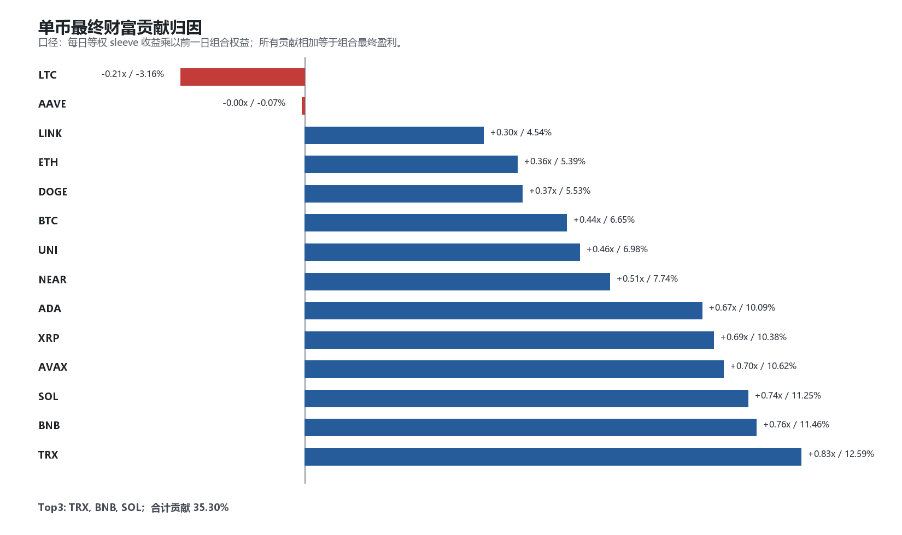
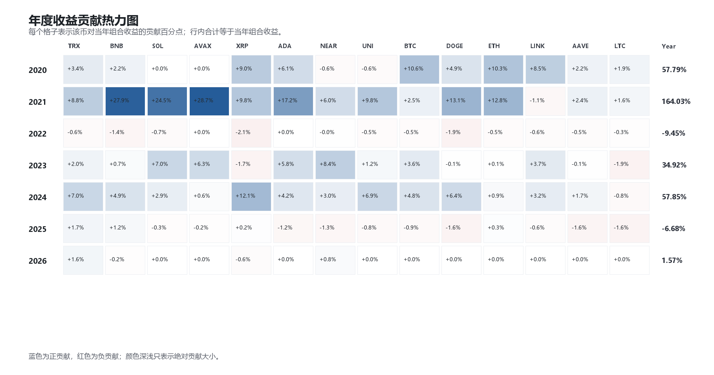
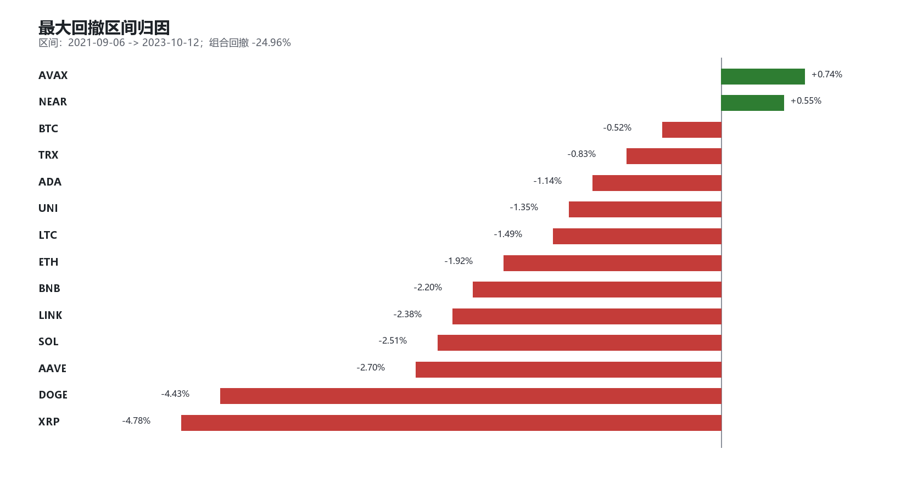

# 右侧现货 long-only：B baseline 归因报告

生成时间：2026-05-23 18:30:29

## 1. 归因口径

本报告只做归因，不改参数，不新增过滤器。

- Universe：5 年历史 + 流动性筛选后的现货主流币池。
- 策略：20 日突破 + EMA200 + close-based 3ATR trailing exit。
- 组合：每个币一个 sleeve，组合层固定等权。
- 归因：每日组合收益为 `mean(symbol_return)`；每日财富贡献为 `前一日组合权益 * symbol_return / N`。
- 这个口径下，所有单币贡献相加，严格等于组合最终盈利。

## 2. 组合层结果

- 起止区间：2020-01-01 至 2026-05-22。
- 入选标的：BTCUSDT, ETHUSDT, SOLUSDT, XRPUSDT, DOGEUSDT, BNBUSDT, TRXUSDT, ADAUSDT, LINKUSDT, AVAXUSDT, NEARUSDT, LTCUSDT, AAVEUSDT, UNIUSDT。
- Gross final equity：7.61x。
- Net final equity：7.32x。
- Gross profit：6.61x。
- Net cost drag：-0.29x。
- 最大回撤：-24.96%，区间 2021-09-06 至 2023-10-12。

## 3. 单币最终财富贡献

| Symbol | Wealth contribution | Share of gross profit | Avg exposure | CAGR | Calmar | Trades |
|---|---:|---:|---:|---:|---:|---:|
| TRXUSDT | 0.83x | 12.59% | 32.98% | 38.11% | 0.97 | 27 |
| BNBUSDT | 0.76x | 11.46% | 29.82% | 48.70% | 1.08 | 27 |
| SOLUSDT | 0.74x | 11.25% | 15.62% | 45.16% | 1.06 | 17 |
| AVAXUSDT | 0.70x | 10.62% | 9.71% | 52.73% | 1.62 | 15 |
| XRPUSDT | 0.69x | 10.38% | 18.46% | 31.28% | 0.49 | 27 |
| ADAUSDT | 0.67x | 10.09% | 17.67% | 59.50% | 1.62 | 15 |
| NEARUSDT | 0.51x | 7.74% | 10.33% | 21.68% | 0.50 | 18 |
| UNIUSDT | 0.46x | 6.98% | 12.94% | 24.75% | 0.72 | 15 |
| BTCUSDT | 0.44x | 6.65% | 33.43% | 38.03% | 1.42 | 24 |
| DOGEUSDT | 0.37x | 5.53% | 14.75% | 20.24% | 0.34 | 27 |
| ETHUSDT | 0.36x | 5.39% | 25.88% | 40.15% | 1.28 | 22 |
| LINKUSDT | 0.30x | 4.54% | 16.42% | 27.13% | 0.65 | 20 |
| AAVEUSDT | -0.00x | -0.07% | 15.30% | 5.89% | 0.10 | 22 |
| LTCUSDT | -0.21x | -3.16% | 17.68% | -8.57% | -0.14 | 28 |

集中度：

- Top1 贡献占比：12.59%。
- Top3 贡献占比：35.30%，主要是 TRX, BNB, SOL。
- Top5 贡献占比：56.31%。
- 正贡献有效标的数：10.96。
- 负贡献标的：AAVE, LTC。

## 4. 核心币与非核心币

| Group | Wealth contribution | Share | Symbols |
|---|---:|---:|---|
| BTC_ETH | 0.80x | 12.04% | BTCUSDT, ETHUSDT |
| BTC_ETH_BNB_SOL | 2.30x | 34.75% | BTCUSDT, ETHUSDT, BNBUSDT, SOLUSDT |
| NON_CORE_REST | 4.32x | 65.25% | TRXUSDT, AVAXUSDT, XRPUSDT, ADAUSDT, NEARUSDT, UNIUSDT, DOGEUSDT, LINKUSDT, AAVEUSDT, LTCUSDT |

解释：

- BTC/ETH 不是本策略收益的主要来源，只贡献约 12.04%。
- BTC/ETH/BNB/SOL 合计约 34.75%。
- 其余主流 alt 合计贡献更高，因此这个策略本质上不是纯 BTC/ETH trend sleeve，而是主流 alt right-tail capture。

## 5. 年度贡献

- 2020：组合 57.79%；贡献靠前：BTC 10.62%, ETH 10.35%, XRP 9.04%；低贡献/拖累：NEAR -0.60%, UNI -0.64%。
- 2021：组合 164.03%；贡献靠前：AVAX 28.73%, BNB 27.90%, SOL 24.54%；低贡献/拖累：LTC 1.55%, LINK -1.10%。
- 2022：组合 -9.45%；贡献靠前：AVAX 0.00%, ADA 0.00%, NEAR -0.04%；低贡献/拖累：DOGE -1.87%, XRP -2.11%。
- 2023：组合 34.92%；贡献靠前：NEAR 8.38%, SOL 6.99%, AVAX 6.34%；低贡献/拖累：XRP -1.66%, LTC -1.89%。
- 2024：组合 57.85%；贡献靠前：XRP 12.05%, TRX 7.00%, UNI 6.92%；低贡献/拖累：AVAX 0.59%, LTC -0.76%。
- 2025：组合 -6.68%；贡献靠前：TRX 1.67%, BNB 1.18%, ETH 0.28%；低贡献/拖累：DOGE -1.62%, LTC -1.62%。
- 2026：组合 1.57%；贡献靠前：TRX 1.58%, NEAR 0.76%, SOL 0.00%；低贡献/拖累：BNB -0.22%, XRP -0.56%。

## 6. 最大回撤归因

| Symbol | Max-DD contribution |
|---|---:|
| XRPUSDT | -4.78% |
| DOGEUSDT | -4.43% |
| AAVEUSDT | -2.70% |
| SOLUSDT | -2.51% |
| LINKUSDT | -2.38% |
| BNBUSDT | -2.20% |
| ETHUSDT | -1.92% |
| LTCUSDT | -1.49% |
| UNIUSDT | -1.35% |
| ADAUSDT | -1.14% |
| TRXUSDT | -0.83% |
| BTCUSDT | -0.52% |
| NEARUSDT | 0.55% |
| AVAXUSDT | 0.74% |

## 7. 初步判断

当前归因没有显示“一两个币撑起全部收益”的危险信号：Top3 约 35.30%，正贡献有效标的数约 10.96。这比单点参数胜出更健康。

但它也暴露了一个更重要的结构事实：收益主要来自主流 alt 的趋势扩散，而不是 BTC/ETH 本身。如果未来要上实盘，组合设计应明确承认这一点：

1. BTC/ETH 可以是稳定性锚，但不是收益主引擎。
2. alt 池筛选必须比入场参数更重要，尤其要固定历史、流动性和交易所现货可交易性规则。
3. 下一步应做分阶段归因和滚动样本验证，确认 alt 扩散收益不是 2021 单周期幻觉。
