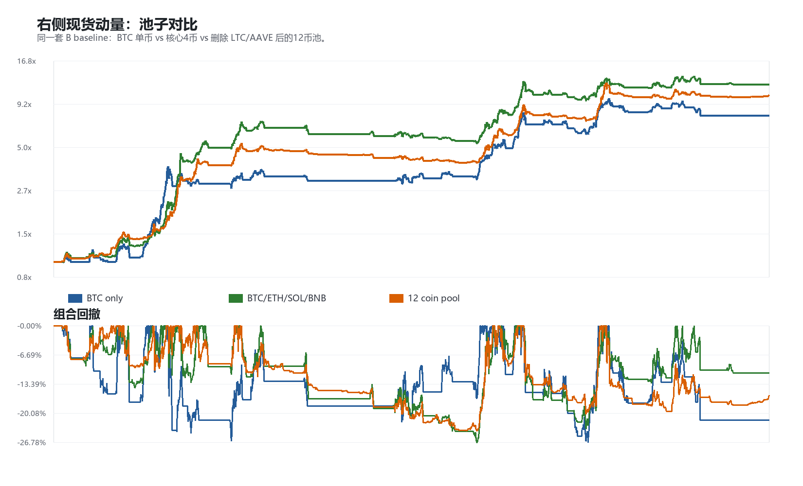
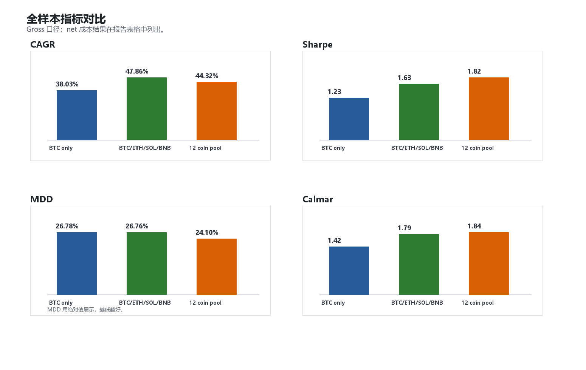
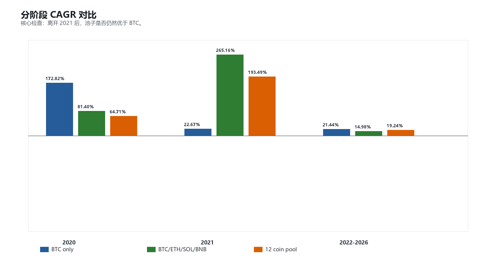

# 右侧现货动量：池子对比报告

生成时间：2026-05-23 18:28:56

## 1. 本轮问题

本轮不讨论“多币种配置”本身，只回答一个更窄的问题：

> 同一套右侧现货动量 baseline，在一个经过筛选并删除差币的有效池子里，是否比 BTC 单币更值得做？

策略逻辑保持不变：

- 20 日突破入场；
- EMA200 过滤；
- close-based 3ATR trailing exit；
- 入场时固定现货 units，持仓期间不动态调仓；
- 现金收益按 0 处理；
- 交易成本口径为 fee 0.10% + slippage 0.05% 单边。

样本窗口：2020-01-01 至 2026-05-22。

## 2. 对比池子

| Pool | Symbols |
|---|---|
| BTC only | BTCUSDT |
| BTC/ETH/SOL/BNB | BTCUSDT, ETHUSDT, SOLUSDT, BNBUSDT |
| 12 coin pool | BTCUSDT, ETHUSDT, SOLUSDT, XRPUSDT, DOGEUSDT, BNBUSDT, TRXUSDT, ADAUSDT, LINKUSDT, AVAXUSDT, NEARUSDT, UNIUSDT |

12 coin pool 的构造：从 5 年历史 + 流动性筛选后的 14 币池中删除 `LTCUSDT, AAVEUSDT`。删除理由不是参数优化，而是归因层面表现差：`LTC` 为明确负贡献，`AAVE` 接近零贡献且最大回撤期拖累明显。

## 3. 全样本结果

Gross：

| Pool | N | CAGR | Sharpe | MDD | Calmar | Final | Avg exposure |
|---|---:|---:|---:|---:|---:|---:|---:|
| BTC only | 1 | 38.03% | 1.23 | -26.78% | 1.42 | 7.85x | 33.43% |
| BTC/ETH/SOL/BNB | 4 | 47.86% | 1.63 | -26.76% | 1.79 | 12.18x | 26.19% |
| 12 coin pool | 12 | 44.32% | 1.82 | -24.10% | 1.84 | 10.43x | 19.83% |

Net cost model：

| Pool | N | CAGR | Sharpe | MDD | Calmar | Final | Avg exposure |
|---|---:|---:|---:|---:|---:|---:|---:|
| BTC only | 1 | 36.81% | 1.20 | -27.48% | 1.34 | 7.41x | 33.43% |
| BTC/ETH/SOL/BNB | 4 | 46.77% | 1.60 | -27.62% | 1.69 | 11.62x | 26.19% |
| 12 coin pool | 12 | 43.45% | 1.79 | -24.91% | 1.74 | 10.04x | 19.83% |

解读：

- BTC only 是必要基准：gross CAGR 38.03%，Calmar 1.42。
- Core4 全样本收益最高：gross CAGR 47.86%，final 12.18x。
- 12 coin pool 的全样本 CAGR 略低于 Core4，但 Sharpe 1.82、MDD -24.10%、Calmar 1.84 是三组里最均衡的。
- 相比 BTC only，12 coin pool 在 CAGR、Sharpe、MDD、Calmar、final 上都更好；这是当前最核心的正证据。

## 4. 分阶段稳定性

| Pool | Period | CAGR | Sharpe | MDD | Calmar | Final |
|---|---|---:|---:|---:|---:|---:|
| BTC only | 2020 | 172.82% | 2.63 | -17.43% | 9.92 | 2.73x |
| BTC only | 2021 | 22.67% | 0.75 | -26.44% | 0.86 | 1.23x |
| BTC only | 2022-2026 | 21.44% | 0.91 | -26.78% | 0.80 | 2.35x |
| BTC/ETH/SOL/BNB | 2020 | 81.40% | 2.34 | -14.18% | 5.74 | 1.81x |
| BTC/ETH/SOL/BNB | 2021 | 265.16% | 3.28 | -13.04% | 20.33 | 3.64x |
| BTC/ETH/SOL/BNB | 2022-2026 | 14.98% | 0.79 | -23.56% | 0.64 | 1.85x |
| 12 coin pool | 2020 | 64.71% | 2.41 | -10.07% | 6.43 | 1.65x |
| 12 coin pool | 2021 | 193.49% | 3.60 | -11.67% | 16.58 | 2.93x |
| 12 coin pool | 2022-2026 | 19.24% | 1.05 | -20.18% | 0.95 | 2.16x |

关键点：

- 2021 年 Core4 最强，说明 Core4 全样本优势明显吃到 SOL/BNB 的单轮大趋势。
- 2022-2026 阶段，12 coin pool CAGR 19.24%，低于 BTC only 的 21.44%，但高于 Core4 的 14.98%。
- 同一阶段，12 coin pool 的 Sharpe、MDD、Calmar 都优于 BTC only 和 Core4；所以它不是收益率单项胜出，而是风险调整后更稳。

## 5. 当前结论

当前应保留三个判断：

1. 右侧现货动量 baseline 本身仍然是核心，不需要改入场/出场参数。
2. 币池不是越大越好；`LTC/AAVE` 应先删掉。
3. 当前候选 baseline 应从 14 币池降为 12 币池，而不是继续扩散到更多币。

更谨慎的表述是：

> 12 coin pool 暂时是 BTC only 的升级候选。它全样本优于 BTC；在 2022-2026 阶段，绝对 CAGR 低于 BTC，但风险调整表现更好。Core4 全样本收益更高，所以下一步要比较“集中核心4币”与“分散12币池”在滚动样本和风险暴露上的稳定性。

## 6. 下一步建议

下一步不要新增过滤器，先做两个验证：

1. 滚动 2 年窗口：看 12 coin pool 相对 BTC 和 Core4 的超额是否稳定。
2. 风险暴露归一化：把三组拉到同一目标波动或同一平均暴露，再比较 CAGR、MDD、Calmar。

如果这两步后 12 coin pool 仍然更稳，它才有资格成为右侧现货动量的正式 baseline；否则就应考虑 Core4 或 BTC-only 作为更干净的实现。
