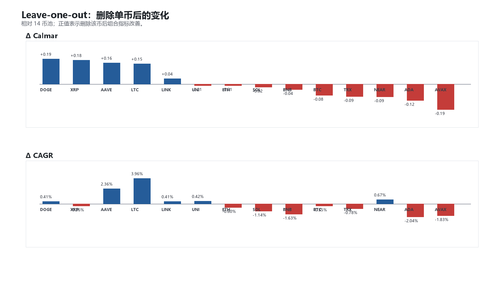
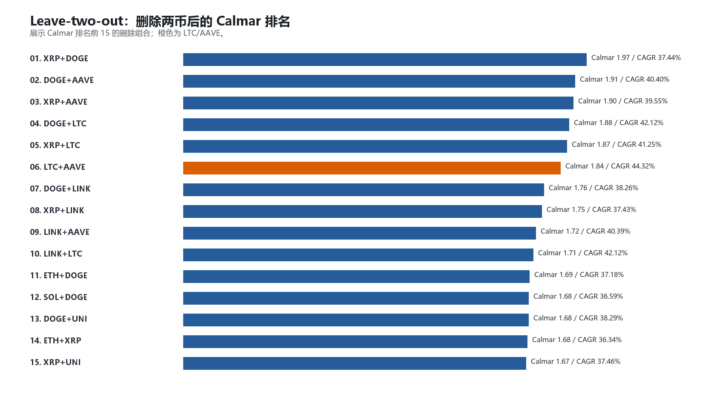
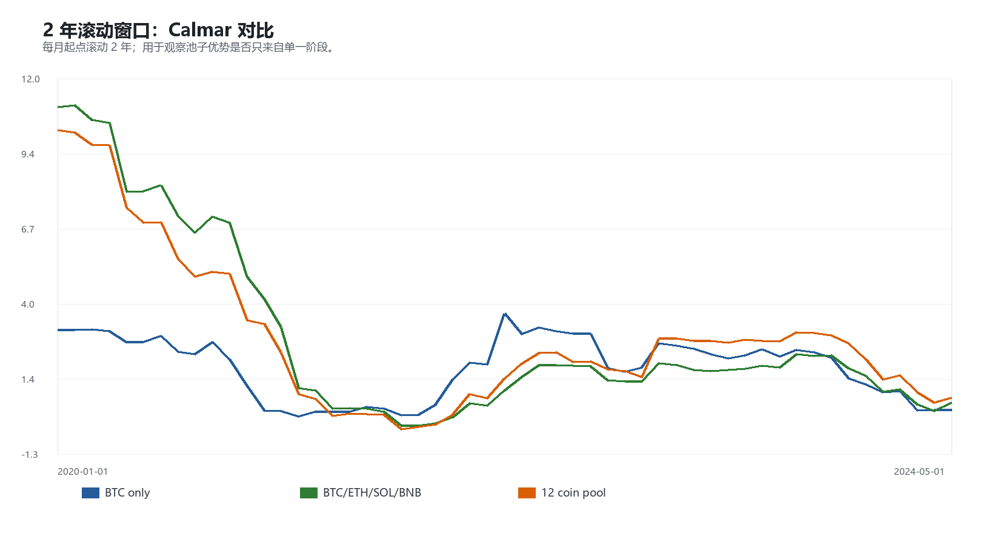
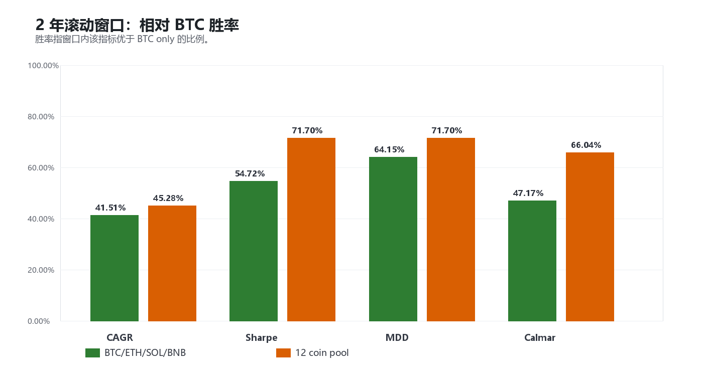

# 右侧现货动量：池子稳健性验证

生成时间：2026-05-23 18:38:22

## 1. 验证目标

本轮只验证币池稳健性，不改入场、不改出场、不新增过滤器。

核心问题：

> 从 14 币池删除 `LTC/AAVE` 得到 12 币池，是不是有稳健证据，而不是事后挑答案？

基础口径：

- 策略仍为 B baseline：20 日突破 + EMA200 + close-based 3ATR trailing exit。
- 样本窗口：2020-01-01 至 2026-05-22。
- 14 币池来自 5 年历史 + 流动性筛选。
- 12 币池：BTCUSDT, ETHUSDT, SOLUSDT, XRPUSDT, DOGEUSDT, BNBUSDT, TRXUSDT, ADAUSDT, LINKUSDT, AVAXUSDT, NEARUSDT, UNIUSDT。

## 2. 全样本三组结果

| Pool | N | CAGR | Sharpe | MDD | Calmar | Final |
|---|---:|---:|---:|---:|---:|---:|
| BTC only | 1 | 38.03% | 1.23 | -26.78% | 1.42 | 7.85x |
| BTC/ETH/SOL/BNB | 4 | 47.86% | 1.63 | -26.76% | 1.79 | 12.18x |
| 14 coin pool | 14 | 37.38% | 1.62 | -24.96% | 1.50 | 7.61x |
| 12 coin pool | 12 | 44.32% | 1.82 | -24.10% | 1.84 | 10.43x |

## 3. Leave-one-out

| Removed | CAGR | Sharpe | MDD | Calmar | Δ Calmar | Δ CAGR |
|---|---:|---:|---:|---:|---:|---:|
| DOGEUSDT | 37.79% | 1.63 | -22.44% | 1.68 | 0.19 | 0.41% |
| XRPUSDT | 37.02% | 1.62 | -22.13% | 1.67 | 0.18 | -0.36% |
| AAVEUSDT | 39.74% | 1.68 | -24.02% | 1.65 | 0.16 | 2.36% |
| LTCUSDT | 41.34% | 1.75 | -25.11% | 1.65 | 0.15 | 3.96% |
| LINKUSDT | 37.79% | 1.62 | -24.56% | 1.54 | 0.04 | 0.41% |
| UNIUSDT | 37.81% | 1.62 | -25.44% | 1.49 | -0.01 | 0.42% |
| ETHUSDT | 36.78% | 1.61 | -24.77% | 1.48 | -0.01 | -0.60% |
| SOLUSDT | 36.24% | 1.55 | -24.59% | 1.47 | -0.02 | -1.14% |
| BNBUSDT | 35.75% | 1.58 | -24.55% | 1.46 | -0.04 | -1.63% |
| BTCUSDT | 37.04% | 1.60 | -26.19% | 1.41 | -0.08 | -0.35% |
| TRXUSDT | 36.60% | 1.57 | -26.04% | 1.41 | -0.09 | -0.78% |
| NEARUSDT | 38.05% | 1.62 | -27.12% | 1.40 | -0.09 | 0.67% |
| ADAUSDT | 35.34% | 1.57 | -25.68% | 1.38 | -0.12 | -2.04% |
| AVAXUSDT | 35.55% | 1.54 | -27.15% | 1.31 | -0.19 | -1.83% |

解读：

- 删除后改善最明显的前 5 个：DOGEUSDT, XRPUSDT, AAVEUSDT, LTCUSDT, LINKUSDT。
- 删除后伤害最大的前 5 个：AVAXUSDT, ADAUSDT, NEARUSDT, TRXUSDT, BTCUSDT。
- `LTC` 在 leave-one-out 中属于明确应该删除的标的：删除后 Calmar 和 CAGR 同时改善。
- `AAVE` 单独删除的改善不一定最大，但它在归因中接近零贡献、最大回撤期拖累明显；所以更适合作为和 LTC 一起删除的风险清理项。

## 4. Leave-two-out

Calmar 前 10：

| Rank | Removed pair | CAGR | Sharpe | MDD | Calmar | Δ CAGR |
|---:|---|---:|---:|---:|---:|---:|
| 1 | XRPUSDT+DOGEUSDT | 37.44% | 1.63 | -19.05% | 1.97 | 0.05% |
| 2 | DOGEUSDT+AAVEUSDT | 40.40% | 1.70 | -21.17% | 1.91 | 3.02% |
| 3 | XRPUSDT+AAVEUSDT | 39.55% | 1.69 | -20.82% | 1.90 | 2.17% |
| 4 | DOGEUSDT+LTCUSDT | 42.12% | 1.77 | -22.40% | 1.88 | 4.74% |
| 5 | XRPUSDT+LTCUSDT | 41.25% | 1.75 | -22.06% | 1.87 | 3.86% |
| 6 | LTCUSDT+AAVEUSDT | 44.32% | 1.82 | -24.10% | 1.84 | 6.94% |
| 7 | DOGEUSDT+LINKUSDT | 38.26% | 1.63 | -21.77% | 1.76 | 0.88% |
| 8 | XRPUSDT+LINKUSDT | 37.43% | 1.62 | -21.43% | 1.75 | 0.05% |
| 9 | LINKUSDT+AAVEUSDT | 40.39% | 1.68 | -23.49% | 1.72 | 3.00% |
| 10 | LINKUSDT+LTCUSDT | 42.12% | 1.75 | -24.69% | 1.71 | 4.74% |

`LTC/AAVE` 删除组合的 Calmar 排名：第 6 / 91；CAGR 排名：第 1 / 91；Sharpe 排名：第 1 / 91。

解释：

- 如果只按 Calmar 排名扫描，`LTC/AAVE` 不是唯一可能组合。
- 但本轮删除规则不是“寻找最优两币删除”，而是只删除归因已经证明差的币。
- 因此 `LTC/AAVE` 可以作为保守清理，不应继续扩展成删除更多币的优化搜索。

## 5. 2 年滚动窗口

相对 BTC only 的滚动胜率：

| Challenger | Windows | CAGR win | Sharpe win | MDD win | Calmar win | Avg CAGR diff | Avg Calmar diff |
|---|---:|---:|---:|---:|---:|---:|---:|
| BTC/ETH/SOL/BNB | 53 | 41.51% | 54.72% | 64.15% | 47.17% | 9.77% | 1.10 |
| 12 coin pool | 53 | 45.28% | 71.70% | 71.70% | 66.04% | 4.23% | 1.08 |

## 6. 当前判断

稳健性结论要克制：

1. 删除 `LTC` 是硬结论。
2. 删除 `AAVE` 是合理的风险清理，但证据弱于 `LTC`。
3. `LTC/AAVE -> 12 coin pool` 是当前可接受的保守版本，但不是通过全组合扫描得到的“最优池子”。
4. 下一步不应继续删币，而应做同风险/同暴露归一化比较；否则很容易把币池筛选变成事后优化。

如果后续同风险/同暴露后，12 coin pool 仍然优于 BTC only，并且不明显弱于 Core4，它才适合晋升为右侧现货动量的正式 baseline。
