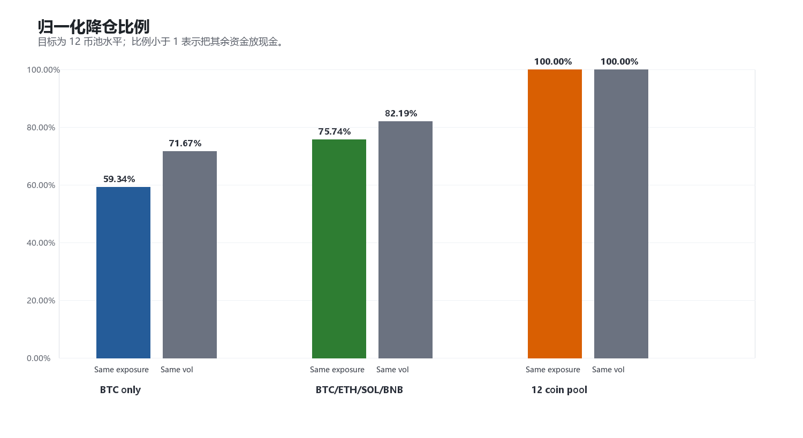
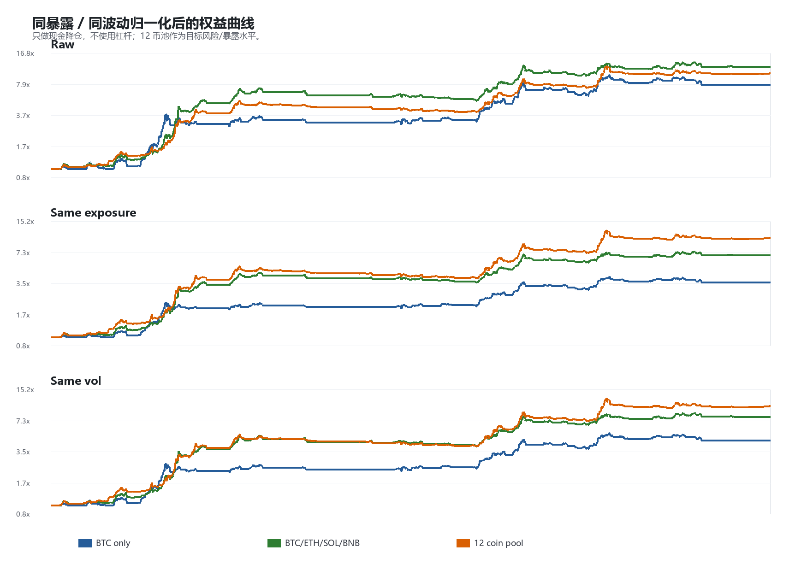
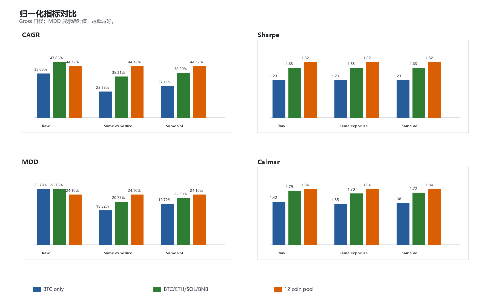

# 右侧现货动量：同风险 / 同暴露归一化对比

生成时间：2026-05-23 18:46:33

## 1. 验证目标

本轮只做归一化验证，不改信号、不改参数、不新增过滤器。

核心问题：

> 12 coin pool 的优势，是否只是因为暴露/波动更低，或者在同风险、同暴露下仍然成立？

样本窗口：2020-01-01 至 2026-05-22。

归一化规则：

- Same exposure：把 BTC only 和 Core4 现金降仓到 12 coin pool 的平均暴露水平。
- Same vol：把 BTC only 和 Core4 现金降仓到 12 coin pool 的年化波动水平。
- 不使用杠杆；如果某组合本来低于目标水平，也不放大。
- 这一步是诊断口径，不是交易参数。

## 2. 降仓比例

| Pool | Raw avg exposure | Raw vol | Same exposure scale | Same vol scale |
|---|---:|---:|---:|---:|
| BTC only | 33.43% | 29.83% | 59.34% | 71.67% |
| BTC/ETH/SOL/BNB | 26.19% | 26.01% | 75.74% | 82.19% |
| 12 coin pool | 19.83% | 21.38% | 100.00% | 100.00% |

12 coin pool 原始平均暴露 19.83%，原始波动 21.38%；因此它是本轮归一化目标。

## 3. 全样本权益与指标

Raw：

| Pool | Scale | CAGR | Sharpe | MDD | Calmar | Final | Avg exposure |
|---|---:|---:|---:|---:|---:|---:|---:|
| BTC only | 100.00% | 38.03% | 1.23 | -26.78% | 1.42 | 7.85x | 33.43% |
| BTC/ETH/SOL/BNB | 100.00% | 47.86% | 1.63 | -26.76% | 1.79 | 12.18x | 26.19% |
| 12 coin pool | 100.00% | 44.32% | 1.82 | -24.10% | 1.84 | 10.43x | 19.83% |

Same exposure：

| Pool | Scale | CAGR | Sharpe | MDD | Calmar | Final | Avg exposure |
|---|---:|---:|---:|---:|---:|---:|---:|
| BTC only | 59.34% | 22.37% | 1.23 | -16.52% | 1.35 | 3.63x | 19.83% |
| BTC/ETH/SOL/BNB | 75.74% | 35.31% | 1.63 | -20.77% | 1.70 | 6.91x | 19.83% |
| 12 coin pool | 100.00% | 44.32% | 1.82 | -24.10% | 1.84 | 10.43x | 19.83% |

Same vol：

| Pool | Scale | CAGR | Sharpe | MDD | Calmar | Final | Avg exposure |
|---|---:|---:|---:|---:|---:|---:|---:|
| BTC only | 71.67% | 27.11% | 1.23 | -19.72% | 1.38 | 4.63x | 23.96% |
| BTC/ETH/SOL/BNB | 82.19% | 38.59% | 1.63 | -22.39% | 1.72 | 8.05x | 21.52% |
| 12 coin pool | 100.00% | 44.32% | 1.82 | -24.10% | 1.84 | 10.43x | 19.83% |

## 4. 结果解读

同暴露口径：

- BTC only 降仓后 CAGR 22.37%，Calmar 1.35。
- Core4 降仓后 CAGR 35.31%，Calmar 1.70。
- 12 coin pool 保持原始仓位，CAGR 44.32%，Calmar 1.84。

同波动口径：

- BTC only 降仓后 CAGR 27.11%，Calmar 1.38。
- Core4 降仓后 CAGR 38.59%，Calmar 1.72。
- 12 coin pool 保持原始仓位，CAGR 44.32%，Calmar 1.84。

因此当前证据更偏向：

> 12 coin pool 的优势不是靠更高暴露获得，而是在较低暴露和较低波动下保持了更好的风险调整收益。

## 5. 2 年滚动窗口

相对 BTC only 的滚动胜率：

| Normalization | Challenger | Windows | CAGR win | Sharpe win | MDD win | Calmar win | Avg CAGR diff | Avg Calmar diff |
|---|---|---:|---:|---:|---:|---:|---:|---:|
| Raw | BTC/ETH/SOL/BNB | 53 | 41.51% | 54.72% | 64.15% | 47.17% | 9.77% | 1.10 |
| Raw | 12 coin pool | 53 | 45.28% | 71.70% | 71.70% | 66.04% | 4.23% | 1.08 |
| Same exposure | BTC/ETH/SOL/BNB | 53 | 54.72% | 54.72% | 28.30% | 47.17% | 12.90% | 0.98 |
| Same exposure | 12 coin pool | 53 | 83.02% | 71.70% | 20.75% | 67.92% | 22.00% | 1.18 |
| Same vol | BTC/ETH/SOL/BNB | 53 | 49.06% | 54.72% | 62.26% | 47.17% | 11.37% | 1.01 |
| Same vol | 12 coin pool | 53 | 69.81% | 71.70% | 28.30% | 67.92% | 16.73% | 1.15 |

注意：归一化后 BTC only 本身也被现金降仓，所以它的滚动 MDD 会机械性改善；MDD win rate 下降不等于 12 coin pool 变差。这个表里更应关注 CAGR、Sharpe、Calmar 三项是否仍然占优。

## 6. 当前判断

这一步支持 12 coin pool 继续作为候选 baseline：

1. 原始口径下，12 coin pool 已经优于 BTC only。
2. 同暴露和同波动后，BTC only 与 Core4 被降仓，12 coin pool 的全样本优势更清楚。
3. 但这不是说 12 coin pool 一定优于 Core4 的收益能力；Core4 原始收益仍更强，只是风险集中度更高。

下一步建议：

> 不再删币，不再调参数。下一轮应做 walk-forward / 时间切片验证，确认 12 coin pool 在不同起点、不同阶段下是否仍能稳定压过 BTC only，并与 Core4 保持可接受差距。
