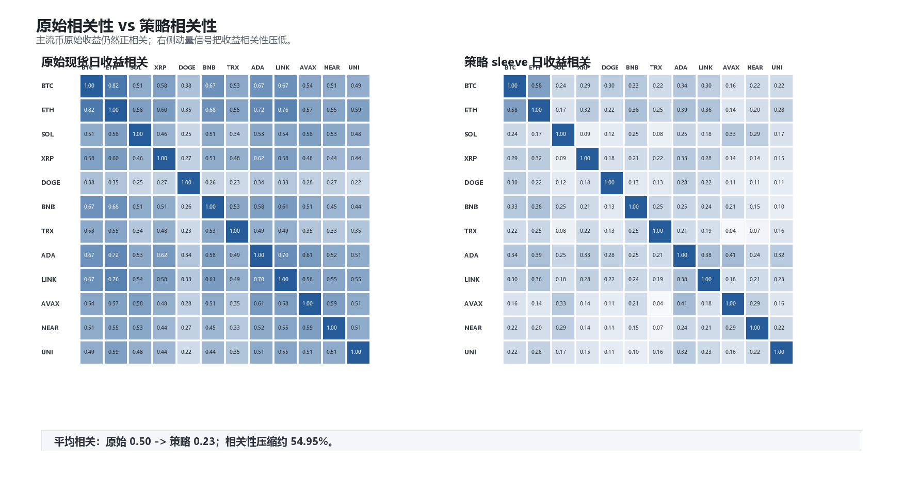
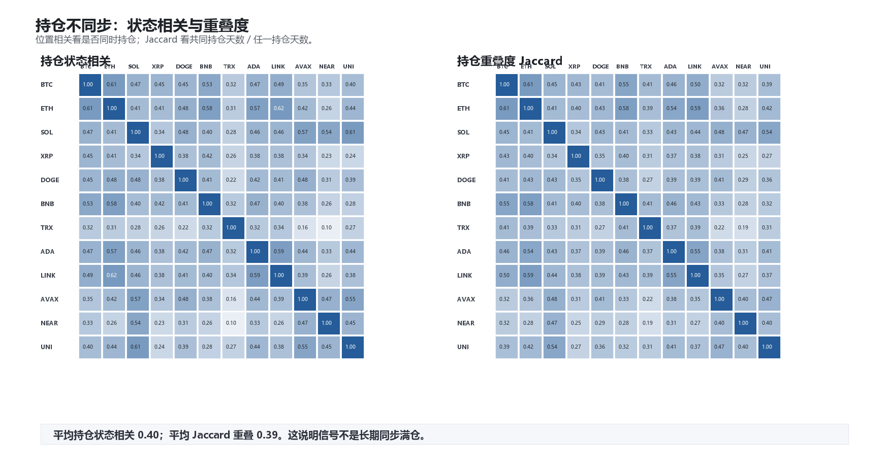
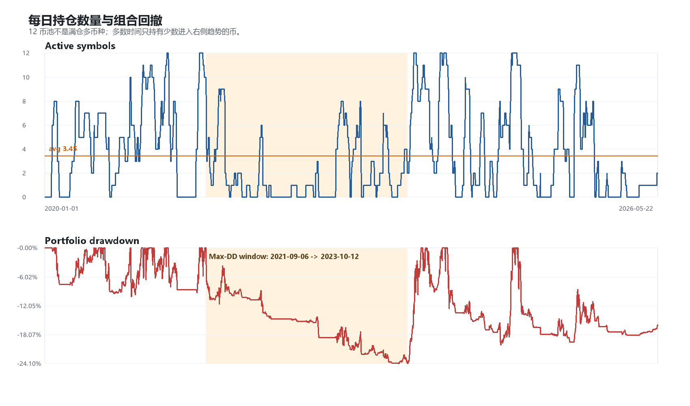
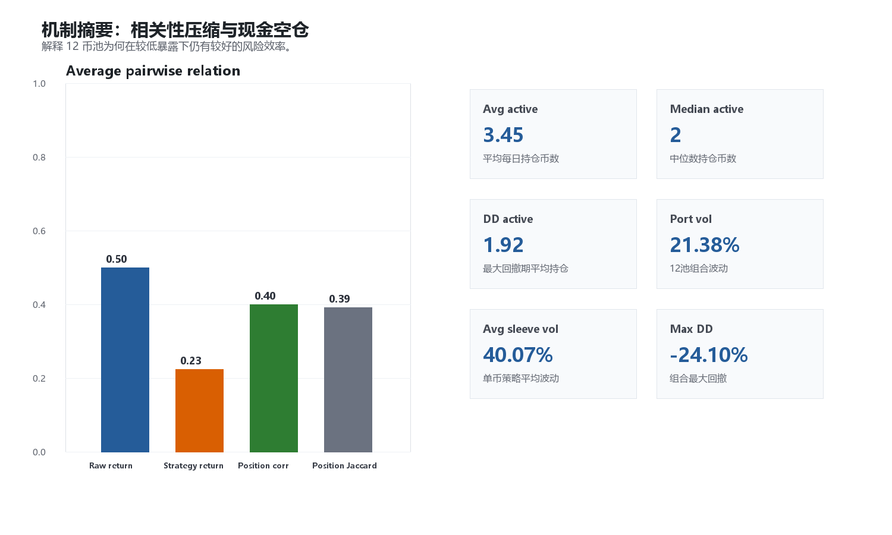

# 右侧现货动量：12 币池机制解释验证

生成时间：2026-05-23 19:02:36

## 1. 验证目的

本报告不改变策略、不改变币池，只解释为什么 12 coin pool 的风险效率更好。

核心判断不是“主流币互相不相关”，而是：

> 主流币原始收益仍然正相关，但右侧动量信号使不同币的入场、持仓和退出不同步，从而降低策略收益的有效相关性。

样本窗口：2020-01-01 至 2026-05-22。

12 币池：BTCUSDT, ETHUSDT, SOLUSDT, XRPUSDT, DOGEUSDT, BNBUSDT, TRXUSDT, ADAUSDT, LINKUSDT, AVAXUSDT, NEARUSDT, UNIUSDT。

## 2. 相关性压缩

| Metric | Mean | Median | Min | Max |
|---|---:|---:|---:|---:|
| raw_return_corr | 0.50 | 0.51 | 0.22 | 0.82 |
| strategy_return_corr | 0.23 | 0.22 | 0.04 | 0.58 |
| position_corr | 0.40 | 0.41 | 0.10 | 0.62 |
| position_jaccard | 0.39 | 0.39 | 0.19 | 0.61 |

解释：

- 原始现货日收益平均相关性为 0.50，说明它们不是非相关资产。
- 经过右侧动量信号后，策略 sleeve 日收益平均相关性降到 0.23。
- 相关性压缩约 54.95%。

这说明 12 币池的风险效率不是来自“币本身完全独立”，而是来自“趋势信号让收益实现路径不同步”。

## 3. 持仓不同步

持仓状态平均相关为 0.40，平均 Jaccard 重叠为 0.39。

含义：

- 很多币会同处于 crypto 大 beta 环境，但不会每天同时触发右侧入场。
- 组合不是长期满仓 12 个币，而是持有当下进入趋势状态的少数币。

## 4. 每日持仓数量与回撤

关键数值：

- 平均每日持仓币数：3.45。
- 持仓币数中位数：2.00。
- 90% 分位持仓币数：9.00。
- 最大回撤区间：2021-09-06 至 2023-10-12。
- 最大回撤期平均持仓币数：1.92。
- 最大回撤：-24.10%。

这说明该组合并不是“多币长期持有”，而是“多 sleeve 候选 + 现金空仓”。熊市或震荡期大部分 sleeve 会自动退出。

## 5. 最大回撤区间贡献

| Symbol | Drawdown contribution |
|---|---:|
| XRPUSDT | -5.55% |
| DOGEUSDT | -5.14% |
| SOLUSDT | -2.93% |
| LINKUSDT | -2.74% |
| BNBUSDT | -2.53% |
| ETHUSDT | -2.24% |
| UNIUSDT | -1.55% |
| ADAUSDT | -1.33% |
| TRXUSDT | -0.98% |
| BTCUSDT | -0.61% |
| NEARUSDT | 0.64% |
| AVAXUSDT | 0.87% |

解释：

- 最大回撤仍然来自多个币的共同拖累，因此不能把 12 币池解释为抗系统性风险。
- 但最大回撤期平均只有 1.92 个币有仓位，说明退出机制确实降低了同时暴露。

## 6. 机制结论

可以这样解释当前策略：

1. 主流币之间仍然有明显正相关，不能依赖“天然分散”。
2. 右侧动量信号把原始相关性 0.50 压到策略收益相关性 0.23。
3. 平均每日只持有 3.45 个币，中位数只有 2.00 个。
4. 最大回撤期平均持仓进一步降到 1.92 个。

因此 12 coin pool 的风险效率更好，主要来自：

- 趋势轮动；
- 持仓不同步；
- 熊市自动现金化；
- 单币错误被 sleeve 结构稀释。

这只是解释证据，不是新的交易规则。下一步仍然应该做 walk-forward / 时间切片验证，而不是根据这些解释继续加过滤器。
