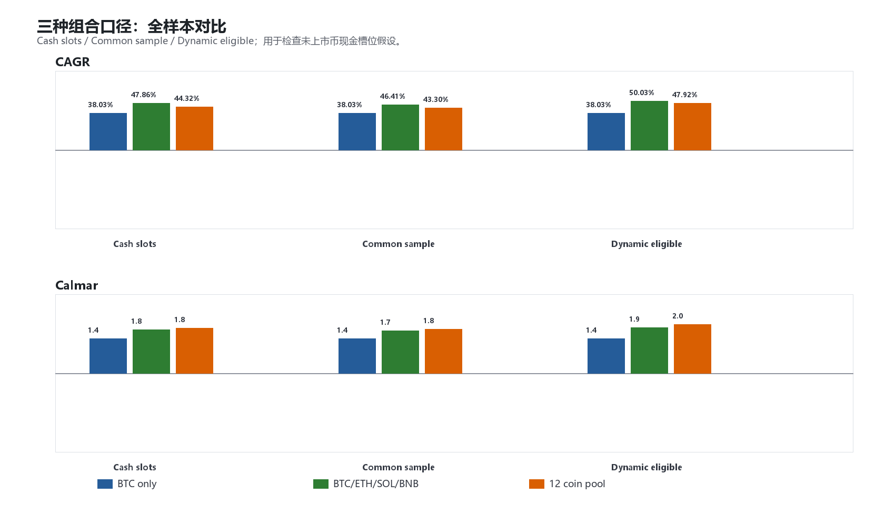
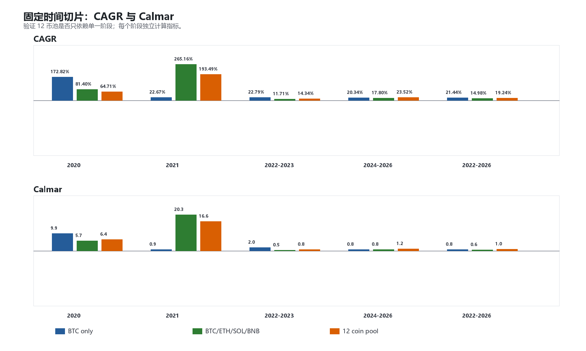
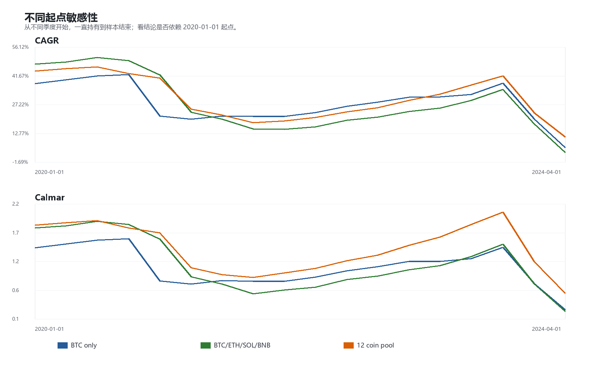
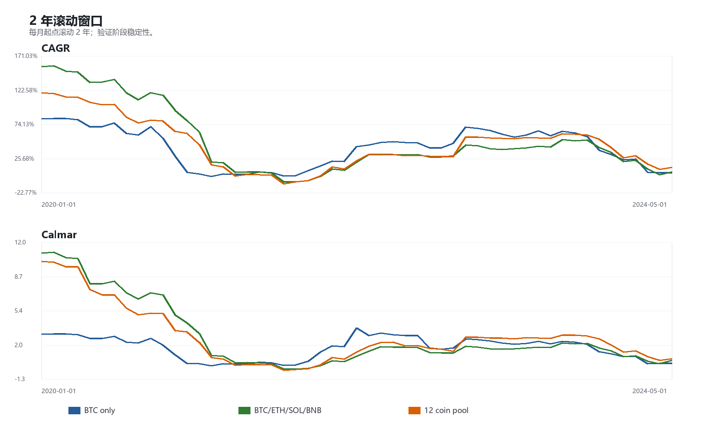
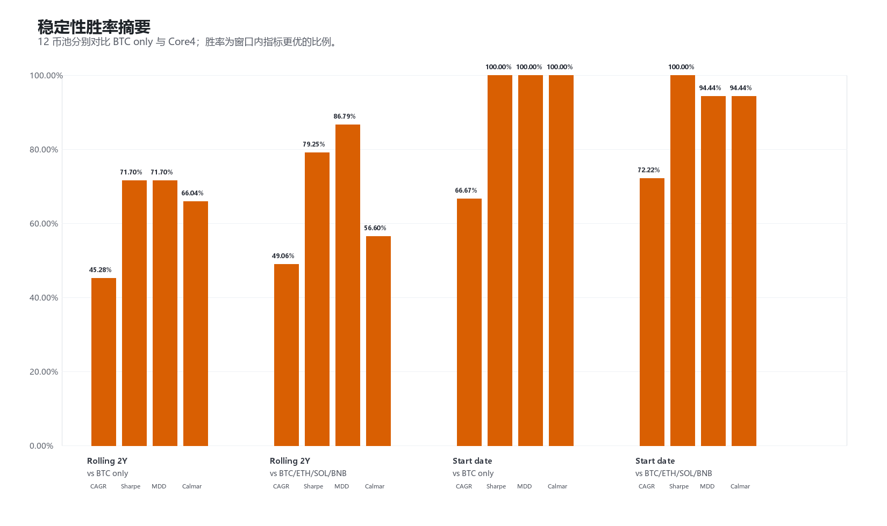

# 右侧现货动量：Walk-forward / 时间切片验证

生成时间：2026-05-23 19:24:18

## 1. 验证目的

本轮不改策略、不改参数、不改币池。

这里的 walk-forward 不是训练参数后的样本外检验，因为当前 baseline 没有拟合参数；它是时间稳定性检验：

- 固定时间切片：看不同阶段是否都能解释；
- 2 年滚动窗口：看局部窗口内是否稳定；
- 不同起点敏感性：看结论是否依赖 `2020-01-01` 这个起点。

注意：滚动窗口和不同起点窗口彼此高度重叠，不能当成独立样本；胜率只用于观察稳定性，不用于显著性检验。

样本窗口：2020-01-01 至 2026-05-22。

## 2. 组合口径

之前报告的主口径是 `cash_slots`：

- `cash_slots`：固定槽位模型；未上市、无数据、不可交易的币，其槽位资金视为现金，收益为 0。
- `common_sample`：严格共同样本；只有所有币都有数据的日期才参与比较。
- `dynamic_eligible`：动态可交易池；当天有数据的币等权，未上市币不占槽位。

`cash_slots` 不是 bug，但它是一个强假设，尤其会影响 SOL、AVAX、NEAR、UNI 上市前的 2020/2021 早期结果。因此本版同时输出三种口径。

全样本三口径：

| Policy | Pool | Start | End | Days | CAGR | Sharpe | MDD | Calmar | Final |
|---|---|---|---|---:|---:|---:|---:|---:|---:|
| Cash slots | BTC only | 2020-01-01 | 2026-05-22 | 2334 | 38.03% | 1.23 | -26.78% | 1.42 | 7.85x |
| Cash slots | BTC/ETH/SOL/BNB | 2020-01-01 | 2026-05-22 | 2334 | 47.86% | 1.63 | -26.76% | 1.79 | 12.18x |
| Cash slots | 12 coin pool | 2020-01-01 | 2026-05-22 | 2334 | 44.32% | 1.82 | -24.10% | 1.84 | 10.43x |
| Common sample | BTC only | 2020-01-01 | 2026-05-22 | 2334 | 38.03% | 1.23 | -26.78% | 1.42 | 7.85x |
| Common sample | BTC/ETH/SOL/BNB | 2020-08-11 | 2026-05-22 | 2111 | 46.41% | 1.57 | -26.76% | 1.73 | 9.06x |
| Common sample | 12 coin pool | 2020-10-14 | 2026-05-22 | 2047 | 43.30% | 1.77 | -24.10% | 1.80 | 7.51x |
| Dynamic eligible | BTC only | 2020-01-01 | 2026-05-22 | 2334 | 38.03% | 1.23 | -26.78% | 1.42 | 7.85x |
| Dynamic eligible | BTC/ETH/SOL/BNB | 2020-01-01 | 2026-05-22 | 2334 | 50.03% | 1.66 | -26.76% | 1.87 | 13.37x |
| Dynamic eligible | 12 coin pool | 2020-01-01 | 2026-05-22 | 2334 | 47.92% | 1.85 | -24.10% | 1.99 | 12.21x |

后续图表的主展示仍使用 `cash_slots`，因为它最接近“固定 12 个 sleeve，空槽资金留现金”的可部署口径；但结论必须同时参考三口径表。

## 3. 固定时间切片

关键阶段表：

| Period | Pool | CAGR | Sharpe | MDD | Calmar | Final |
|---|---|---:|---:|---:|---:|---:|
| 2020-2026 | BTC only | 38.03% | 1.23 | -26.78% | 1.42 | 7.85x |
| 2020-2026 | BTC/ETH/SOL/BNB | 47.86% | 1.63 | -26.76% | 1.79 | 12.18x |
| 2020-2026 | 12 coin pool | 44.32% | 1.82 | -24.10% | 1.84 | 10.43x |
| 2021 | BTC only | 22.67% | 0.75 | -26.44% | 0.86 | 1.23x |
| 2021 | BTC/ETH/SOL/BNB | 265.16% | 3.28 | -13.04% | 20.33 | 3.64x |
| 2021 | 12 coin pool | 193.49% | 3.60 | -11.67% | 16.58 | 2.93x |
| 2022-2026 | BTC only | 21.44% | 0.91 | -26.78% | 0.80 | 2.35x |
| 2022-2026 | BTC/ETH/SOL/BNB | 14.98% | 0.79 | -23.56% | 0.64 | 1.85x |
| 2022-2026 | 12 coin pool | 19.24% | 1.05 | -20.18% | 0.95 | 2.16x |

解读：

- 全样本：12 coin pool CAGR 44.32%，低于 Core4 的 47.86%，但 Calmar 1.84 最高。
- 2021：Core4 明显最强，说明 Core4 全样本收益高度吃到 SOL/BNB/ETH 的强趋势。
- 2022-2026：12 coin pool CAGR 19.24%，低于 BTC only 的 21.44%，但 Sharpe/MDD/Calmar 更好。

单年 Calmar 对局部低回撤非常敏感，只适合阶段观察，不适合作为长期目标值。

## 4. 不同起点敏感性

相对胜率：

| Comparison | Samples | CAGR win | Sharpe win | MDD win | Calmar win | Avg CAGR diff | Avg Calmar diff |
|---|---:|---:|---:|---:|---:|---:|---:|
| 12 coin pool vs BTC only | 18 | 66.67% | 100.00% | 100.00% | 100.00% | 2.52% | 0.34 |
| 12 coin pool vs BTC/ETH/SOL/BNB | 18 | 72.22% | 100.00% | 94.44% | 94.44% | 2.57% | 0.28 |
| BTC/ETH/SOL/BNB vs BTC only | 18 | 33.33% | 61.11% | 100.00% | 44.44% | -0.05% | 0.06 |

关键点：

- 12 coin pool 相对 BTC only：不同起点下 Calmar 胜率 100.00%，Sharpe 胜率 100.00%。
- 12 coin pool 相对 Core4：CAGR 胜率 72.22%，但 Calmar 胜率 94.44%。

这说明 12 池不是单一起点偶然胜出；但它相对 Core4 的优势主要体现在风险调整，而不是绝对收益。

## 5. 2 年滚动窗口

滚动窗口相对胜率：

| Comparison | Samples | CAGR win | Sharpe win | MDD win | Calmar win | Avg CAGR diff | Avg Calmar diff |
|---|---:|---:|---:|---:|---:|---:|---:|
| 12 coin pool vs BTC only | 53 | 45.28% | 71.70% | 71.70% | 66.04% | 4.23% | 1.08 |
| 12 coin pool vs BTC/ETH/SOL/BNB | 53 | 49.06% | 79.25% | 86.79% | 56.60% | -5.54% | -0.02 |
| BTC/ETH/SOL/BNB vs BTC only | 53 | 41.51% | 54.72% | 64.15% | 47.17% | 9.77% | 1.10 |

关键点：

- 12 coin pool 相对 BTC only：2 年滚动 Calmar 胜率 66.04%，Sharpe 胜率 71.70%。
- 12 coin pool 相对 Core4：2 年滚动 Calmar 胜率 56.60%，但 CAGR 胜率 49.06%。

三种组合口径下，12 coin pool 的 2 年滚动胜率：

| Policy | Comparison | Samples | CAGR win | Sharpe win | MDD win | Calmar win | Avg CAGR diff | Avg Calmar diff |
|---|---|---:|---:|---:|---:|---:|---:|---:|
| Cash slots | 12 coin pool vs BTC only | 53 | 45.28% | 71.70% | 71.70% | 66.04% | 4.23% | 1.08 |
| Cash slots | 12 coin pool vs BTC/ETH/SOL/BNB | 53 | 49.06% | 79.25% | 86.79% | 56.60% | -5.54% | -0.02 |
| Common sample | 12 coin pool vs BTC only | 45 | 35.56% | 66.67% | 66.67% | 60.00% | -0.27% | 0.32 |
| Common sample | 12 coin pool vs BTC/ETH/SOL/BNB | 45 | 57.78% | 75.56% | 84.44% | 66.67% | -0.05% | 0.17 |
| Dynamic eligible | 12 coin pool vs BTC only | 53 | 45.28% | 71.70% | 71.70% | 66.04% | 6.18% | 1.18 |
| Dynamic eligible | 12 coin pool vs BTC/ETH/SOL/BNB | 53 | 49.06% | 79.25% | 86.79% | 56.60% | -4.92% | -0.01 |

严格 `common_sample` 口径下，12 coin pool 相对 BTC only 的 CAGR 胜率会下降；这说明不能把 12 池解释为“绝对收益稳定碾压 BTC”。但 Sharpe / MDD / Calmar 仍然更稳，这才是当前结论的核心。

## 6. 当前判断

这一步支持一个克制结论：

> 12 coin pool 不是收益爆发最强的版本，但它在不同时间切片、不同起点和滚动窗口里，风险调整表现更稳定。

具体判断：

1. 如果目标是最高全样本 CAGR，Core4 更强。
2. 如果目标是右侧现货动量的稳定 baseline，12 coin pool 更合理。
3. BTC only 仍是必要基准，但目前不是最优实现。
4. 12 coin pool 的优势主要是 Sharpe / MDD / Calmar，不是每个阶段都 CAGR 领先。
5. `cash_slots` 口径必须明确写作固定槽位现金假设；三口径结果一起看后，12 池的风险调整优势仍然成立，但 CAGR 结论要更谨慎。

下一步建议：

> 当前可以暂定 12 coin pool 为右侧现货动量 baseline 候选；下一轮不要再做筛选或参数优化，而应做最终边界检查：交易成本敏感性、成本冲击、缺失币/交易所可得性，以及部署层的资金分配规则。
