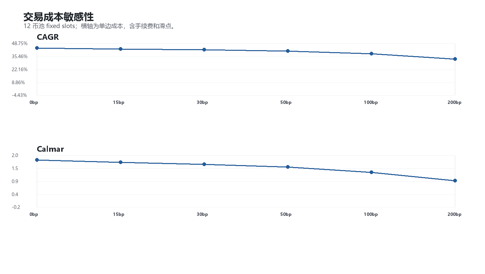
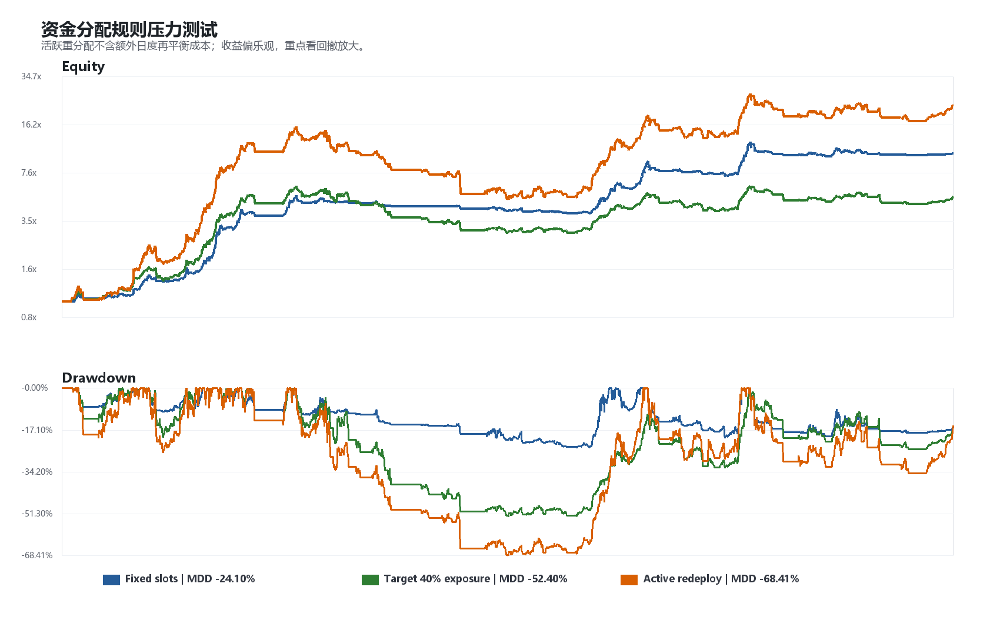
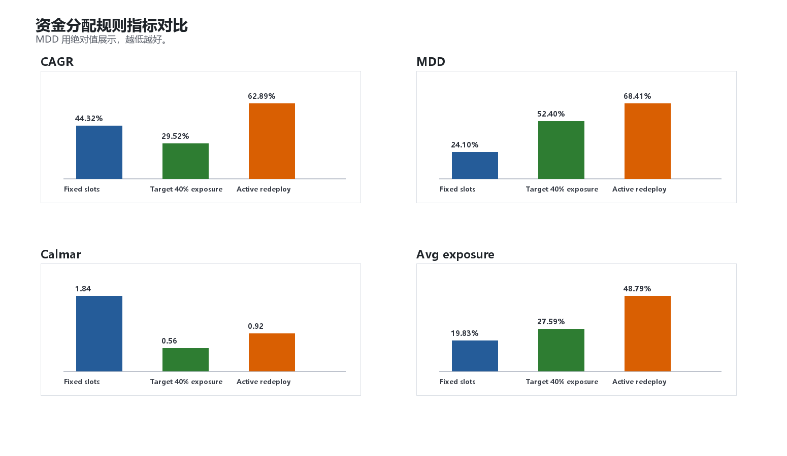
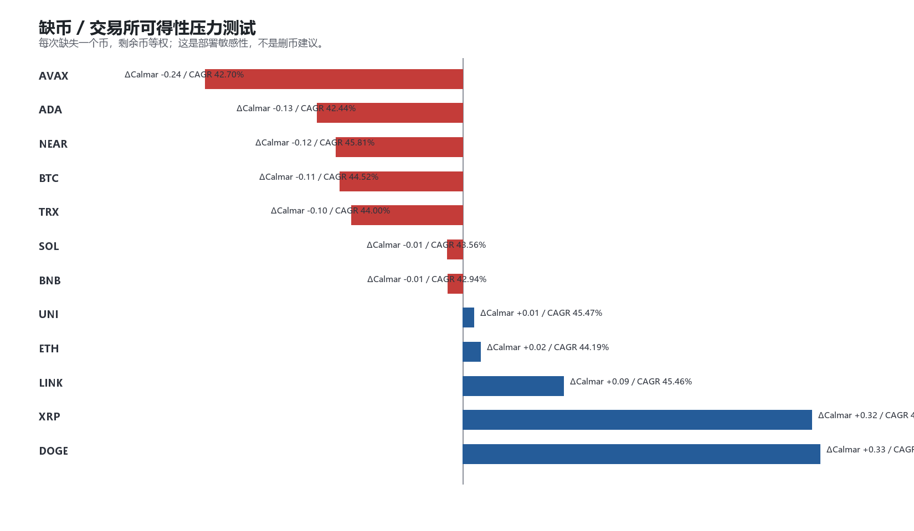

# 右侧现货动量：最终边界与部署压力测试

生成时间：2026-05-23 19:31:31

样本区间：2020-01-01 至 2026-05-22

## 1. 测试目的

本轮不改信号、不改参数、不改币池，只检查部署边界。

固定对象：12 coin pool 与 B baseline。

主要问题：

1. 成本冲击能不能活下来；
2. 如果某个币无法交易，结果是否脆弱；
3. 如果把空闲现金重新分配给活跃信号，MDD 是否明显放大。

## 2. 交易成本敏感性

| One-way cost | CAGR | Sharpe | MDD | Calmar | Final |
|---:|---:|---:|---:|---:|---:|
| 0bp | 44.32% | 1.82 | -24.10% | 1.84 | 10.43x |
| 15bp | 43.45% | 1.79 | -24.91% | 1.74 | 10.04x |
| 30bp | 42.59% | 1.76 | -25.71% | 1.66 | 9.66x |
| 50bp | 41.45% | 1.72 | -26.76% | 1.55 | 9.18x |
| 100bp | 38.64% | 1.62 | -29.34% | 1.32 | 8.07x |
| 200bp | 33.16% | 1.42 | -34.22% | 0.97 | 6.24x |

解读：

- 基准成本 15bp 单边时，CAGR 43.45%，MDD -24.91%，Calmar 1.74。
- 极端成本 200bp 单边时，CAGR 仍有 33.16%，但 Calmar 降到 0.97。
- 说明策略不是极端依赖低成本，但成本会持续侵蚀 Calmar。

## 3. 资金分配规则压力测试

| Rule | CAGR | Sharpe | MDD | Calmar | Final | Avg exposure | P95 exposure | Max exposure |
|---|---:|---:|---:|---:|---:|---:|---:|---:|
| Fixed slots | 44.32% | 1.82 | -24.10% | 1.84 | 10.43x | 19.83% | 65.65% | 88.73% |
| Target 40% exposure | 29.52% | 1.17 | -52.40% | 0.56 | 5.22x | 27.59% | 40.00% | 40.00% |
| Active redeploy | 62.89% | 1.44 | -68.41% | 0.92 | 22.61x | 48.79% | 100.00% | 100.00% |

规则说明：

- Fixed slots：当前 baseline，固定 12 个 sleeve，未触发信号的槽位留现金。
- Target 40% exposure：用上一日已知暴露把组合尽量拉到 40% 暴露，不能超过活跃信号可承载上限。
- Active redeploy：把资金全部重新分配给上一日仍活跃的信号，不使用杠杆。

重要 caveat：`Target 40% exposure` 和 `Active redeploy` 没有扣除额外日度再平衡成本，因此收益偏乐观；这里主要看回撤边界。

核心发现：

- Fixed slots 的 MDD 为 -24.10%。
- Target 40% exposure 的 MDD 放大到 -52.40%。
- Active redeploy 的 MDD 放大到 -68.41%。

你的预判成立：现金空仓是当前策略的重要风险控制。把空闲现金重新塞给活跃信号后，收益可能更高，但 MDD 会显著恶化。

## 4. 缺币 / 交易所可得性压力测试

| Missing symbol | CAGR | Sharpe | MDD | Calmar | Δ Calmar | Δ CAGR |
|---|---:|---:|---:|---:|---:|---:|
| AVAXUSDT | 42.70% | 1.75 | -26.63% | 1.60 | -0.24 | -1.62% |
| ADAUSDT | 42.44% | 1.78 | -24.87% | 1.71 | -0.13 | -1.88% |
| NEARUSDT | 45.81% | 1.83 | -26.58% | 1.72 | -0.12 | 1.49% |
| BTCUSDT | 44.52% | 1.80 | -25.78% | 1.73 | -0.11 | 0.20% |
| TRXUSDT | 44.00% | 1.77 | -25.32% | 1.74 | -0.10 | -0.32% |
| SOLUSDT | 43.56% | 1.75 | -23.86% | 1.83 | -0.01 | -0.76% |
| BNBUSDT | 42.94% | 1.79 | -23.52% | 1.83 | -0.01 | -1.38% |
| UNIUSDT | 45.47% | 1.82 | -24.59% | 1.85 | 0.01 | 1.15% |
| ETHUSDT | 44.19% | 1.82 | -23.81% | 1.86 | 0.02 | -0.13% |
| LINKUSDT | 45.46% | 1.83 | -23.54% | 1.93 | 0.09 | 1.14% |
| XRPUSDT | 44.50% | 1.83 | -20.62% | 2.16 | 0.32 | 0.18% |
| DOGEUSDT | 45.48% | 1.85 | -21.00% | 2.17 | 0.33 | 1.16% |

解释：

- 这是部署敏感性测试，不是新的删币依据。
- 最伤的缺失币是 `AVAXUSDT`，ΔCalmar -0.24。
- 最有利的缺失币是 `DOGEUSDT`，ΔCalmar 0.33。

如果某些交易所无法交易个别币，12 池仍可运行，但具体币缺失会改变收益/风险形态；部署前需要用实际交易所可得列表重跑。

## 5. 当前结论

边界测试支持三个部署原则：

1. 不要把现金空仓强行再投资。它不是低效闲置，而是策略风险控制的一部分。
2. 12 池可以承受中等成本冲击，但成本越高，Calmar 越快被侵蚀。
3. 缺币不会让策略立刻失效，但部署币池必须和实际交易所可得性绑定。

因此，当前 baseline 应保持：

> 固定 12 sleeve，未触发信号留现金，不做活跃信号满分配。

下一步如果继续推进，应整理最终策略说明与部署前检查清单，而不是继续优化参数。
