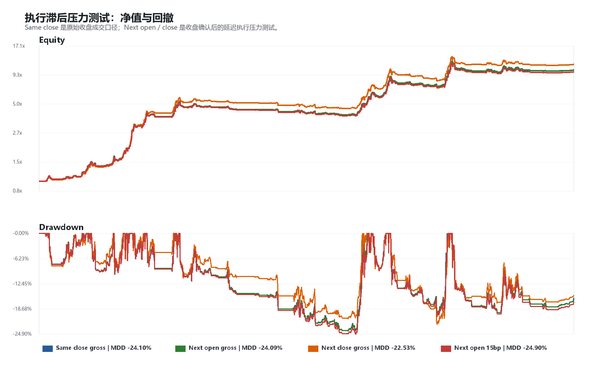
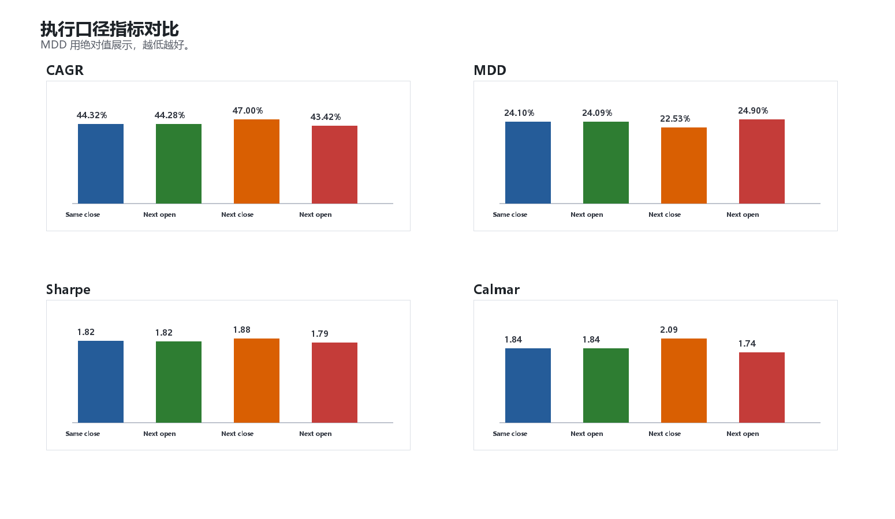
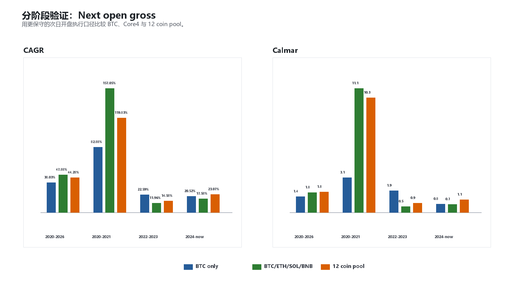
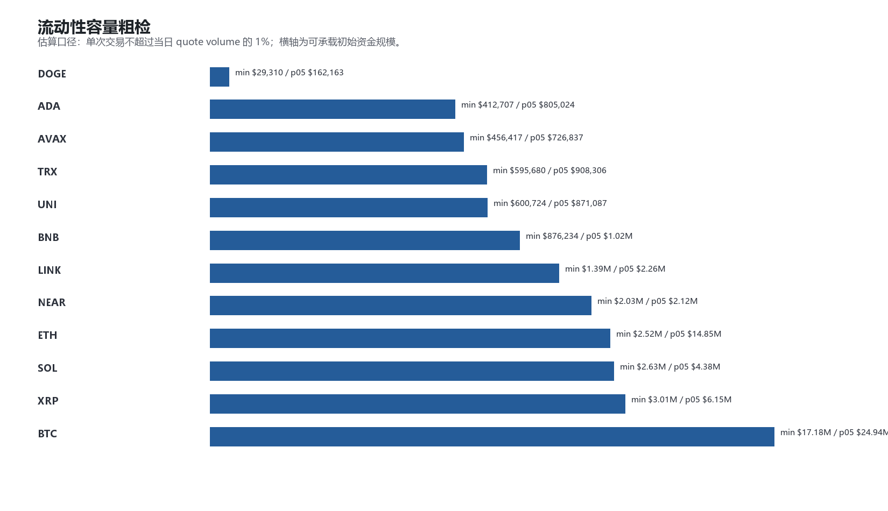

# 右侧现货动量：最终上线前验证

生成时间：2026-05-23 19:47:50

样本区间：2020-01-01 至 2026-05-22

本轮不优化参数，不新增过滤器，不调整币池。目标是验证当前候选 baseline 在更保守执行、数据完整性和流动性口径下是否还能站住。

固定币池：

`BTCUSDT, ETHUSDT, SOLUSDT, XRPUSDT, DOGEUSDT, BNBUSDT, TRXUSDT, ADAUSDT, LINKUSDT, AVAXUSDT, NEARUSDT, UNIUSDT`

## 1. 执行滞后压力测试

| Variant | Price | Signal lag | One-way cost | CAGR | Sharpe | MDD | Calmar | Final | Avg exposure |
|---|---:|---:|---:|---:|---:|---:|---:|---:|---:|
| Same close gross | Close | 0 | 0.00% | 44.32% | 1.82 | -24.10% | 1.84 | 10.43x | 19.83% |
| Next open gross | Open | 1 | 0.00% | 44.28% | 1.82 | -24.09% | 1.84 | 10.42x | 19.83% |
| Next close gross | Close | 1 | 0.00% | 47.00% | 1.88 | -22.53% | 2.09 | 11.73x | 19.83% |
| Next open 15bp | Open | 1 | 0.15% | 43.42% | 1.79 | -24.90% | 1.74 | 10.02x | 19.84% |

解读：

- 原始 `same close gross`：CAGR 44.32%，MDD -24.10%，Calmar 1.84。
- 更现实的 `next open gross`：CAGR 44.28%，MDD -24.09%，Calmar 1.84。
- `next open 15bp` 加入单边 15bp 成本后：CAGR 43.42%，MDD -24.90%，Calmar 1.74。
- 更滞后的 `next close gross`：CAGR 47.00%，MDD -22.53%，Calmar 2.09。

这说明策略不依赖“同日收盘完美成交”。如果用收盘确认后次日开盘执行，风险效率仍然保留。

## 2. 分阶段验证

以下全部使用 `next open gross`，即收盘确认后下一根日线开盘成交：

| Period | Pool | CAGR | Sharpe | MDD | Calmar | Final |
|---|---|---:|---:|---:|---:|---:|
| 2020-2026 | BTC only | 38.03% | 1.23 | -26.78% | 1.42 | 7.85x |
| 2020-2026 | BTC/ETH/SOL/BNB | 47.88% | 1.63 | -26.77% | 1.79 | 12.19x |
| 2020-2026 | 12 coin pool | 44.28% | 1.82 | -24.09% | 1.84 | 10.42x |
| 2020-2021 | BTC only | 82.88% | 1.75 | -26.44% | 3.13 | 3.34x |
| 2020-2021 | BTC/ETH/SOL/BNB | 157.05% | 2.85 | -14.15% | 11.10 | 6.61x |
| 2020-2021 | 12 coin pool | 119.83% | 3.06 | -11.66% | 10.28 | 4.83x |
| 2022-2023 | BTC only | 22.59% | 1.04 | -11.59% | 1.95 | 1.50x |
| 2022-2023 | BTC/ETH/SOL/BNB | 11.96% | 0.71 | -22.03% | 0.54 | 1.25x |
| 2022-2023 | 12 coin pool | 14.58% | 0.94 | -17.02% | 0.86 | 1.31x |
| 2024-now | BTC only | 20.52% | 0.83 | -26.78% | 0.77 | 1.56x |
| 2024-now | BTC/ETH/SOL/BNB | 17.58% | 0.85 | -23.56% | 0.75 | 1.47x |
| 2024-now | 12 coin pool | 23.07% | 1.13 | -20.17% | 1.14 | 1.64x |

解读：

- 12 coin pool 的核心优势仍然主要体现在 Sharpe / MDD / Calmar，而不是每个阶段都压过 BTC 的 CAGR。
- 2024-now 仍然有正收益和较低回撤，但样本较短，只能作为最近阶段检查，不能当长期证明。

## 3. 数据完整性检查

| Symbol | Data start | Data end | Coverage | Missing days | Duplicates | Invalid OHLC | Nonpositive volume | Median quote vol 90d |
|---|---:|---:|---:|---:|---:|---:|---:|---:|
| BTCUSDT | 2020-01-01 | 2026-05-22 | 100.00% | 0 | 0 | 0 | 0 | $1.30B |
| ETHUSDT | 2020-01-01 | 2026-05-22 | 100.00% | 0 | 0 | 0 | 0 | $695.85M |
| SOLUSDT | 2020-08-11 | 2026-05-22 | 100.00% | 0 | 0 | 0 | 0 | $242.09M |
| XRPUSDT | 2020-01-01 | 2026-05-22 | 100.00% | 0 | 0 | 0 | 0 | $136.48M |
| DOGEUSDT | 2020-01-01 | 2026-05-22 | 100.00% | 0 | 0 | 0 | 0 | $79.37M |
| BNBUSDT | 2020-01-01 | 2026-05-22 | 100.00% | 0 | 0 | 0 | 0 | $75.66M |
| TRXUSDT | 2020-01-01 | 2026-05-22 | 100.00% | 0 | 0 | 0 | 0 | $34.78M |
| ADAUSDT | 2020-01-01 | 2026-05-22 | 100.00% | 0 | 0 | 0 | 0 | $30.23M |
| LINKUSDT | 2020-01-01 | 2026-05-22 | 100.00% | 0 | 0 | 0 | 0 | $26.17M |
| AVAXUSDT | 2020-09-22 | 2026-05-22 | 100.00% | 0 | 0 | 0 | 0 | $18.90M |
| NEARUSDT | 2020-10-14 | 2026-05-22 | 100.00% | 0 | 0 | 0 | 0 | $17.56M |
| UNIUSDT | 2020-09-17 | 2026-05-22 | 100.00% | 0 | 0 | 0 | 0 | $10.11M |

检查结果：`0` 个币存在缺失日、重复日、OHLC 异常或非正成交量问题。

## 4. 流动性容量粗检

| Symbol | Trades | Min cap at 1% ADV | P05 cap at 1% ADV | Median cap at 1% ADV | Min cap at 0.25% ADV |
|---|---:|---:|---:|---:|---:|
| ALL | 506 | $29,310 | $1.01M | $14.60M | $7,328 |
| DOGEUSDT | 54 | $29,310 | $162,163 | $26.25M | $7,328 |
| ADAUSDT | 30 | $412,707 | $805,024 | $3.43M | $103,177 |
| AVAXUSDT | 30 | $456,417 | $726,837 | $2.57M | $114,104 |
| TRXUSDT | 53 | $595,680 | $908,306 | $3.55M | $148,920 |
| UNIUSDT | 30 | $600,724 | $871,087 | $6.80M | $150,181 |
| BNBUSDT | 54 | $876,234 | $1.02M | $5.60M | $219,058 |
| LINKUSDT | 40 | $1.39M | $2.26M | $8.54M | $346,787 |
| NEARUSDT | 35 | $2.03M | $2.12M | $11.00M | $506,440 |
| ETHUSDT | 44 | $2.52M | $14.85M | $47.10M | $630,263 |
| SOLUSDT | 34 | $2.63M | $4.38M | $17.58M | $657,978 |
| XRPUSDT | 54 | $3.01M | $6.15M | $19.67M | $752,144 |
| BTCUSDT | 48 | $17.18M | $24.94M | $86.42M | $4.30M |

解释：

- 这是粗略容量检查，不是滑点模型。
- 口径是：单次交易名义金额不超过当日 quote volume 的 1%。
- 全部历史交易中，最紧的 1% ADV 初始资金容量约为 `$29,310`；若用更保守的 0.25% ADV，约为 `$7,328`。
- 这个最小值主要反映早期个别币低流动性阶段，不代表当前容量；但它说明实盘不能完全忽略订单金额上限。

## 5. 最终判断

本轮验证通过了最关键的部署前压力项：

1. 收盘确认后次日开盘执行没有破坏策略主体；
2. 成本进入后仍保留较好的风险效率；
3. 12 coin pool 的优势仍是风险调整收益，而不是单纯追求更高 CAGR；
4. 当前缓存数据没有发现结构性完整性问题；
5. 流动性不是否定 alpha 的证据，但部署时必须设置单笔 ADV 上限；资金规模上去后需要单独建滑点模型。

因此，当前策略可以封存为：

> 右侧现货 long-only 动量 alpha 候选 baseline：固定 12 sleeve，收盘确认信号，次日开盘可执行，未触发信号的 sleeve 留现金，不做活跃信号满仓重分配。

接下来不建议继续围绕参数做优化。更合理的是进入纸面跟踪与实盘前工程化：每日信号复现、交易所可得性核对、订单金额上限、异常数据报警、以及未来样本滚动复盘。
