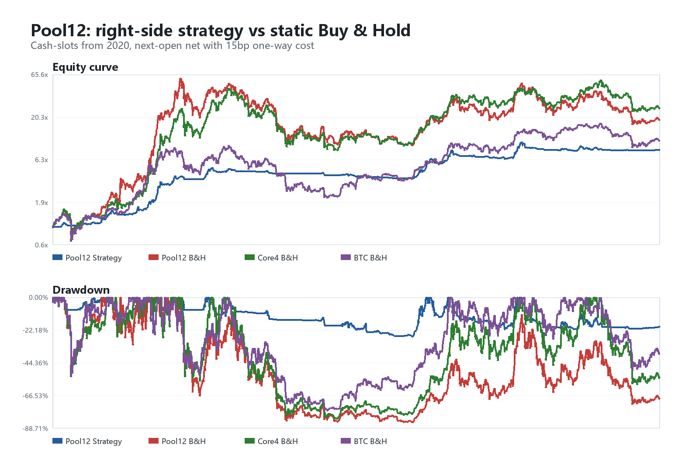
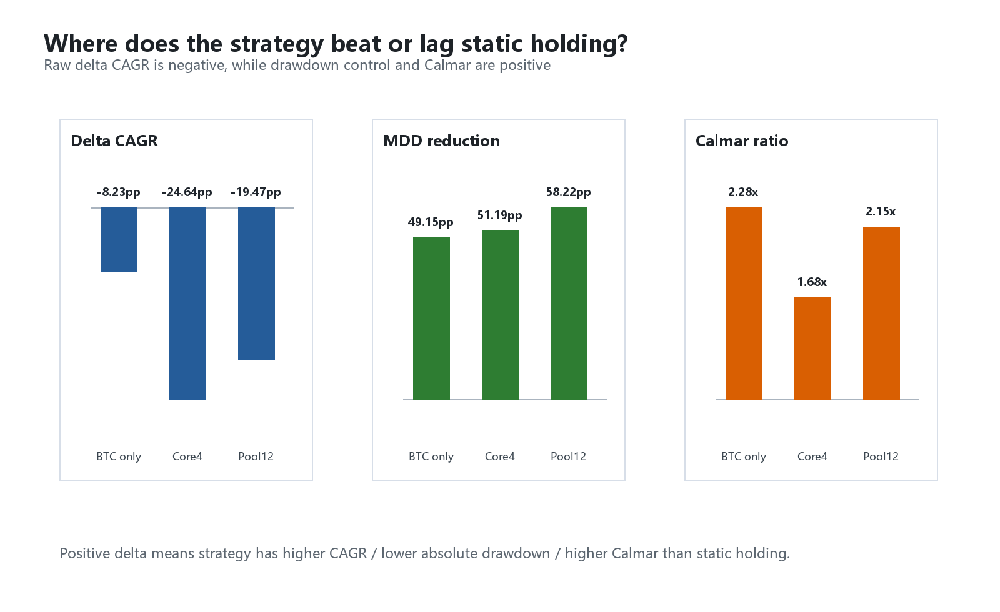
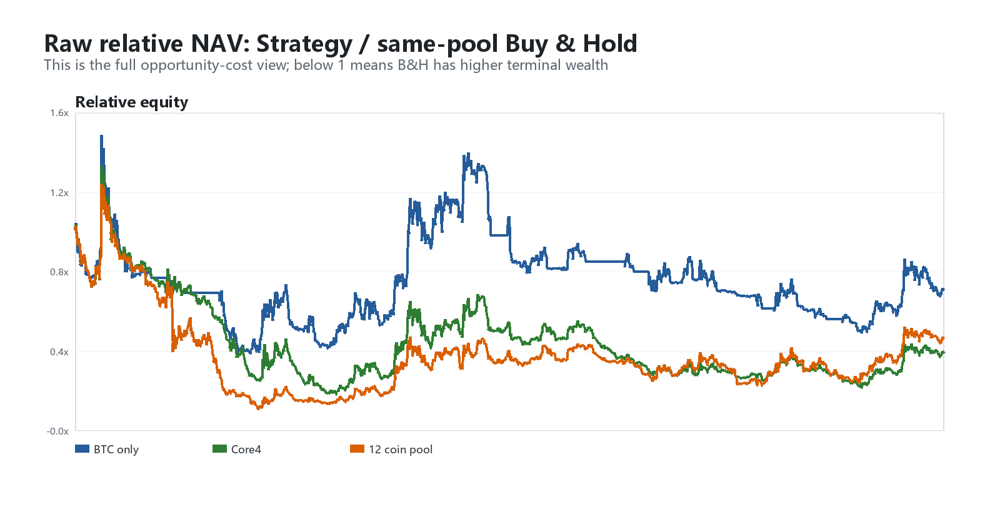
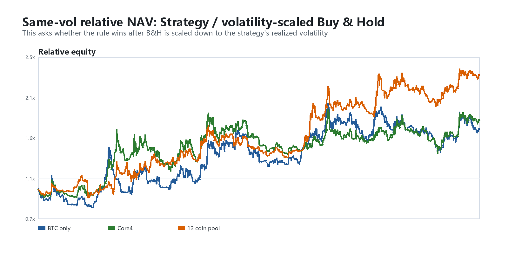
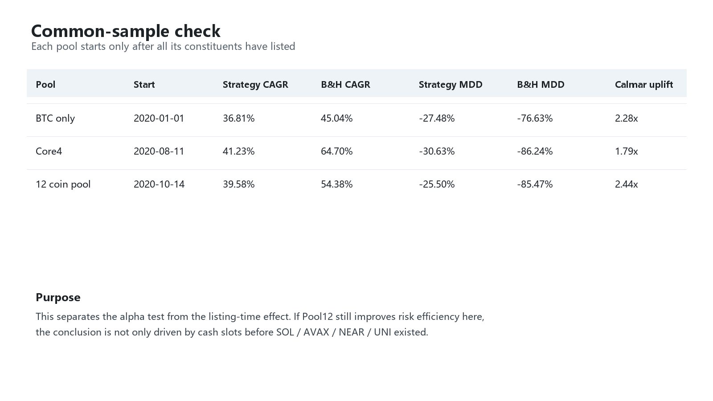
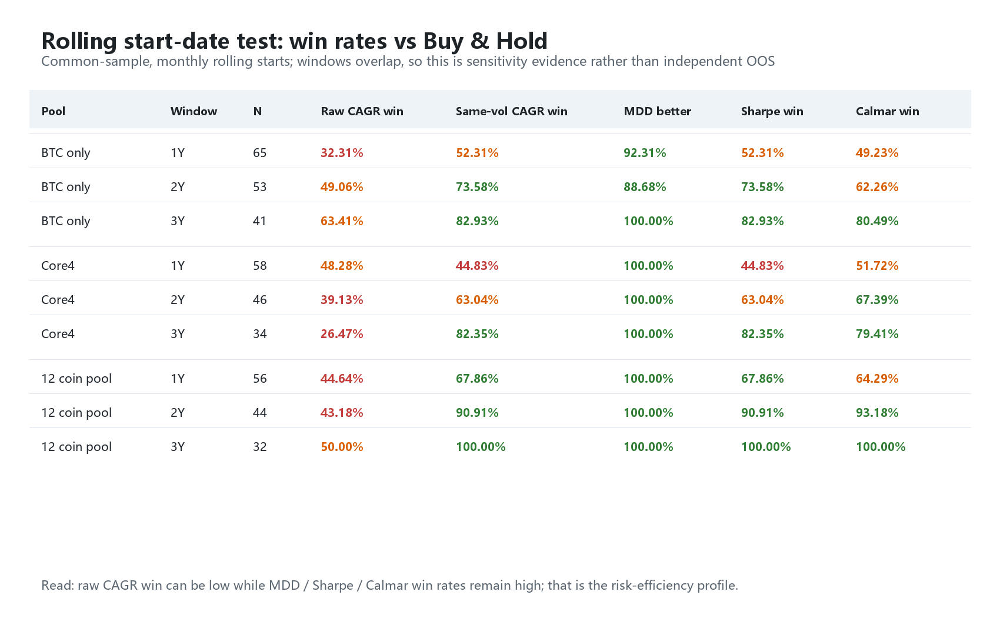
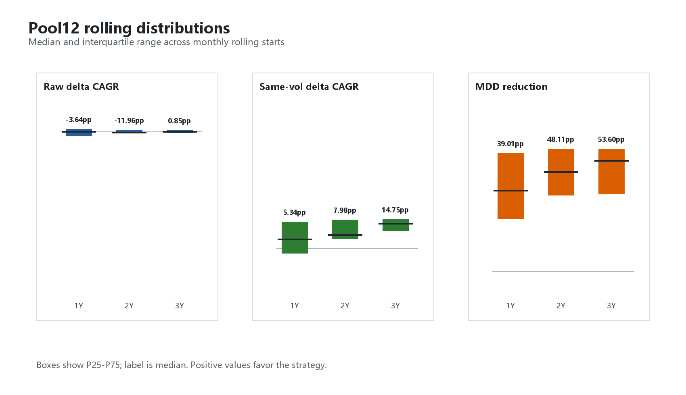

# 右侧现货动量：静态 Buy & Hold 基准对比

生成时间：2026-06-03 16:55:55

本轮只补一个机会成本基准，不优化参数，不改变币池，不新增过滤器。

对比目的：确认右侧 long-only 策略相对于最朴素的静态持有，到底是提高收益、降低回撤，还是只是承受了更少风险暴露。

## 1. 对比口径

- 策略：固定 sleeve，收盘确认信号，次日开盘执行，单边成本 15bp。
- Buy & Hold：同一币池初始等权买入，买入后固定 units，不再平衡，买入成本同样按 15bp 扣除。
- `cash_slots`：从 2020-01-01 起算；未上市 / 无数据的币视为现金，上市后才买入或等待策略信号。
- `common_sample`：每个币池从所有成分币都有数据的日期起算，用于排除上市时间差异。

## 2. Cash-slots 主结果：原始静态持有

| Pool | Start | Strat CAGR | B&H CAGR | Delta CAGR | Strat MDD | B&H MDD | MDD reduction | Strat Sharpe | B&H Sharpe | Strat Calmar | B&H Calmar | Calmar ratio | Strat Final | B&H Final | Final ratio | Strat avg exposure | B&H avg exposure |
|---|---:|---:|---:|---:|---:|---:|---:|---:|---:|---:|---:|---:|---:|---:|---:|---:|---:|
| BTC only | 2020-01-01 | 36.81% | 45.04% | -8.23pp | -27.48% | -76.63% | 49.15pp | 1.20 | 0.92 | 1.34 | 0.59 | 2.28x | 7.41x | 10.77x | 0.69x | 33.44% | 100.00% |
| Core4 | 2020-01-01 | 42.29% | 66.94% | -24.64pp | -30.89% | -82.08% | 51.19pp | 1.39 | 1.07 | 1.37 | 0.82 | 1.68x | 9.53x | 26.45x | 0.36x | 27.06% | 98.07% |
| 12 coin pool | 2020-01-01 | 39.31% | 58.78% | -19.47pp | -26.26% | -84.49% | 58.22pp | 1.54 | 0.97 | 1.50 | 0.70 | 2.15x | 8.32x | 19.21x | 0.43x | 20.54% | 97.30% |

解读：

- Pool12 策略 CAGR 为 39.31%，静态 B&H 为 58.78%，年化差为 -19.47pp。
- Pool12 策略 MDD 为 -26.26%，静态 B&H 为 -84.49%，回撤改善 58.22pp。
- Pool12 策略 Calmar 为 1.50，静态 B&H 为 0.70，Calmar 倍数为 2.15x。
- 策略平均暴露只有 20.54%，B&H 平均暴露为 97.30%。这说明优势不是来自更高仓位，而是来自趋势确认、现金过滤和退出规则。
- 必须明确：原始静态 B&H 的 CAGR 和终值更高，尤其 12 币池。策略没有赢绝对终值，它赢的是回撤控制、Sharpe 和 Calmar。

## 3. Raw 相对净值

`Strategy / Buy & Hold` 是完整机会成本视角。Pool12 原始 B&H 因为长期满仓持有高弹性币，终值大幅高于策略；这说明如果投资者能承受接近 80% 的回撤，静态持有在本样本内有更高绝对收益。

## 4. 同波动 B&H 检查

| Pool | B&H scale | Strat CAGR | Same-vol B&H CAGR | Delta CAGR | Strat MDD | Same-vol B&H MDD | MDD reduction | Strat Calmar | Same-vol B&H Calmar | Calmar ratio | Strat Final | Same-vol B&H Final | Final ratio |
|---|---:|---:|---:|---:|---:|---:|---:|---:|---:|---:|---:|---:|---:|
| BTC only | 48.88% | 36.81% | 25.87% | 10.94pp | -27.48% | -47.92% | 20.44pp | 1.34 | 0.54 | 2.48x | 7.41x | 4.35x | 1.70x |
| Core4 | 37.87% | 42.29% | 29.80% | 12.49pp | -30.89% | -42.80% | 11.91pp | 1.37 | 0.70 | 1.97x | 9.53x | 5.30x | 1.80x |
| 12 coin pool | 27.84% | 39.31% | 22.07% | 17.24pp | -26.26% | -33.51% | 7.25pp | 1.50 | 0.66 | 2.27x | 8.32x | 3.58x | 2.33x |

解读：

- 同波动口径不是替代原始 B&H，而是回答风险效率问题：如果把 B&H 降杠杆 / 留现金到和策略相同波动，谁的收益更高。
- Pool12 同波动 B&H CAGR 为 22.07%，策略为 39.31%，策略高出 17.24pp。
- Pool12 同波动 B&H MDD 为 -33.51%，策略 MDD 为 -26.26%，策略仍改善 7.25pp。
- 这说明策略的价值更准确地说是“风险效率 alpha”，不是无条件打败满仓 B&H 的终值 alpha。

## 5. Common-sample 检查

| Pool | Start | Strat CAGR | B&H CAGR | Delta CAGR | Strat MDD | B&H MDD | MDD reduction | Strat Sharpe | B&H Sharpe | Strat Calmar | B&H Calmar | Calmar ratio | Strat Final | B&H Final | Final ratio | Strat avg exposure | B&H avg exposure |
|---|---:|---:|---:|---:|---:|---:|---:|---:|---:|---:|---:|---:|---:|---:|---:|---:|---:|
| BTC only | 2020-01-01 | 36.81% | 45.04% | -8.23pp | -27.48% | -76.63% | 49.15pp | 1.20 | 0.92 | 1.34 | 0.59 | 2.28x | 7.41x | 10.77x | 0.69x | 33.44% | 100.00% |
| Core4 | 2020-08-11 | 41.23% | 64.70% | -23.47pp | -30.63% | -86.24% | 55.61pp | 1.38 | 1.03 | 1.35 | 0.75 | 1.79x | 7.36x | 17.89x | 0.41x | 26.27% | 100.00% |
| 12 coin pool | 2020-10-14 | 39.58% | 54.38% | -14.80pp | -25.50% | -85.47% | 59.97pp | 1.52 | 0.93 | 1.55 | 0.64 | 2.44x | 6.48x | 11.41x | 0.57x | 20.36% | 100.00% |

解读：

- Common-sample 的作用是避免“12 币池早期有些币没上市，所以现金槽位降低了回撤”的解释风险。
- 在这个口径下，Pool12 仍然主要通过更低回撤和更高 Calmar 体现优势；这支持策略 alpha 不是单纯由上市时间差造成。
- BTC only 与 Core4 的结果用于确认：策略不是只靠一个币池定义取胜，而是在不同静态持有基准下都能体现风险效率改善。

## 6. 滚动起点验证

| Pool | Window | N | Raw CAGR win | Same-vol CAGR win | MDD better | Sharpe win | Calmar win | Median raw delta CAGR | Median same-vol delta CAGR | Median MDD reduction | Median Calmar ratio |
|---|---:|---:|---:|---:|---:|---:|---:|---:|---:|---:|---:|
| BTC only | 1Y | 65 | 32.31% | 52.31% | 92.31% | 52.31% | 49.23% | -32.68pp | 0.23pp | 20.66pp | 0.68x |
| BTC only | 2Y | 53 | 49.06% | 73.58% | 88.68% | 73.58% | 62.26% | -6.72pp | 5.65pp | 26.78pp | 0.65x |
| BTC only | 3Y | 41 | 63.41% | 82.93% | 100.00% | 82.93% | 80.49% | 7.04pp | 16.92pp | 49.81pp | 3.36x |
| Core4 | 1Y | 58 | 48.28% | 44.83% | 100.00% | 44.83% | 51.72% | -1.57pp | -1.46pp | 34.36pp | 0.72x |
| Core4 | 2Y | 46 | 39.13% | 63.04% | 100.00% | 63.04% | 67.39% | -25.06pp | 2.80pp | 44.40pp | 0.76x |
| Core4 | 3Y | 34 | 26.47% | 82.35% | 100.00% | 82.35% | 79.41% | -17.39pp | 7.62pp | 55.38pp | 1.74x |
| 12 coin pool | 1Y | 56 | 44.64% | 67.86% | 100.00% | 67.86% | 64.29% | -3.64pp | 5.34pp | 39.01pp | 1.02x |
| 12 coin pool | 2Y | 44 | 43.18% | 90.91% | 100.00% | 90.91% | 93.18% | -11.96pp | 7.98pp | 48.11pp | 1.38x |
| 12 coin pool | 3Y | 32 | 50.00% | 100.00% | 100.00% | 100.00% | 100.00% | 0.85pp | 14.75pp | 53.60pp | 2.06x |

解释：

- 滚动窗口使用 common-sample 口径、月度起点、1/2/3 年固定窗口；窗口高度重叠，所以它是起点敏感性检验，不是 18 个独立样本。
- Pool12 在 2 年窗口里，原始 CAGR 胜率为 43.18%，但 MDD 改善胜率为 100.00%，Sharpe 胜率为 90.91%，Calmar 胜率为 93.18%。
- Pool12 在 3 年窗口里，同波动 CAGR 胜率为 100.00%，Calmar 胜率为 100.00%，中位同波动 CAGR 差为 14.75pp。
- 因此，滚动结果不支持“策略在任意起点都赢满仓 B&H 的绝对收益”；它支持的是“多数滚动窗口里，策略改善回撤和风险效率”。

## 7. Alpha 解释

这部分验证后，可以更清楚地把 alpha 拆成两层：

1. 不是绝对收益上战胜满仓 beta：原始 B&H 的 CAGR 和终值更高，这一点不能回避。
2. 右侧规则贡献：突破 + EMA200 避免长期弱势阶段，ATR trailing exit 在趋势破坏后退出，未触发信号的 sleeve 保持现金。
3. 多币异步趋势贡献：不同币种的趋势窗口不同步，Pool12 的相对净值更稳定，说明它不是单一 BTC 择时的变体。
4. 风险效率贡献：策略用更低平均暴露，显著降低 MDD，并在同波动口径下获得更高 CAGR 和 Calmar。

## 8. 当前结论

静态 Buy & Hold 对比后的结论应更谨慎：

> 相比同币池原始静态持有，右侧现货 long-only 策略不赢绝对终值，也不应被包装成满仓 B&H 替代品；它大幅降低最大回撤，并在静态样本与滚动窗口中提高 Sharpe / Calmar。更准确的定位是风险效率 alpha，其来源是“趋势确认后的阶段性参与 + 无趋势时现金过滤 + ATR 收盘确认退出”。

下一步不建议继续参数扫描。更有价值的是把这组 Buy & Hold 对比加入终稿 PPT / 归档摘要，并进入纸面跟踪。
