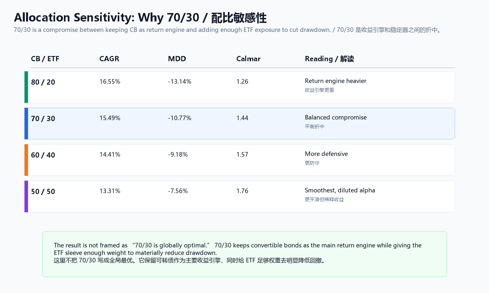

# ETF Stabilizer


## Thesis

ETF is not here to look heroic. It is here to make the full portfolio more holdable.

The ETF module is judged by portfolio utility: lower drawdown, lower correlation to the convertible-bond core, and a cleaner capital path.

## Current Decision

Status: sealed stabilizer candidate.

ETF Stabilizer V1.1:

```text
20% CSI300 ETF
20% S&P 500 ETF
40% Treasury ETF
20% Gold ETF

Monthly check:
if an equity sleeve fails its 12M risk switch,
move that 20% sleeve into 80% Treasury / 20% Gold.

S&P 500 exposure also requires abs(close / NAV - 1) <= 5%.
```


## Portfolio Evidence

| Portfolio | CAGR | MDD | Calmar | Correlation to CB | Interpretation |
|---|---:|---:|---:|---:|---|
| CB only | 18.60% | -18.76% | 0.99 | 1.00 | Main return engine |
| 70% CB + 30% Treasury fallback | 15.35% | -10.92% | 1.41 | 0.26 | Earlier defensive version |
| 70% CB + 30% ETF Stabilizer | 15.49% | -10.77% | 1.44 | 0.25 | Current sealed candidate |


## Allocation Sensitivity

| CB / ETF | CAGR | MDD | Calmar | Reading |
|---|---:|---:|---:|---|
| 80 / 20 | 16.55% | -13.14% | 1.26 | Return engine heavier |
| 70 / 30 | 15.49% | -10.77% | 1.44 | Balanced compromise |
| 60 / 40 | 14.41% | -9.18% | 1.57 | More defensive |
| 50 / 50 | 13.31% | -7.56% | 1.76 | Smoothest path, more alpha dilution |

70/30 is not presented as globally optimal. It is a readable compromise between keeping convertible bonds as the return engine and giving ETF enough weight to materially reduce drawdown.



## Archive Boundary

Top3 momentum, right-side ETF sleeve, short-financing variants, and more aggressive fallback choices remain observations or archives. They are not the public default.


## Code And Evidence Anchors

- [Code appendix](../../code/etf-stabilizer/README.md)
- Public evidence index: [Evidence Index](../../docs/evidence-index.md)
- Notion hub: ETF Allocation & Portfolio Stabilizer Hub
- Local source family before public migration: ETF Stabilizer final implementation and archived ETF variants
