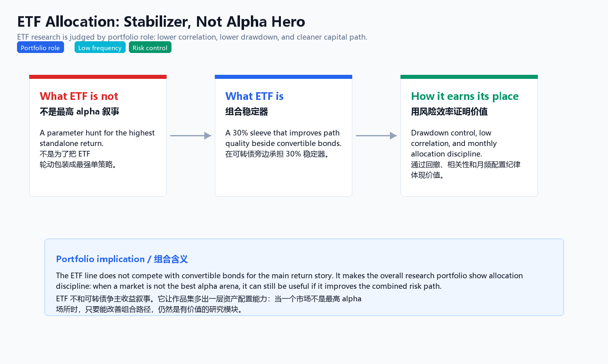
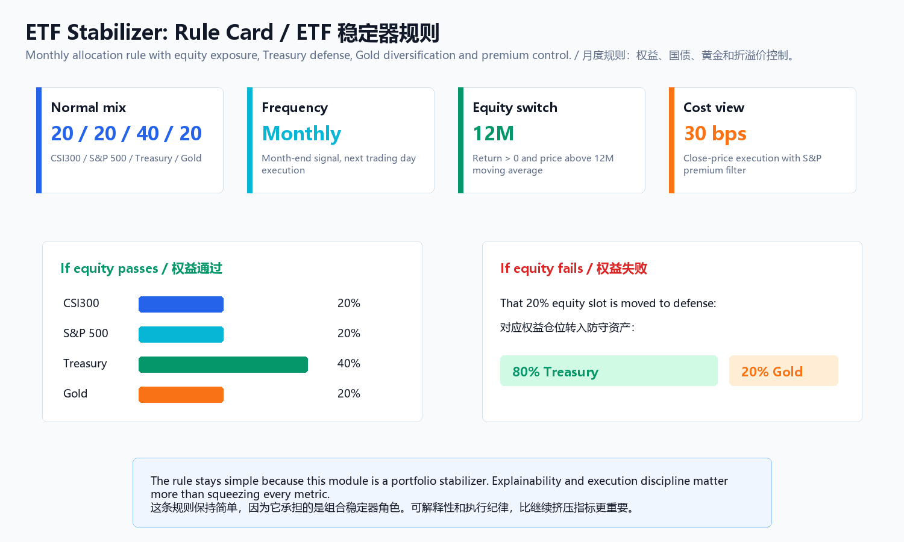
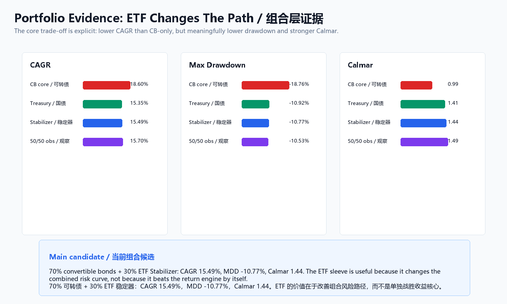
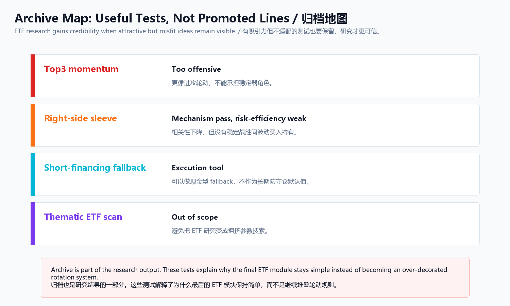

# ETF Stabilizer



## Thesis

ETF is not here to look heroic. It is here to make the full portfolio more holdable.

The ETF module is judged by portfolio utility: lower drawdown, lower correlation to the convertible-bond core, and a cleaner capital path.

## Current Decision

Status: sealed stabilizer candidate.

ETF Stabilizer V1.1:

```text
20% CSI300 ETF
20% S&P 500 ETF
40% Treasury ETF
20% Gold ETF

Monthly check:
if an equity sleeve fails its 12M risk switch,
move that 20% sleeve into 80% Treasury / 20% Gold.

S&P 500 exposure also requires abs(close / NAV - 1) <= 5%.
```



## Portfolio Evidence

| Portfolio | CAGR | MDD | Calmar | Correlation to CB | Interpretation |
|---|---:|---:|---:|---:|---|
| CB only | 18.60% | -18.76% | 0.99 | 1.00 | Main return engine |
| 70% CB + 30% Treasury fallback | 15.35% | -10.92% | 1.41 | 0.26 | Earlier defensive version |
| 70% CB + 30% ETF Stabilizer | 15.49% | -10.77% | 1.44 | 0.25 | Current sealed candidate |



## Evidence Chain

| Stage | Public Evidence |
|---|---|
| Strategy rule and role | [strategy card](reports/ETF_Stabilizer_V1_策略卡.md), [final combo validation](reports/01_final_combo_validation_zh.md) |
| Variant checks | [short fallback validation](reports/02_short_fallback_validation_zh.md), [lookback stability](reports/03_lookback_stability_zh.md), [fallback gold shift](reports/04_fallback_gold_shift_test_zh.md) |
| Archive boundary | [archive note](reports/研究归档说明.md) |
| Result tables | [selected ETF result CSVs](results/) |
| Code path | [ETF Stabilizer code appendix](../../code/etf-stabilizer/README.md) |

## Archive Boundary

Top3 momentum, right-side ETF sleeve, short-financing variants, and more aggressive fallback choices remain observations or archives. They are not the public default.



## Public Evidence Anchors

- [Evidence Index](../../docs/evidence-index.md)
- [CB + ETF Bridge](../cb-etf-bridge/README.md)
