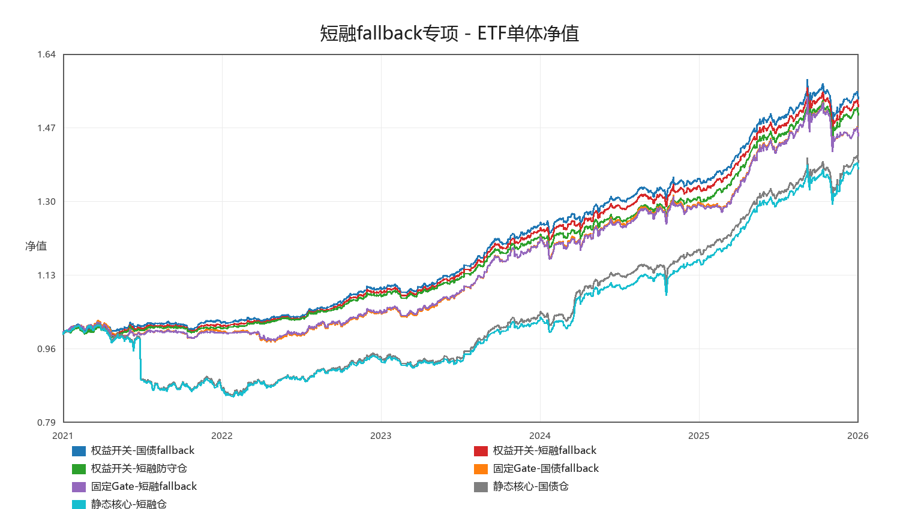
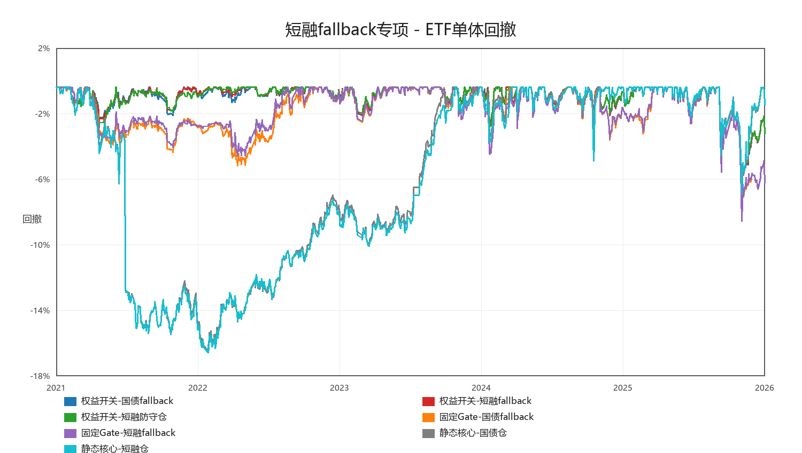
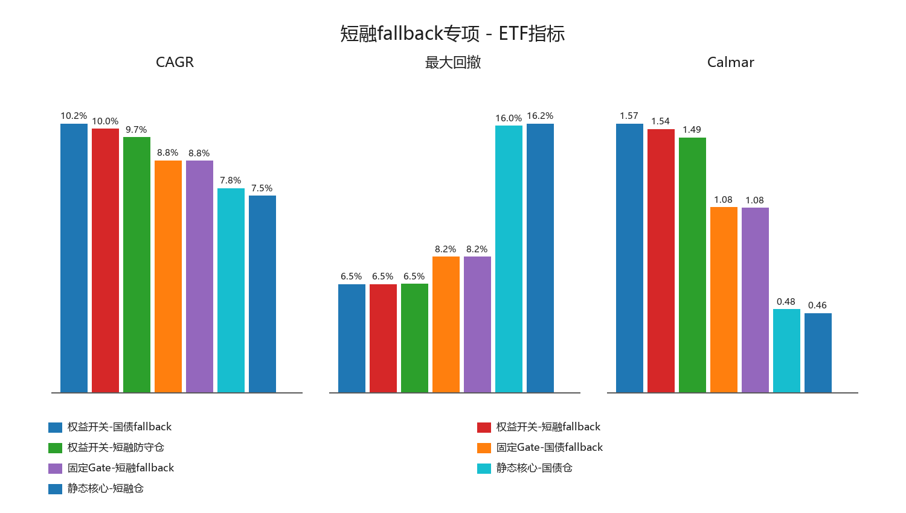
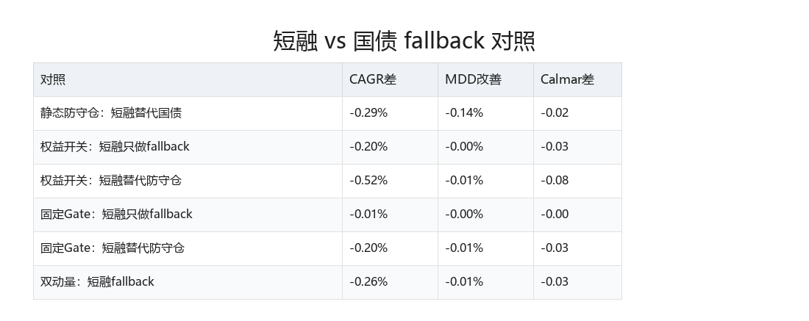
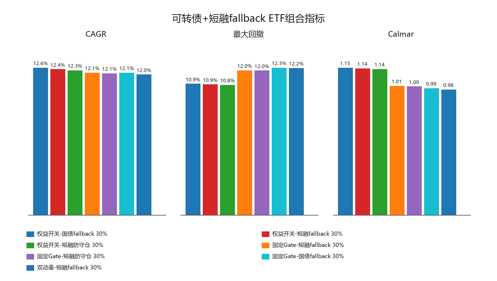
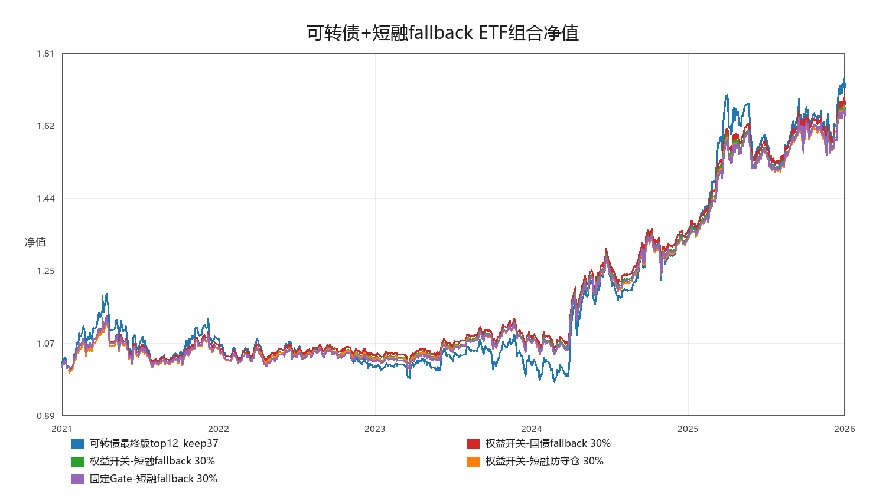
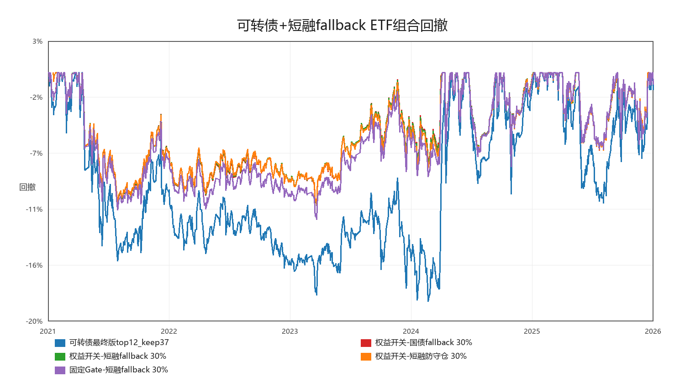

# ETF 短融 fallback 组合专项

生成时间：2026-05-22 17:26:45

## 测试口径

- 只在短融 ETF 可用的同窗口内比较，不把短融起点作为长期研究窗口。
- 主口径：`close`，成本 `30bps`，标普 ETF 绝对折溢价 `5%` 过滤。
- 短融测试分两类：只做风险资产失效后的 fallback，以及替代原本国债防守仓。
- 可转债使用最终版 `top12_keep37` 的 `net` 日收益，并在同窗口内重算基准指标。

## 关键结论

- 短融单资产：CAGR 2.15%，MDD -1.06%，Calmar 2.03。同窗口国债：CAGR 2.83%，MDD -1.56%，Calmar 1.82。
- ETF 单体最优 Calmar：短融ETF，CAGR 2.15%，MDD -1.06%，Calmar 2.03。
- 可转债同窗口单独：CAGR 13.19%，MDD -18.76%，Calmar 0.70。
- 组合层最优：可转债 + 权益开关-国债fallback 30.00%，CAGR 12.55%，MDD -10.92%，Calmar 1.15，MDD 改善 7.83%。

## 短融 vs 国债 对照

| 对照 | 测试版本 | CAGR | MDD | Calmar | CAGR差 | MDD改善 | Calmar差 |
|---|---|---:|---:|---:|---:|---:|---:|
| 静态防守仓：短融替代国债 | 静态核心-短融仓 | 7.47% | -16.18% | 0.46 | -0.29% | -0.14% | -0.02 |
| 权益开关：短融只做fallback | 权益开关-短融fallback | 10.00% | -6.51% | 1.54 | -0.20% | -0.00% | -0.03 |
| 权益开关：短融替代防守仓 | 权益开关-短融防守仓 | 9.69% | -6.52% | 1.49 | -0.52% | -0.01% | -0.08 |
| 固定Gate：短融只做fallback | 固定Gate-短融fallback | 8.79% | -8.16% | 1.08 | -0.01% | -0.00% | -0.00 |
| 固定Gate：短融替代防守仓 | 固定Gate-短融防守仓 | 8.61% | -8.17% | 1.05 | -0.20% | -0.01% | -0.03 |
| 双动量：短融fallback | 双动量-短融fallback | 8.29% | -8.17% | 1.01 | -0.26% | -0.01% | -0.03 |

## ETF 单体主口径

| 策略 | 类型 | CAGR | MDD | Calmar | Sharpe | worst12m | 最差3年CAGR | 年换手 |
|---|---|---:|---:|---:|---:|---:|---:|---:|
| 短融ETF | 单资产参考 | 2.15% | -1.06% | 2.03 | 2.91 | 1.07% | 2.06% | 0.00 |
| 国债ETF | 单资产参考 | 2.83% | -1.56% | 1.82 | 1.71 | -1.12% | 2.62% | 0.00 |
| 权益开关-国债fallback | fallback对照 | 10.21% | -6.51% | 1.57 | 2.03 | 1.13% | 8.62% | 1.18 |
| 权益开关-短融fallback | fallback对照 | 10.00% | -6.51% | 1.54 | 2.01 | 1.23% | 8.33% | 1.42 |
| 权益开关-短融防守仓 | 防守仓替代 | 9.69% | -6.52% | 1.49 | 1.95 | 1.08% | 7.60% | 1.42 |
| 固定Gate-国债fallback | fallback对照 | 8.80% | -8.16% | 1.08 | 1.40 | -4.07% | 7.25% | 3.29 |
| 固定Gate-短融fallback | fallback对照 | 8.79% | -8.16% | 1.08 | 1.41 | -3.71% | 7.11% | 3.29 |
| 固定Gate-短融防守仓 | 防守仓替代 | 8.61% | -8.17% | 1.05 | 1.38 | -3.80% | 6.67% | 3.29 |
| 双动量-国债fallback | fallback对照 | 8.55% | -8.16% | 1.05 | 1.42 | -4.07% | 7.14% | 2.73 |
| 双动量-短融fallback | fallback对照 | 8.29% | -8.17% | 1.01 | 1.39 | -3.80% | 6.38% | 2.73 |
| 静态核心-国债仓 | 静态防守仓 | 7.75% | -16.04% | 0.48 | 0.96 | -13.81% | 3.64% | 0.73 |
| 静态核心-短融仓 | 静态防守仓 | 7.47% | -16.18% | 0.46 | 0.92 | -13.94% | 2.85% | 0.73 |

## 可转债 + ETF 同窗口组合

| ETF策略 | ETF权重 | CAGR | MDD | Calmar | Sharpe | 与可转债相关 | CAGR差 | MDD改善 | 波动差 |
|---|---:|---:|---:|---:|---:|---:|---:|---:|---:|
| 权益开关-国债fallback | 30.00% | 12.55% | -10.92% | 1.15 | 1.09 | 0.25 | -0.63% | 7.83% | -4.27% |
| 权益开关-短融fallback | 30.00% | 12.42% | -10.86% | 1.14 | 1.08 | 0.26 | -0.67% | 7.90% | -4.26% |
| 权益开关-短融防守仓 | 30.00% | 12.33% | -10.83% | 1.14 | 1.07 | 0.27 | -0.77% | 7.93% | -4.24% |
| 固定Gate-短融fallback | 30.00% | 12.12% | -12.04% | 1.01 | 1.03 | 0.28 | -1.07% | 6.72% | -4.09% |
| 固定Gate-短融防守仓 | 30.00% | 12.06% | -12.02% | 1.00 | 1.03 | 0.28 | -1.12% | 6.74% | -4.07% |
| 固定Gate-国债fallback | 30.00% | 12.12% | -12.26% | 0.99 | 1.04 | 0.27 | -1.06% | 6.49% | -4.09% |
| 双动量-短融fallback | 30.00% | 11.97% | -12.24% | 0.98 | 1.02 | 0.29 | -1.22% | 6.52% | -4.10% |
| 双动量-国债fallback | 30.00% | 12.05% | -12.42% | 0.97 | 1.03 | 0.27 | -1.13% | 6.34% | -4.12% |
| 权益开关-国债fallback | 20.00% | 12.79% | -13.39% | 0.96 | 0.99 | 0.25 | -0.40% | 5.36% | -2.87% |
| 权益开关-短融fallback | 20.00% | 12.67% | -13.36% | 0.95 | 0.98 | 0.26 | -0.42% | 5.40% | -2.86% |
| 权益开关-短融防守仓 | 20.00% | 12.61% | -13.34% | 0.95 | 0.97 | 0.27 | -0.49% | 5.41% | -2.85% |
| 固定Gate-短融fallback | 20.00% | 12.50% | -14.13% | 0.88 | 0.96 | 0.28 | -0.69% | 4.63% | -2.76% |
| 固定Gate-短融防守仓 | 20.00% | 12.46% | -14.12% | 0.88 | 0.96 | 0.28 | -0.72% | 4.64% | -2.75% |
| 固定Gate-国债fallback | 20.00% | 12.50% | -14.27% | 0.88 | 0.96 | 0.27 | -0.68% | 4.48% | -2.77% |
| 双动量-短融fallback | 20.00% | 12.40% | -14.26% | 0.87 | 0.95 | 0.29 | -0.79% | 4.50% | -2.77% |
| 双动量-国债fallback | 20.00% | 12.45% | -14.38% | 0.87 | 0.96 | 0.27 | -0.73% | 4.38% | -2.78% |
| 国债ETF | 30.00% | 10.27% | -11.99% | 0.86 | 0.93 | -0.11 | -2.92% | 6.76% | -4.78% |
| 短融ETF | 30.00% | 10.05% | -11.92% | 0.84 | 0.91 | -0.03 | -3.14% | 6.84% | -4.74% |
| 国债ETF | 20.00% | 11.26% | -14.10% | 0.80 | 0.89 | -0.11 | -1.92% | 4.66% | -3.19% |
| 短融ETF | 20.00% | 11.11% | -14.07% | 0.79 | 0.88 | -0.03 | -2.07% | 4.68% | -3.16% |
| 静态核心-国债仓 | 30.00% | 11.77% | -15.07% | 0.78 | 0.97 | 0.34 | -1.41% | 3.69% | -3.71% |
| 静态核心-短融仓 | 30.00% | 11.69% | -15.04% | 0.78 | 0.96 | 0.34 | -1.50% | 3.72% | -3.69% |
| 静态核心-国债仓 | 20.00% | 12.27% | -16.10% | 0.76 | 0.92 | 0.34 | -0.92% | 2.65% | -2.53% |
| 静态核心-短融仓 | 20.00% | 12.21% | -16.08% | 0.76 | 0.92 | 0.34 | -0.98% | 2.67% | -2.52% |
| 可转债最终版top12_keep37 | 0.00% | 13.19% | -18.76% | 0.70 | 0.83 | 1.00 | 0.00% | 0.00% | 0.00% |

## 最大回撤期间仓位

| 策略 | 起点 | 终点 | 深度 | 权益 | 国债 | 短融 | 黄金 |
|---|---:|---:|---:|---:|---:|---:|---:|
| 静态核心-短融仓 | 2021-12-28 | 2022-10-11 | -16.18% | 40.00% | 0.00% | 40.00% | 20.00% |
| 静态核心-国债仓 | 2021-12-31 | 2022-10-11 | -16.04% | 40.00% | 40.00% | 0.00% | 20.00% |
| 固定Gate-短融防守仓 | 2026-01-29 | 2026-03-23 | -8.17% | 25.00% | 0.00% | 50.00% | 25.00% |
| 双动量-短融fallback | 2026-01-29 | 2026-03-23 | -8.17% | 25.00% | 0.00% | 50.00% | 25.00% |
| 固定Gate-短融fallback | 2026-01-29 | 2026-03-23 | -8.16% | 25.00% | 25.00% | 25.00% | 25.00% |
| 双动量-国债fallback | 2026-01-29 | 2026-03-23 | -8.16% | 25.00% | 50.00% | 0.00% | 25.00% |
| 固定Gate-国债fallback | 2026-01-29 | 2026-03-23 | -8.16% | 25.00% | 50.00% | 0.00% | 25.00% |
| 权益开关-短融防守仓 | 2026-01-29 | 2026-03-23 | -6.52% | 20.00% | 0.00% | 60.00% | 20.00% |
| 权益开关-短融fallback | 2026-01-29 | 2026-03-23 | -6.51% | 20.00% | 40.00% | 20.00% | 20.00% |
| 权益开关-国债fallback | 2026-01-29 | 2026-03-23 | -6.51% | 20.00% | 60.00% | 0.00% | 20.00% |
| 国债ETF | 2025-01-06 | 2025-03-11 | -1.56% | 0.00% | 100.00% | 0.00% | 0.00% |
| 短融ETF | 2023-09-05 | 2023-09-08 | -1.06% | 0.00% | 0.00% | 100.00% | 0.00% |

## 图表

## 判断

- 如果短融只做 fallback，目标不是提高年化，而是在风险资产失效时不拖后腿、降低相关性、压住回撤。
- 如果短融替代全部国债防守仓，收益可能更平滑，但也会放弃国债在部分风险期的久期收益，这个版本只能作为防守型执行选项。
- 短融不应该作为长期 edge，但可以保留为实盘 fallback 工具，并和国债 fallback 并列进入组合层候选。
