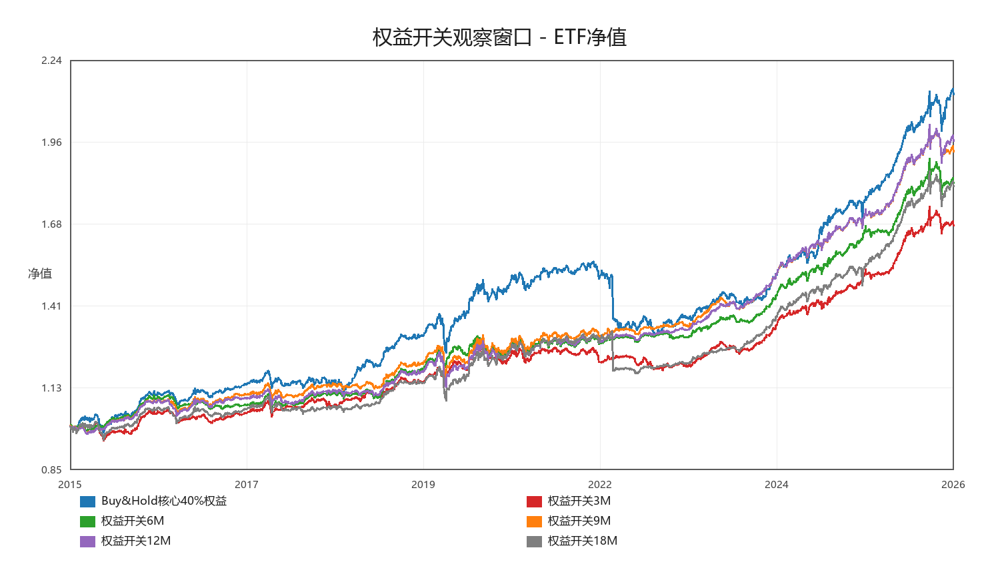
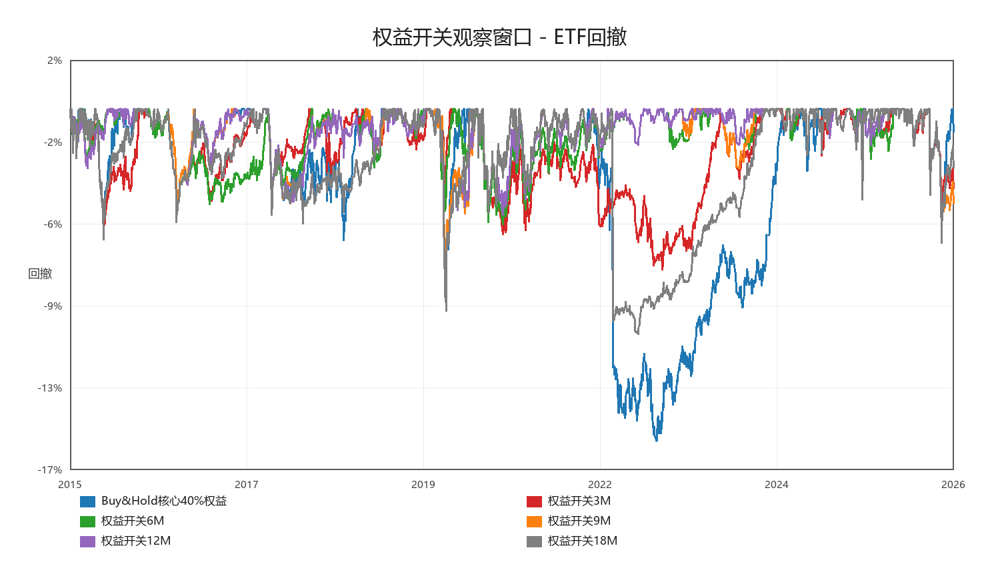
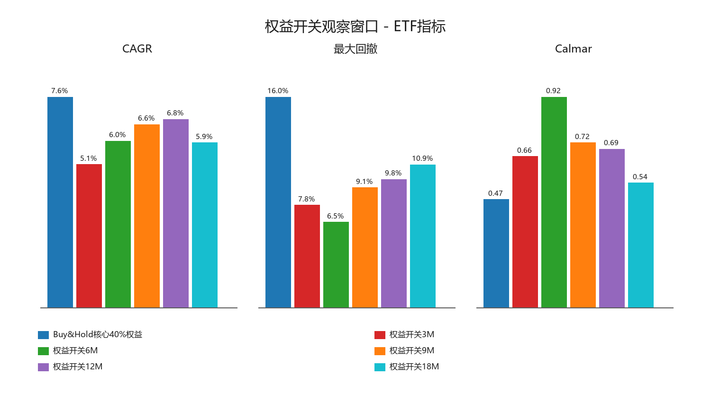
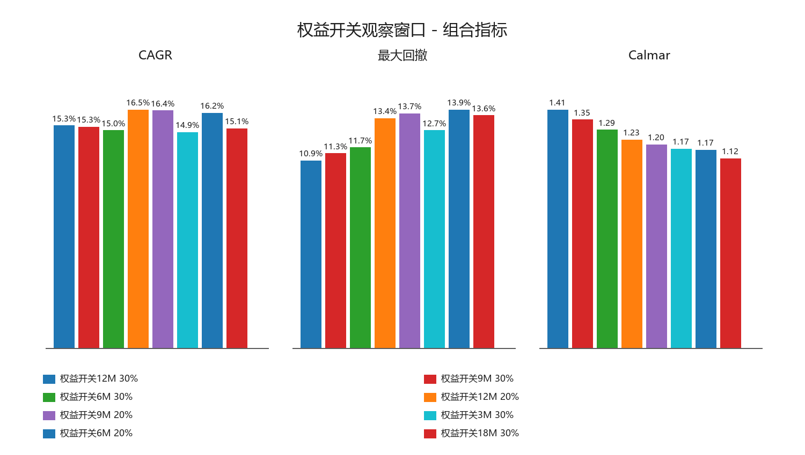

# ETF 权益风险开关观察窗口稳定性

生成时间：2026-05-22 17:35:00

## 测试口径

- ETF 执行口径：`close`，成本 `30bps`，跨境 ETF 绝对折溢价 `5%` 过滤。
- 固定底仓：沪深300 20%、标普500 20%、国债 40%、黄金 20%。
- 权益开关只作用于沪深300和标普500：观察窗口收益 > 0 且价格 > 同窗口均线才持有，否则切到国债。
- 为了公平，所有窗口裁到同一起点比较。

## 关键结论

- Buy&Hold 核心40%权益：CAGR 7.57%，MDD -16.04%，Calmar 0.47。
- 12M 权益开关：CAGR 6.76%，MDD -9.76%，Calmar 0.69。
- ETF 单体 Calmar 最优：权益开关6M，CAGR 5.98%，MDD -6.51%，Calmar 0.92。
- 组合层 Calmar 最优：可转债 + 权益开关12M 30.00%，CAGR 15.35%，MDD -10.92%，Calmar 1.41。
- 初步判断：12M 不是唯一答案，也不是需要迷信的参数；它偏慢但稳定。6M/9M 更灵敏，是否替代 12M 要看组合层和换手成本。

## ETF 单体表现

| 策略 | CAGR | MDD | Calmar | Sharpe | worst12m | 最差3年CAGR | 最差3年MDD | 年换手 |
|---|---:|---:|---:|---:|---:|---:|---:|---:|
| 权益开关6M | 5.98% | -6.51% | 0.92 | 1.22 | -3.35% | 1.61% | -6.51% | 2.17 |
| 权益开关9M | 6.57% | -9.14% | 0.72 | 1.25 | -1.18% | 2.35% | -9.14% | 1.79 |
| 权益开关12M | 6.76% | -9.76% | 0.69 | 1.28 | -1.05% | 2.54% | -9.76% | 1.59 |
| 权益开关3M | 5.14% | -7.79% | 0.66 | 1.02 | -5.18% | -0.07% | -7.79% | 2.99 |
| 权益开关18M | 5.92% | -10.89% | 0.54 | 0.91 | -8.85% | 0.75% | -10.89% | 1.57 |
| Buy&Hold核心40%权益 | 7.57% | -16.04% | 0.47 | 1.04 | -14.56% | -0.86% | -16.04% | 0.47 |

## 可转债 + ETF 组合层

| ETF策略 | ETF权重 | CAGR | MDD | Calmar | Sharpe | 与可转债相关 | CAGR差 | MDD改善 | 波动差 |
|---|---:|---:|---:|---:|---:|---:|---:|---:|---:|
| 权益开关12M | 30.00% | 15.35% | -10.92% | 1.41 | 1.27 | 0.26 | -3.25% | 7.83% | -4.43% |
| 权益开关9M | 30.00% | 15.26% | -11.34% | 1.35 | 1.26 | 0.25 | -3.34% | 7.41% | -4.46% |
| 权益开关6M | 30.00% | 15.02% | -11.68% | 1.29 | 1.24 | 0.27 | -3.58% | 7.08% | -4.47% |
| 权益开关12M | 20.00% | 16.45% | -13.39% | 1.23 | 1.21 | 0.26 | -2.15% | 5.36% | -2.98% |
| 权益开关9M | 20.00% | 16.39% | -13.67% | 1.20 | 1.21 | 0.25 | -2.21% | 5.08% | -3.00% |
| 权益开关3M | 30.00% | 14.90% | -12.69% | 1.17 | 1.24 | 0.23 | -3.70% | 6.07% | -4.52% |
| 权益开关6M | 20.00% | 16.23% | -13.89% | 1.17 | 1.20 | 0.27 | -2.37% | 4.86% | -3.00% |
| 权益开关18M | 30.00% | 15.15% | -13.56% | 1.12 | 1.25 | 0.22 | -3.45% | 5.19% | -4.37% |
| 权益开关3M | 20.00% | 16.15% | -14.55% | 1.11 | 1.20 | 0.23 | -2.45% | 4.20% | -3.04% |
| 权益开关18M | 20.00% | 16.32% | -15.11% | 1.08 | 1.20 | 0.22 | -2.28% | 3.64% | -2.96% |
| Buy&Hold核心40%权益 | 30.00% | 15.51% | -15.07% | 1.03 | 1.24 | 0.34 | -3.09% | 3.69% | -4.03% |
| Buy&Hold核心40%权益 | 20.00% | 16.56% | -16.10% | 1.03 | 1.20 | 0.34 | -2.04% | 2.65% | -2.74% |
| 可转债最终版 | 0.00% | 18.60% | -18.76% | 0.99 | 1.13 | 1.00 | 0.00% | 0.00% | 0.00% |

## 图表

## 解释

- 3M 太敏感，容易更早减仓，但也更容易反复切换。
- 6M/9M 是更值得观察的中间版本，通常比 12M 更快，但不能只看单体收益。
- 12M 的优势是慢、少动、解释简单；缺点是熊市初期反应偏慢。
- 所以最终不应该说“12M 最优”，更准确是：12M 是当前可解释默认值，6M/9M 是下一轮 challenger。
