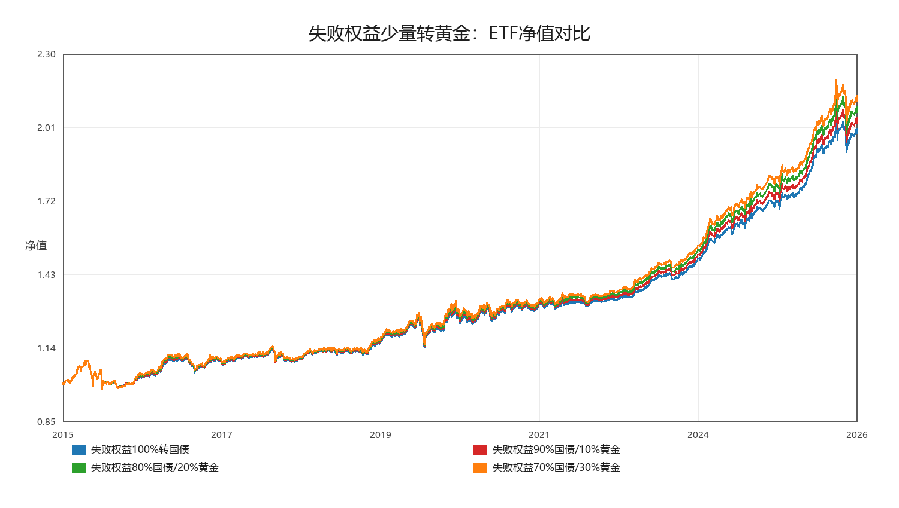
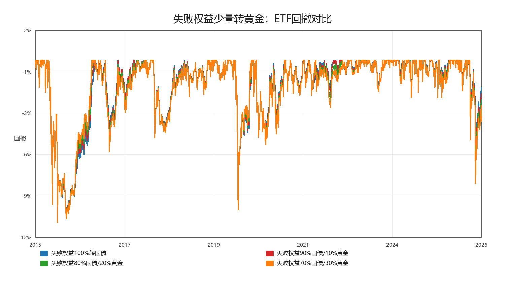
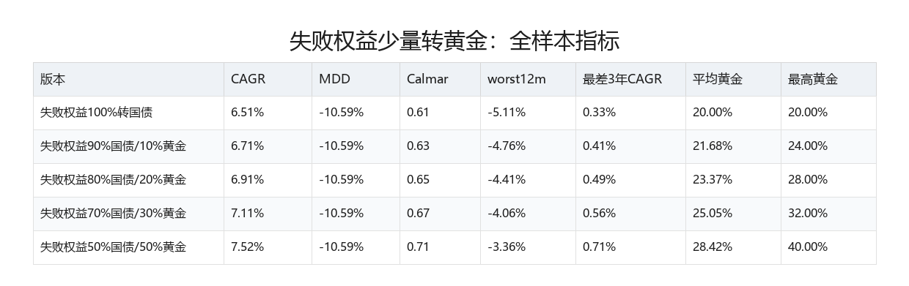
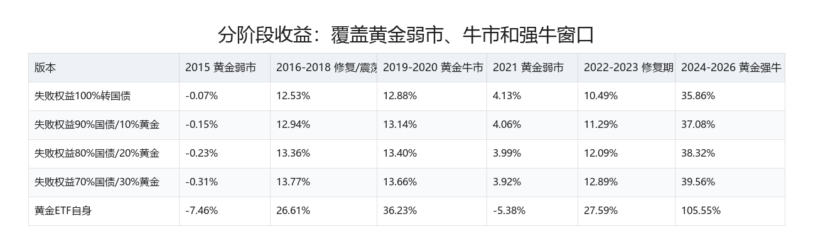
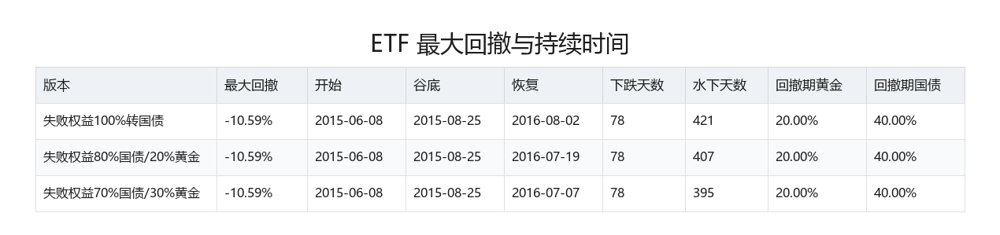

# ETF 权益失败后少量转黄金测试

生成时间：2026-05-22 18:55:26

## 测试设定

- 执行口径：`close`，成本 `30bps`，跨境 ETF 折溢价过滤 `5%`。
- 其他逻辑不变：沪深300 20%、标普500 20%、国债 40%、黄金 20%；只对两个权益仓位做 12M 趋势 + 12M 均线开关。
- 只改一件事：权益仓位失败时，原本 100% 转国债；本轮测试其中 10% / 20% / 30% / 50% 是否转入黄金。
- 目标：判断这是不是比纯国债 fallback 更稳，而不是重新优化参数。

## 全样本结果

| 版本 | CAGR | MDD | Calmar | Sharpe | worst12m | 最差3年CAGR | 最差3年MDD | 平均黄金 | 最高黄金 | 年换手 |
|---|---:|---:|---:|---:|---:|---:|---:|---:|---:|---:|
| 失败权益100%转国债 | 6.51% | -10.59% | 0.61 | 1.11 | -5.11% | 0.33% | -10.59% | 20.00% | 20.00% | 1.60 |
| 失败权益90%国债/10%黄金 | 6.71% | -10.59% | 0.63 | 1.12 | -4.76% | 0.41% | -10.59% | 21.68% | 24.00% | 1.60 |
| 失败权益80%国债/20%黄金 | 6.91% | -10.59% | 0.65 | 1.12 | -4.41% | 0.49% | -10.59% | 23.37% | 28.00% | 1.60 |
| 失败权益70%国债/30%黄金 | 7.11% | -10.59% | 0.67 | 1.13 | -4.06% | 0.56% | -10.59% | 25.05% | 32.00% | 1.60 |
| 失败权益50%国债/50%黄金 | 7.52% | -10.59% | 0.71 | 1.13 | -3.36% | 0.71% | -10.59% | 28.42% | 40.00% | 1.60 |

## 最大回撤与持续时间

| 版本 | 最大回撤 | 开始 | 谷底 | 恢复 | 下跌天数 | 水下天数 | 回撤期沪深300 | 回撤期标普500 | 回撤期国债 | 回撤期黄金 |
|---|---:|---:|---:|---:|---:|---:|---:|---:|---:|---:|
| 失败权益100%转国债 | -10.59% | 2015-06-08 | 2015-08-25 | 2016-08-02 | 78 | 421 | 20.00% | 20.00% | 40.00% | 20.00% |
| 失败权益90%国债/10%黄金 | -10.59% | 2015-06-08 | 2015-08-25 | 2016-07-29 | 78 | 417 | 20.00% | 20.00% | 40.00% | 20.00% |
| 失败权益80%国债/20%黄金 | -10.59% | 2015-06-08 | 2015-08-25 | 2016-07-19 | 78 | 407 | 20.00% | 20.00% | 40.00% | 20.00% |
| 失败权益70%国债/30%黄金 | -10.59% | 2015-06-08 | 2015-08-25 | 2016-07-07 | 78 | 395 | 20.00% | 20.00% | 40.00% | 20.00% |
| 失败权益50%国债/50%黄金 | -10.59% | 2015-06-08 | 2015-08-25 | 2016-07-01 | 78 | 389 | 20.00% | 20.00% | 40.00% | 20.00% |

## 分阶段结果

| 版本 | 2015 黄金弱市 | 2016-2018 修复/震荡 | 2019-2020 黄金牛市 | 2021 黄金弱市 | 2022-2023 修复期 | 2024-2026 黄金强牛 |
|---|---:|---:|---:|---:|---:|---:|
| 失败权益100%转国债 | -0.07% | 12.53% | 12.88% | 4.13% | 10.49% | 35.86% |
| 失败权益90%国债/10%黄金 | -0.15% | 12.94% | 13.14% | 4.06% | 11.29% | 37.08% |
| 失败权益80%国债/20%黄金 | -0.23% | 13.36% | 13.40% | 3.99% | 12.09% | 38.32% |
| 失败权益70%国债/30%黄金 | -0.31% | 13.77% | 13.66% | 3.92% | 12.89% | 39.56% |
| 失败权益50%国债/50%黄金 | -0.48% | 14.60% | 14.17% | 3.79% | 14.50% | 42.05% |

黄金 ETF 自身分阶段收益：

| 2015 黄金弱市 | 2016-2018 修复/震荡 | 2019-2020 黄金牛市 | 2021 黄金弱市 | 2022-2023 修复期 | 2024-2026 黄金强牛 |
|---:|---:|---:|---:|---:|---:|
| -7.46% | 26.61% | 36.23% | -5.38% | 27.59% | 105.55% |

## 可转债 + ETF 30% 组合层

| 版本 | CAGR | MDD | Calmar | Sharpe | corr_to_cb | 对可转债CAGR差 | 对可转债MDD改善 |
|---|---:|---:|---:|---:|---:|---:|---:|
| 可转债最终版 | 18.60% | -18.76% | 0.99 | 1.13 | 1.00 | 0.00% | 0.00% |
| 失败权益100%转国债 | 15.35% | -10.92% | 1.41 | 1.27 | 0.26 | -3.25% | 7.83% |
| 失败权益90%国债/10%黄金 | 15.42% | -10.84% | 1.42 | 1.27 | 0.25 | -3.18% | 7.91% |
| 失败权益80%国债/20%黄金 | 15.49% | -10.77% | 1.44 | 1.28 | 0.25 | -3.11% | 7.99% |
| 失败权益70%国债/30%黄金 | 15.56% | -10.69% | 1.46 | 1.28 | 0.24 | -3.04% | 8.07% |
| 失败权益50%国债/50%黄金 | 15.70% | -10.53% | 1.49 | 1.29 | 0.23 | -2.90% | 8.22% |

## 初步判断

- 相比纯国债 fallback，当前最好版本是 `失败权益50%国债/50%黄金`：CAGR 7.52%，MDD -10.59%，Calmar 0.71。
- 当前封存版纯国债 fallback：CAGR 6.51%，MDD -10.59%，Calmar 0.61。
- 组合层最优为 `失败权益50%国债/50%黄金`：CAGR 15.70%，MDD -10.53%，Calmar 1.49。
- 80%国债/20%黄金版本的最大回撤为 -10.59%，从 2015-06-08 到 2015-08-25 下跌约 78 天，恢复到前高约用 407 天。
- 判断标准仍是：如果只是 2024-2026 黄金强牛里更好，但 2021 黄金弱市或 2022-2023 压力期更差，就不能直接改默认参数。

## 图表

